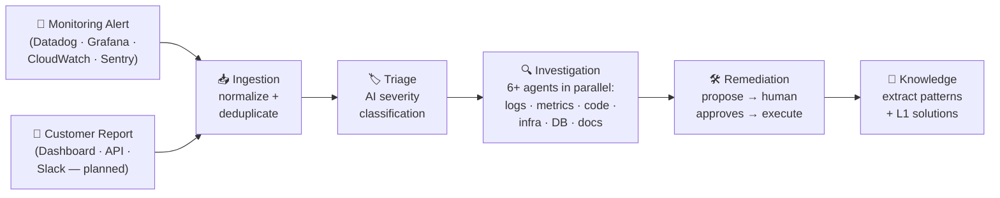
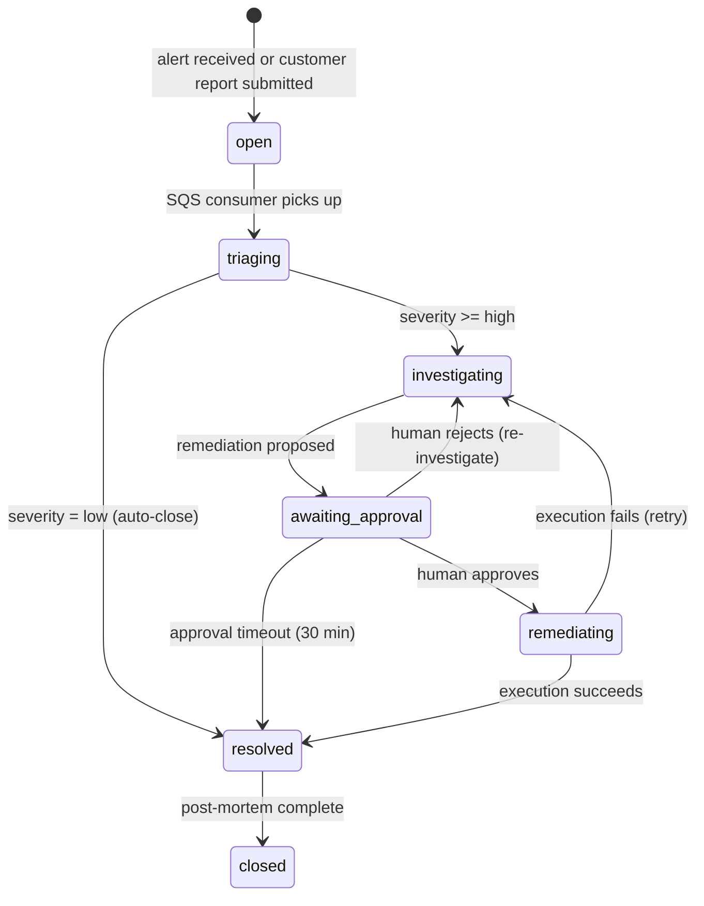
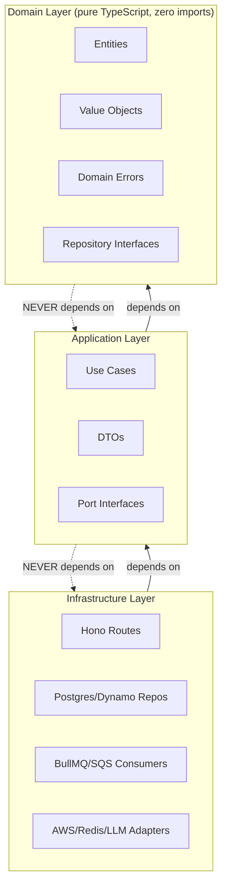
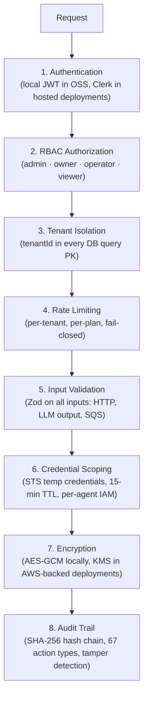

# CauseFlow

**AI-powered platform for Engineering and Customer Support teams.** CauseFlow automates incident investigation — whether triggered by monitoring alerts (SRE) or customer-reported issues (Support). Parallel AI agents investigate logs, metrics, infrastructure, code, and documentation, then propose a fix that requires human approval before execution.

Average incident MTTR: **~35 minutes** (vs. 2-4 hours with manual investigation).

## How It Works

An alert arrives from a monitoring tool, or a support team member creates an incident from a customer report. CauseFlow normalizes it, runs AI triage, dispatches specialized agents in parallel to investigate logs, metrics, infrastructure, code, and documentation, then proposes a fix that requires human approval before execution. After resolution, the Knowledge module extracts patterns for faster future responses — including known solutions that L1 support can use directly.



Each stage runs asynchronously via BullMQ/Redis in the open-source runtime and via SQS in AWS-backed deployments. The system degrades gracefully — agents only activate when their integration is connected (no AWS credentials? infra agents are skipped; no GitHub App? code analysis is skipped; no Notion/Shortcut? documentation search is skipped).

### Incident State Machine

Incidents can originate from monitoring alerts (SRE path) or customer reports submitted via the Dashboard, Slack, or API (Support path). Both enter the same state machine.



> For the full step-by-step walkthrough with code-level detail, see [04 — Complete Flow](../docs/04-complete-flow.md) — the most important doc for understanding the system end-to-end.

## Quick Start

### Prerequisites

| Tool | Version | Required for |
|------|---------|--------------|
| Node.js | >= 22 | Runtime |
| pnpm | >= 8 | Package manager (**never use npm**) |
| Docker + Compose | >= 20 | OSS runtime: Postgres, Redis, Hindsight, Core API, worker |
| Git | >= 2.30 | Submodule for relay agent |

### Setup

```bash
# 1. Clone with submodules
git clone --recurse-submodules <repo-url>
cd causeflow-core

# 2. Install dependencies (pnpm only — npm will break symlinks)
pnpm install

# 3. Configure environment
cp .env.example .env
# Defaults are enough for OSS local runtime; ANTHROPIC_API_KEY is optional

# 4. Start the OSS runtime
docker-compose up -d
# API: http://localhost:3099, Postgres: 5439, Redis: 6380

# 5. Start the dev server
pnpm dev

# 6. Verify it's running
curl http://localhost:3099/health
# Expected: { "status": "ok", "timestamp": "..." }
```

### Testing a Basic Scenario

With the dev server running, simulate an alert flowing through the full pipeline:

```bash
# 1. Create a tenant
curl -X POST http://localhost:3099/v1/tenants \
  -H "Content-Type: application/json" \
  -d '{"name": "my-team", "slug": "my-team", "plan": "starter"}'
# Save the tenant_id from the response

# 2. Create an API key for webhook authentication
curl -X POST http://localhost:3099/v1/api-keys \
  -H "Authorization: Bearer <jwt>" \
  -H "Content-Type: application/json" \
  -d '{"name": "datadog-webhook"}'
# Save the plaintextKey — it's shown only once

# 3. Send a test alert (Datadog format)
curl -X POST http://localhost:3099/v1/webhooks/{tenant_id}/datadog \
  -H "X-API-Key: <plaintextKey>" \
  -H "X-Webhook-Signature: <hmac-sha256-signature>" \
  -H "X-Alert-Source: datadog" \
  -H "Content-Type: application/json" \
  -d '{
    "id": "alert-001",
    "title": "High CPU on api-server",
    "text": "CPU usage above 90% for 5 minutes",
    "priority": "high",
    "tags": ["service:api-server", "env:production"]
  }'

# 4. Check the incident was created and is being processed
curl http://localhost:3099/v1/incidents \
  -H "Authorization: Bearer <jwt>"
```

### Testing a Customer Support Scenario

With the dev server running, simulate a customer-reported issue:

```bash
# Create an incident from a customer report (manual entry)
curl -X POST http://localhost:3099/v1/incidents/chat \
  -H "Authorization: Bearer <jwt>" \
  -H "Content-Type: application/json" \
  -d '{
    "title": "Customers cannot export reports",
    "description": "Multiple customers reporting that the export button returns 500 errors since this morning"
  }'
```

The incident follows the same pipeline as monitoring alerts: `open → triaging → investigating → awaiting_approval`.

Incidents from both sources progress through the same state machine: `open → triaging → investigating → awaiting_approval`. You'll see real-time updates via the SSE stream at `GET /v1/notifications/stream`.

> For full API details, authentication, and all endpoints, see [06 — API Endpoints](../docs/06-api-endpoints.md).

## Architecture

**Modular Monolith (Modlito)** with **Clean Architecture**. One process, 15 modules, strict dependency rules.



**The dependency rule**: dependencies point inward only. Domain has zero external imports. Application imports Domain but never Infrastructure. Infrastructure implements the interfaces defined by inner layers.

**Module communication**: EventBus (in-process pub/sub) or type imports from another module's domain layer. Never import use cases or infra across modules.

**Composition root**: `bootstrap.ts` wires all dependencies — the only place where concrete implementations are connected to port interfaces.

> Full architecture details, code examples, and EventBus event catalog: [02 — Architecture](../docs/02-architecture.md)

### Modules

| Module | Path | What it does |
|--------|------|-------------|
| **Tenant** | `src/modules/tenant/` | Multi-tenancy, plans (starter/pro/business/enterprise), API key management, beta allowlist |
| **Auth** | `src/modules/auth/` | Clerk integration — webhook sync of users/orgs, `whoami` endpoint |
| **User** | `src/modules/user/` | User profiles, team invites, RBAC (admin/owner/operator/viewer) |
| **Billing** | `src/modules/billing/` | Stripe subscriptions, metered usage (investigations, events), signup flow, Stripe webhooks |
| **Ingestion** | `src/modules/ingestion/` | Receives alerts from Datadog/Grafana/CloudWatch/Sentry AND customer-reported incidents via Dashboard/API, HMAC validation, dedup |
| **Triage** | `src/modules/triage/` | AI classifies severity and category (Sonnet), skips investigation for low-severity |
| **Investigation** | `src/modules/investigation/` | Wave-based agents (scout → foundational → analysts → synthesis), Haiku/Sonnet routing, ~$0.70/investigation |
| **Remediation** | `src/modules/remediation/` | Propose → **human approves** → execute (restart, scale, rollback, PR). Always requires approval |
| **Memory** | `src/modules/memory/` | Agent long-term memory (Hindsight/Vectorize), chat history, past-incident recall for scout agent |
| **Code Intelligence** | `src/modules/code-intelligence/` | Code knowledge base — repo/service maps, package dependencies, code search for investigation agents |
| **Skills** | `src/modules/skills/` | Tenant-specific investigation skills (reusable runbooks / known solutions) |
| **Widget** | `src/modules/widget/` | Embeddable customer support widget + hosted portal, API-key-auth, Web Push notifications |
| **Notification** | `src/modules/notification/` | SSE real-time stream, approval workflows (30-min timeout) |
| **Integration** | `src/modules/integration/` | GitHub App (code read, PR create), Composio triggers (Slack/Jira/etc.), OSS stub connector, OAuth for Notion/Shortcut, Relay gateway |
| **Audit** | `src/modules/audit/` | SHA-256 hash-chained immutable audit trail, 67 action types (SOC2/HIPAA ready) |

> Full module documentation with data flows and code examples: [03 — Modules](../docs/03-modules.md)

## AI Agents

CauseFlow uses **cost-optimized model routing** — cheap models for simple tasks, expensive models only for synthesis:

| Agent | Model | What it does |
|-------|-------|-------------|
| Triage | Sonnet | Severity classification, agent selection |
| Log Analyst | Haiku | CloudWatch log queries |
| Metric Analyst | Haiku | CloudWatch metric analysis |
| Change Detector | Haiku | Recent deploys, CloudTrail events |
| Code Analyzer | Haiku | GitHub code context via App token |
| Infra Inspector | Sonnet | ECS/EC2 resource state |
| DB Analyst | Sonnet | Database queries via Relay or DynamoDB |
| Doc Enricher (planned) | Sonnet | Searches tenant documentation (Notion, Shortcut) for context and known solutions |
| Synthesis | Sonnet | Final root cause analysis from all agents |

Estimated cost: **~$0.70 per investigation** (~4× cheaper than using Opus for everything).

Each agent gets **temporary STS credentials** scoped to minimum permissions — the Log Analyst can only read CloudWatch Logs, the Remediator can only call `ecs:UpdateService`, etc.

Observability: [Langfuse](https://langfuse.com) traces per-agent cost, latency, and token usage. Quality gates: [Promptfoo](https://promptfoo.dev) evals on triage accuracy.

> Full agent specs, tool definitions, prompt patterns, and cost model: [07 — AI System](../docs/07-ai-system.md)

## Tech Stack

| Layer | Technology |
|-------|-----------|
| Runtime | Node.js 22, TypeScript |
| HTTP | Hono |
| Database | Postgres for OSS/local runtime; DynamoDB for AWS-backed deployments |
| Cache | Redis (ElastiCache in production) |
| Queues | BullMQ/Redis for OSS/local runtime; AWS SQS for AWS-backed deployments |
| AI | Local OpenAI-compatible connector by default in OSS; Anthropic override supported |
| Agent Framework | Enhanced runner / local worker path; Mastra remains optional for AWS-backed deployments |
| Auth | Local JWT auth in OSS; Clerk (`@clerk/backend`) for hosted deployments |
| Billing | Stripe (subscriptions + metered usage) |
| Agent Memory | Hindsight (Vectorize) for long-term recall |
| Integration Hub | Composio (Slack/Jira/etc. triggers + tools), Svix (webhook delivery) |
| Push | Web Push (VAPID) for widget notifications |
| Encryption | AES-256-GCM locally; KMS envelope encryption for AWS-backed OAuth tokens |
| Observability | Langfuse (AI), CloudWatch (infra), Pino (logs) |
| IaC | AWS CDK (TypeScript) |
| Tests | Vitest + Promptfoo (LLM evals) |
| Package Manager | pnpm |

## Project Structure

```
src/
├── main.ts                    # Entry point, scheduler, graceful shutdown
├── bootstrap.ts               # Composition root (DI wiring)
├── app.ts                     # Hono app + middleware chain + routes
├── lifecycle.ts               # Startup / shutdown orchestration
├── workers/                   # Standalone workers (investigation-worker.ts)
├── modules/                   # 15 modules (see Modules table above)
│   └── <module>/
│       ├── domain/            # Entities, value objects, repository interfaces (ports)
│       ├── application/       # Use cases, DTOs
│       └── infra/             # Routes, repository implementations, adapters
└── shared/
    ├── domain/                # EventBus, branded types (TenantId, IncidentId), errors
    ├── application/ports/     # LLM, Cloud, Agent, Queue port interfaces
    ├── config/                # Environment-based configuration
    └── infra/
        ├── db/                # Postgres client/repositories plus AWS-backed entities
        ├── llm/               # OpenAI-compatible/Anthropic clients + agent runner
        ├── cloud/             # AWS provider (CloudWatch, ECS, EC2, Lambda, SSM, etc.)
        ├── credentials/       # STS AssumeRole credential vending
        ├── queue/             # BullMQ/SQS queue adapters
        ├── cache/             # Redis client
        ├── relay/             # WebSocket relay for customer DB access
        ├── chat/              # SSE notification stream
        ├── memory/            # Hindsight agent memory client
        ├── integrations/      # Composio client + trigger service
        ├── pubsub/            # In-process event bus
        ├── observability/     # Langfuse tracer, metrics
        ├── scheduler/         # Cron-like job runner
        ├── ecs/               # ECS helpers
        ├── health/            # Health checker
        └── http/middleware/   # Auth (Clerk), tenant isolation, rate limit, audit

relay/                         # Secure database relay agent (git submodule) → see relay/README.md
dashboard/                     # Static dashboard (served at /dashboard)
packages/                      # Internal packages
infra/                         # AWS CDK infrastructure stack
tests/                         # 5-level test pyramid (see Testing section)
```

## Testing

5-level test pyramid — each level catches different classes of bugs:

| Level | Framework | Time | When to run | What it tests |
|-------|-----------|------|-------------|---------------|
| **Unit** | Vitest | <10s | Every commit | Business logic, all I/O mocked |
| **Integration** | Vitest | ~30s | Pre-commit | Real Postgres + Redis via Docker |
| **E2E** | Vitest | ~2min | Before PR | Full pipeline, Claude responses stubbed |
| **Smoke** | Vitest | ~5min | Post-deploy | Health, auth, basic webhook on real infra |
| **LLM Eval** | Promptfoo | varies | After prompt changes | Triage accuracy, classification quality |

### Running Tests

```bash
# Unit tests (no dependencies needed)
pnpm test:run

# Integration tests (requires Docker services)
docker-compose up -d
pnpm test:integration

# E2E tests (requires Docker + dev server running, Claude is stubbed)
pnpm test:e2e

# Smoke tests (requires a deployed environment)
pnpm test:smoke

# LLM quality evaluation (requires ANTHROPIC_API_KEY)
pnpm eval:triage
pnpm eval:pipeline
```

> Test examples, TDD workflow, and directory structure: [11 — Testing](../docs/11-testing.md)

## Development Workflow

### Day-to-day

```bash
pnpm dev              # Start dev server with hot reload (tsx watch)
pnpm typecheck        # Type check without emit
pnpm lint             # ESLint
pnpm test:run         # Run unit tests
pnpm lint-invariants   # Check architectural invariants
pnpm verify-deploy     # Verify a deploy completed successfully
```

### TDD (mandatory)

1. Write a failing test first
2. Implement the minimum code to pass
3. Refactor
4. Add integration tests for anything touching DB/cache/queues

For bug fixes: reproduce with a failing test first, then fix.

### File Naming Conventions

| Type | Pattern | Example |
|------|---------|---------|
| Entity types | `{name}.entity.ts` | `incident.entity.ts` |
| Repository interfaces | `{name}.repository.ts` | `incident.repository.ts` |
| Use cases | `{action}-{entity}.usecase.ts` | `ingest-alert.usecase.ts` |
| Routes | `{module}.routes.ts` | `ingestion.routes.ts` |
| ElectroDB entities | `{Name}Entity.ts` | `IncidentEntity.ts` |

### Adding a New Module

Each module follows the same Clean Architecture structure:

```
src/modules/your-module/
├── domain/            # Pure types, no external imports
│   ├── your.entity.ts
│   └── your.repository.ts    # Port interface
├── application/
│   └── your-action.usecase.ts
└── infra/
    ├── your.routes.ts
    └── pg-your.repository.ts      # Implements the port
```

Wire it in `bootstrap.ts` (composition root) and register routes in `app.ts`.

## Security

8-layer security model — see [08 — Security](../docs/08-security.md) for full details:



Key design decisions:
- **Fail-closed rate limiting** — when Redis is down, in-memory fallback still enforces limits
- **Per-agent STS session policies** — each AI agent gets only the IAM permissions it needs
- **Webhook HMAC validation** — both custom webhooks (X-Webhook-Signature) and GitHub (X-Hub-Signature-256)
- **CORS** — explicit origin allowlist, no wildcards

## Infrastructure & Deploy

### Local Development

`docker-compose up -d` starts:
- **Postgres** on host port 5439
- **Redis** on host port 6380
- **Hindsight** on ports 8888 and 9999
- **Core API** on host port 3099
- **Core worker** as the BullMQ consumer

### Production (AWS CDK)

```bash
cd infra/cdk
pnpm cdk synth    # Generate CloudFormation template
pnpm cdk diff     # Preview changes
pnpm cdk deploy   # Deploy stack
```

The CDK stack provisions: DynamoDB (single table, 3 GSIs, PITR), SQS (4 queues + 4 DLQs: alerts, investigation, remediation, progress), ECS Fargate (ALB), ElastiCache Redis, KMS, Secrets Manager, CloudWatch, VPC (multi-AZ + NAT), OIDC IAM role (GitHub Actions authentication), EFS (Hindsight agent memory persistence), Cloud Map private DNS namespace. ECR repos are stage-isolated (causeflow-staging / causeflow-production).

### Deploy Workflow

```
feature branch → PR → CI (typecheck + unit tests + lint-invariants)
    → merge to main → build-and-push (dual ECR: staging + production)
    → deploy-staging (CDK) → verify-staging
    → deploy-production (CDK) → verify-production
```

Rollback: `npx cdk deploy causeflow-<stage> -c stage=<stage> -c imageTag=<PREVIOUS_SHA>` (CDK owns task definitions — never register task defs manually)

> Full infrastructure details, cost estimates, and deployment diagram: [09 — AWS Infrastructure](../docs/09-aws-infrastructure.md)
>
> Monitoring, runbooks, and maintenance schedules: [12 — Production Maintenance](../docs/12-production-maintenance.md)

## Documentation

Full technical documentation lives in [`../docs/`](../docs/00-index.md):

| # | Document | What you'll find |
|---|----------|-----------------|
| 00 | [Index](../docs/00-index.md) | Reading order + role-based quick start |
| 01 | [Overview](../docs/01-overview.md) | Product vision, business model, plans & rate limits |
| 02 | [Architecture](../docs/02-architecture.md) | Clean Architecture rules, EventBus, code examples |
| 03 | [Modules](../docs/03-modules.md) | All modules in depth with data flows |
| 04 | [Complete Flow](../docs/04-complete-flow.md) | **Start here** — full incident lifecycle with pseudocode |
| 05 | [Data Model](../docs/05-data-model.md) | All entities and persistence models |
| 06 | [API Endpoints](../docs/06-api-endpoints.md) | All HTTP endpoints, auth, request/response examples |
| 07 | [AI System](../docs/07-ai-system.md) | Agent specs, model selection, tools, cost estimates |
| 08 | [Security](../docs/08-security.md) | JWT, RBAC, STS, encryption, HMAC, audit chain |
| 09 | [AWS Infrastructure](../docs/09-aws-infrastructure.md) | CDK stack, services, cost breakdown |
| 10 | [Local Environment](../docs/10-local-environment.md) | Setup guide + troubleshooting |
| 11 | [Testing](../docs/11-testing.md) | 5 test levels, TDD, examples |
| 12 | [Production Maintenance](../docs/12-production-maintenance.md) | Monitoring, runbooks, maintenance schedules |
| 13 | [Relay Integration](../docs/13-relay-integration.md) | Secure database relay: architecture, protocol, agent integration |

## License

Proprietary. All rights reserved.
