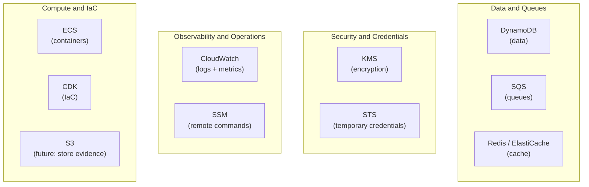
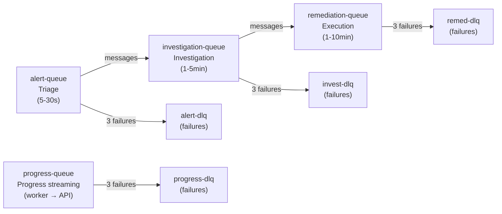
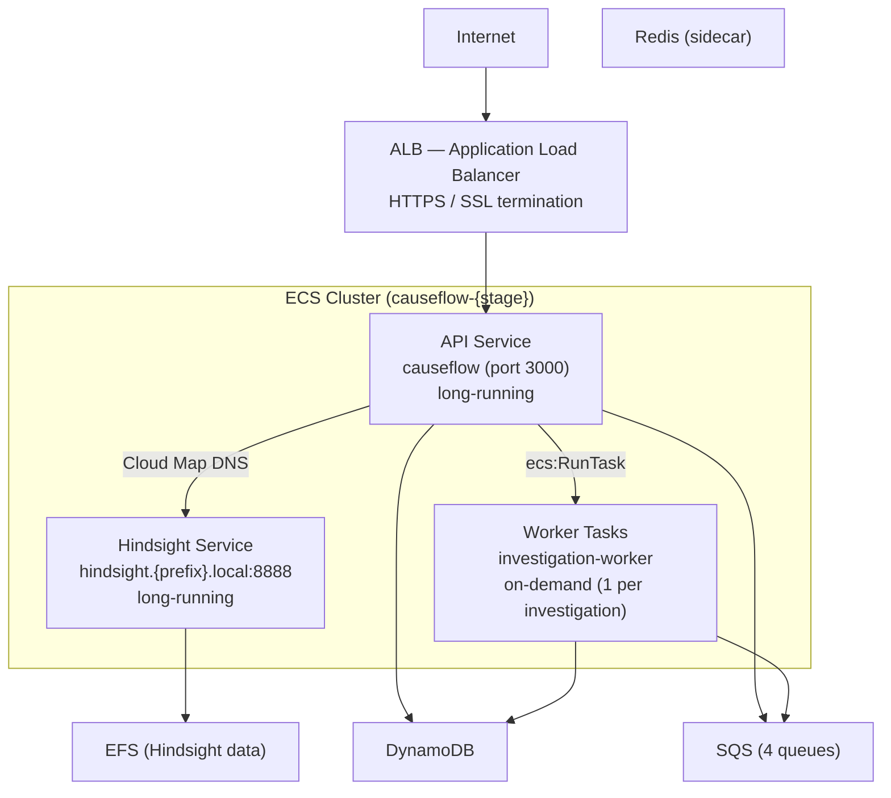

# 09 — AWS Infrastructure

[< Back to index](./00-index.md) | [Previous: Security](./08-security.md) | [Next: Local Environment >](./10-local-environment.md)

---

## AWS Services Used



---

## DynamoDB

### What is it?
AWS's serverless NoSQL database. You don't manage servers — you just use it.

### How CauseFlow uses it:
- **Single table:** `causeflow` (Single Table Design)
- **Billing:** PAY_PER_REQUEST (pay per operation, not per hour)
- **Latency:** < 10ms per operation

### Estimated Cost:
| Operation | Price |
|-----------|-------|
| Write | $1.25 per million writes |
| Read | $0.25 per million reads |
| Storage | $0.25/GB/month |

For 100 incidents/month: ~$0.50/month (very cheap)

### In CDK Infrastructure:
```typescript
// infra/cdk/lib/causeflow-stack.ts (simplified)
const table = new dynamodb.Table(this, 'CauseFlowTable', {
  tableName: `causeflow-${stage}`, // e.g. causeflow-staging, causeflow-production
  partitionKey: { name: 'pk', type: dynamodb.AttributeType.STRING },
  sortKey: { name: 'sk', type: dynamodb.AttributeType.STRING },
  billingMode: dynamodb.BillingMode.PAY_PER_REQUEST,
  // + 3 GSIs
});
```

---

## SQS (Queues)

### What are they?
Message queues. They allow the system to process tasks in the background
without blocking the HTTP response.

### 4 Queues + 4 DLQs (Dead Letter Queues):



The `progress-queue` (visibility timeout 300s) is used for streaming investigation progress from the worker back to the API. It does not feed into another queue.

### DLQ (Dead Letter Queue)
If a message fails 3 times, it goes to the DLQ. This prevents a problematic message
from looping indefinitely.

**For maintenance:** Check the DLQs periodically. Messages in the DLQ
mean something failed and needs attention.

| Queue | Purpose | Visibility Timeout |
|-------|---------|-------------------|
| `alert-queue` | Incoming alert triage | default (30s) |
| `investigation-queue` | Investigation task dispatch | default (30s) |
| `remediation-queue` | Remediation execution | default (30s) |
| `progress-queue` | Investigation progress streaming (worker → API) | 300s |

### Estimated Cost:
$0.40 per million requests. For 100 incidents/month: ~$0.01/month

---

## Redis (ElastiCache)

### What is it?
Ultra-fast in-memory database. Used for:
1. **Rate limiting** — counting requests per tenant
2. **Cache** — frequently accessed data

### Cost:
| Type | Price |
|------|-------|
| cache.t3.micro | ~$13/month |
| cache.t3.small | ~$25/month |

**Note:** Redis is the only service with a fixed cost (not serverless).
For test/dev environments, a t3.micro can be used.

---

## KMS (Key Management Service)

### What is it?
Encryption key management service. CauseFlow uses it to
encrypt OAuth tokens (Notion, Shortcut, Trello).

### How it is used:
- One CMK (Customer Master Key): `alias/causeflow-token-encryption`
- Envelope encryption: KMS encrypts DEK → DEK encrypts token
- Cost: $1/month per key + $0.03 per 10,000 requests

---

## STS (Security Token Service)

### What is it?
Service that generates temporary AWS credentials. CauseFlow uses it to
access client infrastructure securely.

### Flow:
```
CauseFlow → STS AssumeRole → Temporary credentials (15min)
→ Agent uses credentials to access tenant's CloudWatch/ECS
→ Credentials expire automatically
```

### Cost: Free (included in the AWS account)

---

## CloudWatch

### Two Uses:

1. **CauseFlow's own logs** (internal observability)
   - Pino sends JSON logs to CloudWatch Logs
   - Use for debugging CauseFlow issues

2. **Tenant logs** (incident investigation)
   - AI agents query TENANTS' CloudWatch Logs
   - Via cross-account STS (temporary credentials)
   - CloudWatch Insights for complex queries

---

## CDK (Infrastructure as Code)

### What is it?
Framework for defining AWS infrastructure as TypeScript code.

### Main file:
`infra/cdk/lib/causeflow-stack.ts`

### Commands:
```bash
cd infra/cdk
cdk synth        # Generates CloudFormation template
cdk diff         # Shows pending changes
cdk deploy       # Applies changes to AWS
cdk destroy      # Removes everything (CAUTION!)
```

### What the stack creates:
- DynamoDB table (`causeflow-{stage}`) + 3 GSIs + PITR
- **4 SQS queues + 4 DLQs** (alerts, investigation, remediation, progress)
- KMS key (token encryption)
- ECS cluster + API service + Hindsight service (both long-running)
- **ECS Worker task definition** (investigation-worker, spawned on-demand — NOT a service)
- ALB (Application Load Balancer) + Route53 A record + ACM certificate
- VPC (2 AZs, 1 NAT gateway) + public/private subnets + security groups
- CloudWatch log groups + alarms (CPU high, 4× DLQ depth)
- IAM roles (execution + task) + **OIDC role** (GitHub Actions authentication)
- Secrets Manager references (25 secrets)
- **EFS file system** (Hindsight memory persistence: One Zone staging, Standard multi-AZ production)
- **Cloud Map private DNS namespace** (`{prefix}.local`) for internal service discovery
- ECR repository (stage-isolated: `causeflow-staging` / `causeflow-production`)

---

## OIDC (GitHub Actions Authentication)

CauseFlow's CI/CD pipeline uses **OpenID Connect** to authenticate GitHub Actions runners to AWS — no long-lived credentials are stored in GitHub secrets.

The CDK stack creates an IAM OIDC identity provider and a `DEPLOY_ROLE_ARN` role that GitHub Actions assumes via `aws-actions/configure-aws-credentials`. The role grants only the permissions needed to run `cdk deploy` (ECS, ECR, CloudFormation, Secrets Manager reads).

This replaces the previous approach of storing `AWS_ACCESS_KEY_ID` / `AWS_SECRET_ACCESS_KEY` in GitHub secrets.

---

## ECS Investigation Worker

### What is it?
Heavy investigations do not run inside the API container — they run in a **dedicated ECS Fargate task** spawned per incident. This isolates long-running LLM/agent work from the HTTP request path and lets each investigation get its own CPU/memory budget without starving the API.

### How it works:
1. API receives an alert → enqueues investigation into `investigation-queue` (SQS)
2. The orchestrator calls `RunTask` on the worker task definition (`{prefix}-worker` family)
3. ECS launches a Fargate task running `src/workers/investigation-worker.ts` with env vars:
   - `INCIDENT_ID`, `TENANT_ID`, `SUGGESTED_AGENTS`
4. The worker boots ONLY the deps it needs (no HTTP server, no SQS consumers, no SSE, no cron jobs)
5. The worker runs the investigation with a **10-minute hard timeout** (`INVESTIGATION_MAX_TIMEOUT_MS=600000`)
6. Progress is streamed back to the API via `publishProgressToSQS`
7. Task exits → Fargate reclaims the container

### Fallback:
If ECS worker is disabled (e.g., local dev, LocalStack), the investigation falls back to **in-process execution** inside the API container. Same code path, same use case, different runtime.

### Task definition (CDK):
```typescript
// infra/cdk/lib/causeflow-stack.ts
const workerTaskDef = new ecs.FargateTaskDefinition(this, 'WorkerTaskDef', {
  family: `${prefix}-worker`,
  cpu: 512,
  memoryLimitMiB: 1024,
});
workerTaskDef.addContainer('investigation-worker', {
  image: ecs.ContainerImage.fromEcrRepository(repository, `worker-${imageTag}`),
  containerName: 'investigation-worker',  // MUST match — referenced by RunTask
  essential: true,
  ...
});
```

### Why a separate task (not a separate service)?
- **On-demand:** Services run N tasks continuously. Investigations are bursty — you want 0 idle tasks when no incidents are firing.
- **Isolation:** One slow investigation cannot block another.
- **Cost:** Fargate is billed per-second; idle workers would burn money.

---

## Hindsight Service (Agent Memory)

### What is it?
**Hindsight** (ghcr.io/vectorize-io/hindsight) is the memory engine CauseFlow agents use to remember observations, reflections, and prior investigations across incidents. It is self-hosted as an **internal ECS Fargate service**.

### Deployment:
- Fargate service `{prefix}-hindsight`, 1 vCPU / 2 GB, single task
- **No public IP** — only reachable from the API security group
- Exposed via Cloud Map private DNS: `hindsight.{prefix}.local:8888` (API) and `:9999` (debug UI)
- Logs to `/ecs/{prefix}-hindsight` CloudWatch log group
- Secrets (`HINDSIGHT_API_LLM_API_KEY`, `HINDSIGHT_API_KEY`) come from AWS Secrets Manager
- The API container reads `HINDSIGHT_BASE_URL=http://hindsight.{prefix}.local:8888`

### Status:
The Hindsight ECS service definition lives in `infra/cdk/lib/causeflow-stack.ts` and **may be commented out in some stages**. When disabled, agents fall back to a stub memory adapter. To enable: create the `causeflow-{stage}/hindsight-secrets` secret, uncomment the service block, and redeploy.

### Storage

Hindsight's PostgreSQL data (`/home/hindsight/.pg0`) is persisted via **EFS**:

- **Staging:** EFS One Zone (`causeflow-staging-hindsight-fs`) — data survives restarts. Memory banks are recreatable if the EFS is deleted.
- **Production:** EFS Standard multi-AZ (`causeflow-production-hindsight-fs`), `removalPolicy: RETAIN` — data is preserved even if the stack is destroyed.

---

## External Dependencies (non-AWS)

CauseFlow depends on several **critical external services** that are not part of the AWS stack but are required for the system to function. Outages or credential failures in these services degrade or block CauseFlow.

| Service | Purpose | Failure impact |
|---------|---------|----------------|
| **Clerk** | Identity provider (auth, users, organizations, JWT) | No login, no API auth — full block |
| **Stripe** | Subscriptions, billing, and per-investigation usage metering | Billing stops, metering gap — degraded |
| **Composio** | Broker for 3rd-party integrations (Notion, Shortcut, Trello, Slack, etc.) used as agent tools | Tool-requiring investigations fail — degraded |
| **Hindsight** | Agent memory HTTP API (self-hosted on ECS, see above) | Agents lose cross-incident memory — degraded |
| **Langfuse** | LLM observability (traces, prompts, evals, cost tracking) | No observability — non-blocking |
| **Anthropic API** | Claude models used by all agents and the orchestrator | No investigations possible — full block |

### Credentials:
All external service credentials are stored in **AWS Secrets Manager** (`causeflow-{stage}/*`) and injected into ECS tasks as `ecs.Secret` — never committed to the repo, never exposed as plain env vars.

### Health checks:
The API `/health` endpoint pings each external dependency on a best-effort basis. Failures are logged to CloudWatch and surfaced on the status dashboard, but do not cause the ECS task to be marked unhealthy (to avoid cascading restarts when an upstream is down).

---

## Estimated Monthly Costs (Full Environment)

### Production (enterprise, 200 incidents/month)

| Service | Estimate |
|---------|----------|
| DynamoDB (PAY_PER_REQUEST) | ~$5/month |
| SQS | ~$1/month |
| Redis (ElastiCache t3.small) | ~$25/month |
| KMS | ~$2/month |
| ECS Fargate (2 tasks) | ~$70/month |
| ALB | ~$22/month |
| CloudWatch Logs | ~$10/month |
| Claude API (AI) | ~$120-300/month |
| **TOTAL** | **~$255-435/month** |

### Development/Test (LocalStack)

| Service | Estimate |
|---------|----------|
| EC2 t3.small (LocalStack + app) | ~$15/month |
| Claude API (manual tests) | ~$5/month |
| **TOTAL** | **~$20/month** |

---

## Production Deployment Diagram



[Next: Local Environment >](./10-local-environment.md)
