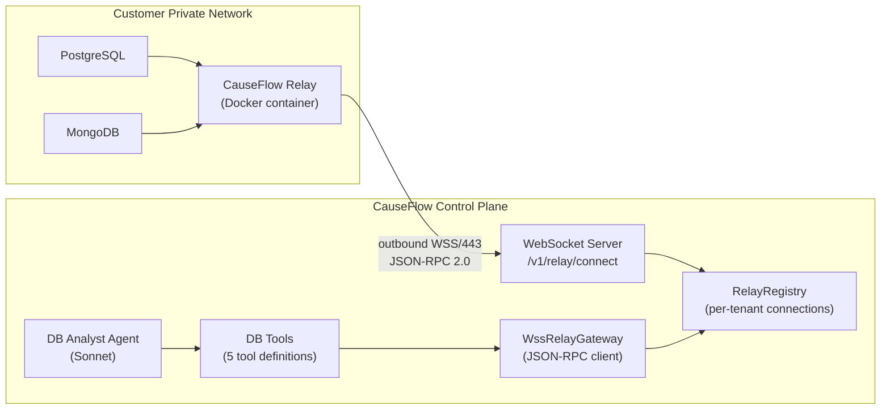
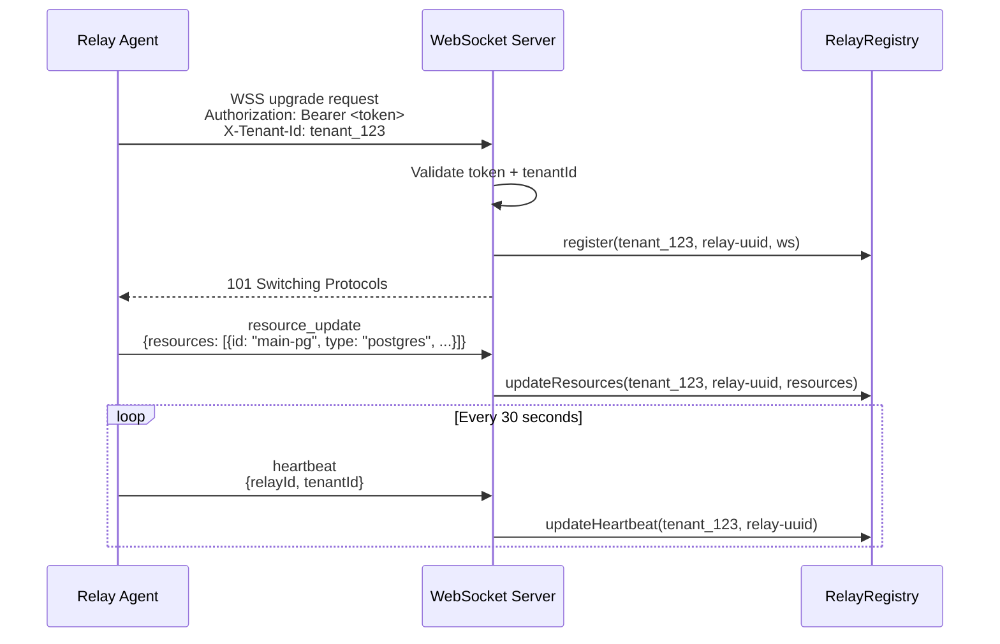
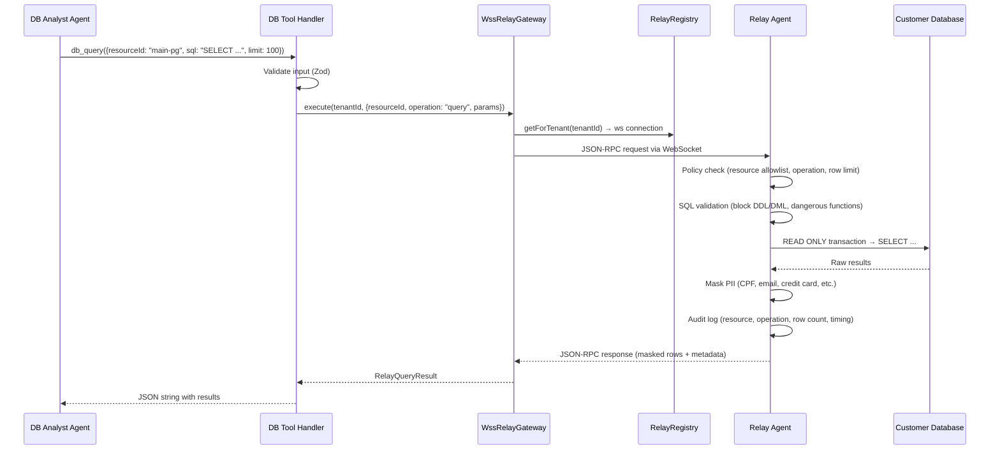
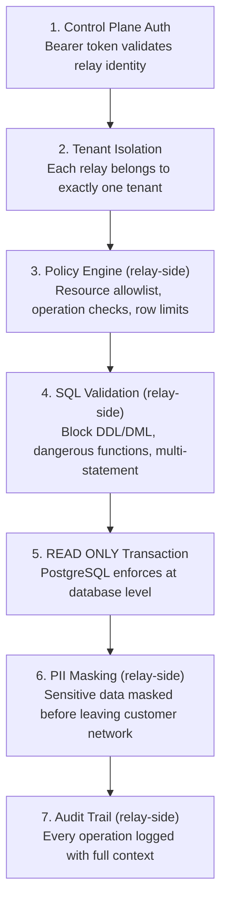

# 13 — Relay Integration

[< Back to index](./00-index.md) | [Previous: Production Maintenance](./12-production-maintenance.md)

---

## What is the Relay?

The Relay is a lightweight agent deployed **inside the customer's private network** that gives CauseFlow's AI investigation agents secure, read-only access to customer databases (PostgreSQL, MongoDB). It lives as a [git submodule](../../relay/) with its own codebase, Docker image, and release cycle.

> The relay exists because customer databases are in private networks (VPCs, on-prem) that the CauseFlow SaaS backend cannot reach directly. Instead of asking customers to expose their databases to the internet, we deploy a small container inside their network that calls out to us.

### Design Principles

| Principle | What it means |
|-----------|---------------|
| **Zero Inbound** | The relay initiates all connections outbound (WSS/443). No firewall rules, no VPN, no port exposure |
| **Read-Only** | Only SELECT (Postgres) and find (MongoDB). Enforced by SQL parser, READ ONLY transactions, and policy engine |
| **Zero Persistence** | No customer data is stored on disk. Everything in memory, discarded after use |
| **PII Masking** | Sensitive data is masked inside the relay before it leaves the customer's network |
| **Least Privilege** | Container runs as non-root, read-only filesystem, all Linux capabilities dropped |

---

## Architecture Overview



**Two independent codebases, one WebSocket connection:**

| Side | Codebase | Responsibility |
|------|----------|---------------|
| **Relay** (customer network) | `relay/` submodule | Connect to control plane, receive queries, enforce policy, mask PII, execute against local databases, return results |
| **Control Plane** (CauseFlow) | `src/shared/infra/relay/` | Accept relay connections, track health, route RPC requests from agents to the correct tenant's relay, correlate responses |

---

## Control Plane Components

Four files implement the control plane side of the relay integration:

### RelayRegistry (`src/shared/infra/relay/relay-registry.ts`)

Maintains a map of `tenantId -> relayId -> RelayConnection`. Each connection tracks:

```typescript
interface RelayConnection {
  relayId: string;        // UUID assigned on connect
  tenantId: string;       // Which tenant owns this relay
  ws: WebSocket;          // The live WebSocket connection
  healthy: boolean;       // Set to false if heartbeat is stale
  lastHeartbeat: number;  // Timestamp of last heartbeat
  resources: RelayResource[];  // Cached list of available databases
}
```

**Health monitoring**: A background interval runs every 30 seconds. If a relay hasn't sent a heartbeat for 90 seconds (3x the heartbeat interval), it is marked unhealthy and the WebSocket is closed.

### RelayWSServer (`src/shared/infra/relay/relay-ws-server.ts`)

A `noServer` WebSocket upgrade handler attached to the HTTP server. Handles:

1. **Authentication** — Bearer token in `Authorization` header (or `token` query param) must match the configured secret
2. **Tenant identification** — `X-Tenant-Id` header (or `tenantId` query param)
3. **Message routing** — Heartbeats update the registry, resource updates cache the database list, JSON-RPC responses are dispatched to the gateway's pending map

### WssRelayGateway (`src/shared/infra/relay/relay-gateway.ts`)

Implements the `IRelayGateway` port interface. Sends JSON-RPC requests to the relay via the WebSocket and correlates responses using request IDs.

```typescript
interface IRelayGateway {
  isConnected(tenantId: TenantId): boolean;
  listResources(tenantId: TenantId): Promise<RelayResource[]>;
  execute(tenantId: TenantId, command: RelayCommand): Promise<RelayQueryResult>;
  describeResource(tenantId: TenantId, resourceId: string): Promise<{...}>;
}
```

**Timeout**: Each RPC request has a 30-second timeout. If the relay doesn't respond, the promise rejects with a timeout error.

### RelayProtocol (`src/shared/infra/relay/relay-protocol.ts`)

Defines the JSON-RPC 2.0 contract and Zod schemas for validation:

- `RelayRpcRequest` / `RelayRpcResponse` — request/response types
- `relayHeartbeatSchema`, `relayResourceUpdateSchema` — relay-initiated message validation
- `createRpcRequest()`, `parseRelayMessage()` — helpers

---

## How the Relay Connects



On disconnect (network failure, relay shutdown), the registry unregisters the connection. The relay has built-in auto-reconnect with exponential backoff.

---

## How Agents Query Databases

When the Investigation module spawns agents for an incident, it checks if a relay is connected for the tenant. If so, the **DB Analyst** agent is automatically added to the investigation team.

### Agent Activation (Conditional)

In `investigate-incident.usecase.ts`:

```typescript
// If relay is connected, add DB analyst to the agent roster
if (this.relayGateway?.isConnected(tenantId)) {
  subAgents.push(DB_ANALYST_CONFIG);
}
```

No relay? No DB analyst. The investigation proceeds with other agents (logs, metrics, code, infra). No errors, no degradation.

### DB Tools

The DB Analyst agent has 5 tools available, defined in `src/modules/investigation/infra/db-tools.ts`:

| Tool | Operation | What it does |
|------|-----------|-------------|
| `db_list_resources` | - | List all databases available via the relay (Postgres, MongoDB) |
| `db_list_tables` | `list_tables` | List tables/collections in a specific database |
| `db_describe_table` | `describe_table` | Get schema: columns, types, constraints, indexes |
| `db_query` | `query` | Execute a read-only query (SELECT for Postgres, find for MongoDB). Default limit: 100, max: 1000 |
| `db_explain` | `explain` | EXPLAIN ANALYZE for query performance diagnosis |

### Query Flow (End-to-End)



### DB Analyst Agent Profile

| Property | Value |
|----------|-------|
| **Role** | `db_analyst` |
| **Model** | Sonnet (configurable via `ANTHROPIC_DB_ANALYST_MODEL`) |
| **Max turns** | 10 per investigation |
| **Tools** | 5 DB tools + `get_incident_details` + memory tools (`recall_past_incidents`, `remember_finding`, `get_service_topology`, `get_recent_changes`, `check_remediation_history`) |

**Investigation strategy** (from system prompt):

1. Start with `db_list_resources` to discover available databases
2. Use `db_list_tables` and `db_describe_table` to understand schema before querying
3. Look for data anomalies: negative values, orphaned records, duplicates
4. Check for race conditions: concurrent modifications, cache/source mismatches
5. Use `db_explain` for transaction safety analysis (locking, index usage)
6. Build a timeline with `ORDER BY timestamp DESC`

---

## Bootstrap Wiring

The relay integration is **conditionally wired** in `bootstrap.ts` and `main.ts`.

### In `main.ts` (server startup)

```typescript
// Only initialize if relay is enabled
if (config.relay.enabled) {
  const registry = new RelayRegistry();
  const relayGateway = new WssRelayGateway(registry);

  // Pass gateway to bootstrap for dependency injection
  const ctx = bootstrap({ relayGateway });

  // Attach WebSocket upgrade handler to HTTP server
  createRelayWSServer(server, registry, config.auth.jwtSecret, config.relay.wsPath);

  // Register shutdown hook
  onShutdown(() => registry.shutdown());
}
```

### In `bootstrap.ts` (composition root)

```typescript
// relayGateway is optional — undefined when relay is disabled
relayGateway: overrides?.relayGateway,

// Passed to InvestigateIncidentUseCase
new InvestigateIncidentUseCase(
  // ... other deps
  relayGateway,  // undefined is fine — use case checks isConnected()
)
```

### In `app.ts` (HTTP routes)

```typescript
// Relay status endpoint only registered when relay is available
if (ctx.relayGateway) {
  app.route('/v1/relay', createRelayRoutes(ctx.relayGateway));
}
```

---

## Configuration

### Environment Variables

| Variable | Default | Description |
|----------|---------|-------------|
| `RELAY_ENABLED` | `false` | Enable relay infrastructure (WebSocket server, registry, gateway) |
| `RELAY_WS_PATH` | `/v1/relay/connect` | WebSocket upgrade path for relay connections |

### HTTP Endpoints

| Method | Path | Auth | Description |
|--------|------|------|-------------|
| `GET` | `/v1/relay/status` | JWT | Returns connection status and available resources for the authenticated tenant |

**Response**:

```json
{
  "connected": true,
  "resources": [
    {
      "resourceId": "main-pg",
      "type": "postgres",
      "name": "Main PostgreSQL",
      "database": "appdb",
      "readOnly": true
    }
  ]
}
```

---

## Security Layers

The relay integration implements defense in depth — multiple independent layers that each enforce constraints:



**Key security property**: Layers 3-7 run inside the customer's network, on the relay. Even if the control plane is compromised, the relay's local policy engine rejects unauthorized queries.

### What Gets Blocked

| Attack | Where blocked | How |
|--------|---------------|-----|
| SQL injection (`DROP TABLE`) | Relay SQL parser | AST validation rejects non-SELECT statements |
| Dangerous functions (`pg_sleep`, `dblink`) | Relay SQL parser | Function name blocklist |
| Read unauthorized table | Relay policy engine | Resource allowlist check |
| Exfiltrate large datasets | Relay policy engine | `maxRowsPerQuery` enforced |
| PII exfiltration | Relay masking engine | Regex patterns mask before data leaves network |
| Unauthorized relay connection | Control plane WS server | Bearer token + tenantId validation |
| Stale relay impersonation | Control plane registry | 90-second heartbeat timeout |

---

## Testing

### Smoke Tests

The smoke test suite (`tests/smoke/scenarios/relay-db.smoke.test.ts`) uses a **test relay client** that simulates a real relay container:

```typescript
// tests/smoke/helpers/test-relay-client.ts
const testRelay = await connectTestRelay(port, tenantId, token);
// Registers mock resources: order-postgres, order-mongo
// Responds to JSON-RPC with realistic test data:
//   - Products table (with negative stock for anomaly detection testing)
//   - Orders table (with concurrent orders for race condition testing)
//   - Customers table (with PII for masking testing)
```

This allows end-to-end testing of the full relay flow (agent -> tools -> gateway -> WS -> relay -> response) without requiring real databases.

### What to Test When Modifying Relay Code

| Change | Test level | Command |
|--------|-----------|---------|
| Relay submodule (drivers, policy, masking) | Unit tests in `relay/` | `cd relay && npm test` |
| Control plane integration (gateway, registry, WS server) | Integration tests | `pnpm test:integration` |
| DB tools or agent config | Smoke tests | `pnpm test:smoke` |
| Full pipeline (agent investigates with DB access) | E2E tests | `pnpm test:e2e` |

---

## Relay Submodule

The relay lives in `relay/` as a git submodule pointing to the `causeflow/causeflow-relay` repository. It has its own:

- `package.json` (dependencies: ws, pg, mongodb, node-sql-parser, zod, pino)
- `tsconfig.json`
- `Dockerfile` (multi-stage build, non-root user)
- Release cycle and versioning

### Submodule Operations

```bash
# Update to latest relay version
git submodule update --remote relay

# After cloning the repo (submodule not initialized)
git submodule init && git submodule update
```

For the full relay documentation (configuration, drivers, security model, deployment options), see the [Relay README](../../relay/README.md).

---

## Graceful Degradation

The relay is **fully optional**. When not connected:

| Component | Behavior |
|-----------|----------|
| Investigation module | Skips DB Analyst agent. Other agents (logs, metrics, code, infra) still run |
| Bootstrap | `relayGateway` is `undefined`. No errors |
| HTTP routes | `/v1/relay` routes are not registered. 404 for relay endpoints |
| Agent roster | `db_analyst` not included in sub-agents list |

This follows the same pattern as other optional integrations (GitHub App, Notion, Shortcut): agents only activate when their integration is connected.
