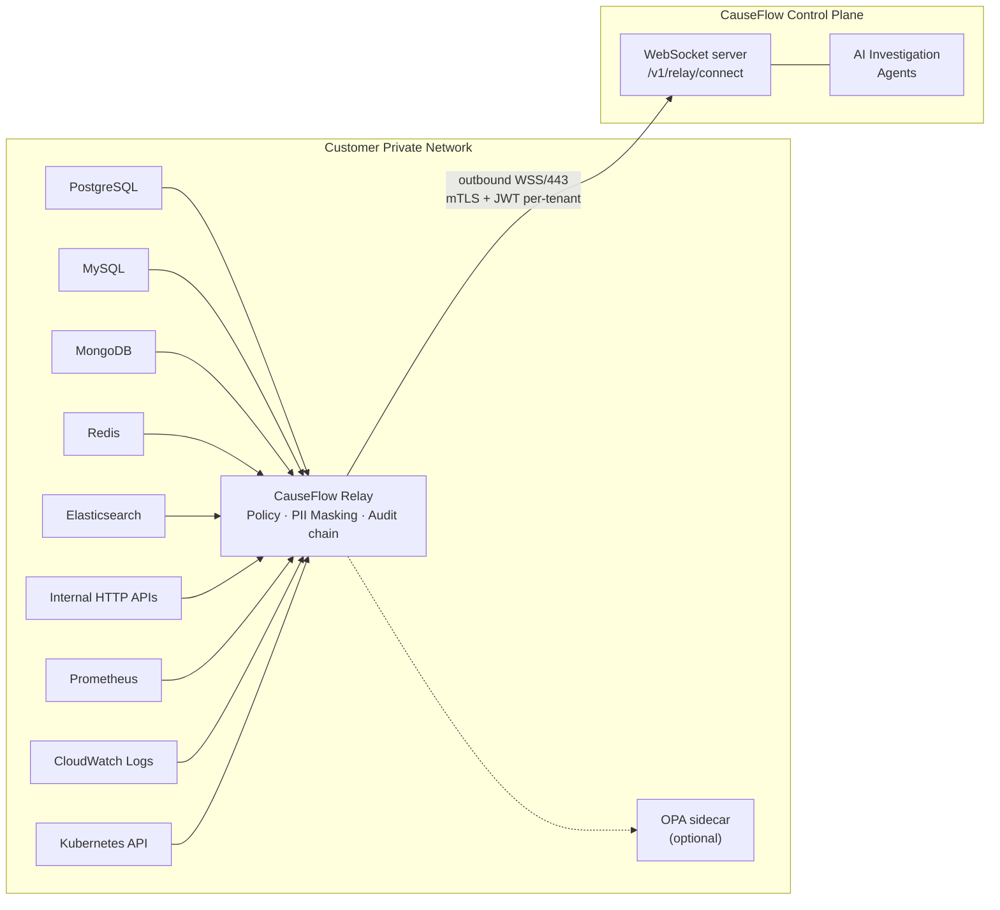

# CauseFlow Relay

**Secure, read-only investigation relay for customer private networks.** The CauseFlow Relay is a lightweight agent deployed inside the customer's network (VPC, on-prem, any private environment). It establishes an outbound-only WebSocket connection to the CauseFlow control plane — **no inbound ports, no firewall rules needed** — and exposes a curated, policy-gated, PII-masked read interface to the customer's data sources.

## How It Works



Every request from the AI agent is validated, policy-checked, executed with read-only semantics, PII-masked, and audited **locally** before any bytes leave the customer's network.

## Key Properties

| Property | Details |
|---|---|
| **Zero Inbound** | All traffic outbound to port 443. No firewall rules, no public endpoints |
| **Read-Only** | SELECT-only SQL (parsed to AST), `find`/safe aggregations for Mongo, `GET`/`HEAD` for HTTP, `get`/`list` for Kubernetes, read subset for Redis |
| **Per-Tenant JWT Auth** | Control plane issues short-lived per-tenant JWT. No shared global secret |
| **mTLS opt-in** | mutual TLS with SHA-256 certificate pinning of the control plane |
| **PII Masking** | 17 built-in detectors (BR + global) with validator checks. Per-column rules + FPE correlation option |
| **Policy as Code** | Local engine for basic rules, OPA sidecar for Rego-based policies |
| **Tamper-evident Audit** | SHA-256 hash-chain + HMAC signatures, forwarded to control plane |
| **Secret Providers** | AWS Secrets Manager, Azure Key Vault, GCP Secret Manager, HashiCorp Vault, env vars |
| **Break-glass** | Customer can instantly revoke access via HTTP POST + shared secret |
| **Plugin System** | Drop a custom driver in `/app/plugins/` — no fork required |
| **Observability** | Prometheus `/metrics`, `/healthz`, `/readyz`, structured JSON logs |
| **Container Hardening** | Distroless, non-root UID, read-only FS, all Linux caps dropped |

---

## Quick Start

### 1. Prerequisites

| Tool | Version |
|---|---|
| Docker | ≥ 20 (or Kubernetes, or a plain VM) |
| CauseFlow tenant with relay enabled | — |
| Network egress to `wss://<your-causeflow-host>:443` | — |

### 2. Get a relay token from the CauseFlow dashboard

Settings → **Relay** → **Generate token**.

Under the hood this calls:

```bash
POST /v1/relay/tokens
Authorization: Bearer <your-causeflow-session-jwt>

Response:
{
  "token": "eyJhbGciOi...",   # JWT, per-tenant, TTL up to 7 days
  "relayId": "c3a1...",
  "expiresInSeconds": 86400
}
```

Save the token somewhere safe (your secret manager — the relay can read it from there).

### 3. (Optional) Verify the image before running

```bash
./scripts/verify-image.sh causeflowai/relay:latest \
  "https://github.com/causeflow/relay/.github/workflows/release.yml@refs/heads/main" \
  "https://token.actions.githubusercontent.com"
```

This validates the image was built by the official GitHub Actions release pipeline and not tampered with. See [Trust & Provenance](#trust--provenance).

### 4. Write `relay-config.yaml`

Copy the example and adjust:

```bash
cp relay-config.example.yaml relay-config.yaml
```

Minimal config:

```yaml
transport:
  kind: wss
  url: wss://app.causeflow.ai/v1/relay/connect
  tenantId: ${TENANT_ID}
  tokenRef: env:RELAY_TOKEN

resources:
  - id: main-pg
    type: postgres
    name: Main PostgreSQL
    connection:
      host: ${PG_HOST}
      port: '5432'
      database: ${PG_DATABASE}
      user: ${PG_USER}
      password: aws-sm:prod/relay/pg#password
    allowedOperations: [query, describe_table, list_tables, explain]
    maxRowsPerQuery: 1000

masking:
  enabled: true

audit:
  enabled: true
```

See [Configuration reference](#configuration-reference) below for the full schema.

### 5. Run with Docker

```bash
docker run -d \
  --name causeflow-relay \
  --restart unless-stopped \
  -v $(pwd)/relay-config.yaml:/app/relay-config.yaml:ro \
  -e TENANT_ID=<your-tenant-id> \
  -e RELAY_TOKEN=<token-from-step-2> \
  -e PG_HOST=your-db-host \
  -e PG_DATABASE=yourdb \
  -e PG_USER=readonly_user \
  --memory=512m \
  --cpus=0.5 \
  --read-only \
  --tmpfs /tmp:size=64m \
  --security-opt no-new-privileges \
  --cap-drop ALL \
  causeflowai/relay:latest
```

The relay connects outbound, appears in your tenant's dashboard within seconds.

### 6. Verify

```bash
curl https://app.causeflow.ai/v1/relay/status \
  -H "Authorization: Bearer <your-causeflow-session-jwt>"

# { "connected": true, "resources": [ { "resourceId": "main-pg", ... } ] }
```

---

## Deployment: Docker Compose (with OPA sidecar)

If you want [OPA](https://www.openpolicyagent.org/) for Rego-based policy-as-code (recommended for prod):

```bash
docker compose up -d
```

`docker-compose.yml` (shipped) spins up:
- `relay` — the agent itself (port 8080 bound to localhost for metrics/health)
- `opa` — OPA server loading `./policies/*.rego` on port 8181

Set `policy.engine: opa` in `relay-config.yaml` to route decisions through it. The local engine stays as fallback if OPA is unreachable and `failClosed: false`.

### Kubernetes

Example `Deployment` skeleton:

```yaml
apiVersion: apps/v1
kind: Deployment
metadata: { name: causeflow-relay }
spec:
  replicas: 1
  selector: { matchLabels: { app: causeflow-relay } }
  template:
    metadata: { labels: { app: causeflow-relay } }
    spec:
      automountServiceAccountToken: true     # needed only for k8s driver
      containers:
        - name: relay
          image: causeflowai/relay:0
          args: []
          ports:
            - { name: metrics, containerPort: 8080 }
          env:
            - { name: TENANT_ID, value: "tid_..." }
            - name: RELAY_TOKEN
              valueFrom: { secretKeyRef: { name: causeflow-relay, key: token } }
          volumeMounts:
            - { name: config, mountPath: /app/relay-config.yaml, subPath: relay-config.yaml, readOnly: true }
          livenessProbe:  { httpGet: { path: /healthz, port: metrics }, periodSeconds: 30 }
          readinessProbe: { httpGet: { path: /readyz,  port: metrics }, periodSeconds: 10 }
          securityContext:
            runAsNonRoot: true
            runAsUser: 65532
            readOnlyRootFilesystem: true
            allowPrivilegeEscalation: false
            capabilities: { drop: [ALL] }
          resources: { limits: { memory: 512Mi, cpu: 500m } }
      volumes:
        - name: config
          configMap: { name: causeflow-relay-config }
```

---

## Configuration reference

The full schema lives in `src/config/schema.ts`. Highlights:

### `transport`
```yaml
transport:
  kind: wss                      # or 'azure-relay' (beta)
  url: wss://app.causeflow.ai/v1/relay/connect
  tenantId: ${TENANT_ID}
  tokenRef: env:RELAY_TOKEN      # see "Secret references"
  mtls:
    enabled: false
    certRef: aws-sm:relay/cert
    keyRef:  aws-sm:relay/key
    caRef:   aws-sm:relay/ca
  pinnedSha256: a1b2c3...        # optional — SHA-256 of control-plane cert
  reconnect:
    initialDelayMs: 1000
    maxDelayMs: 30000
    jitterRatio: 0.2
  replayWindow:
    enabled: true
    ttlMs: 300000                # 5 min — drops RPC IDs seen twice
    maxEntries: 10000
```

### `resources`
One entry per data source. Nine types:

| `type` | What it is | Operations |
|---|---|---|
| `postgres` | PostgreSQL (connection pool, READ ONLY txn, AST-validated SQL) | query, describe_table, list_tables, explain |
| `mysql` | MySQL / MariaDB (MAX_EXECUTION_TIME, AST SELECT only) | query, describe_table, list_tables, explain |
| `mongodb` | MongoDB (aggregation stage allowlist, deep operator validation) | query, describe_table, list_tables, explain |
| `redis` | Redis (read-only subset: GET, HGET, SCAN, INFO, ...) | query, describe_table (SCAN), list_tables (INFO) |
| `elasticsearch` | Elasticsearch / OpenSearch (body key allowlist) | query, describe_table (mapping), list_tables |
| `http` | Generic HTTP (GET/HEAD, path regex allowlist) | query, list_tables |
| `prometheus` | PromQL instant and range queries | query, query_range, list_tables (metrics) |
| `cloudwatch` | AWS CloudWatch Logs Insights | query, list_tables (log groups) |
| `kubernetes` | Kubernetes API (get/list/watch only) | query, list_tables (api resources) |

Per-resource policy knobs:

```yaml
- id: main-pg
  type: postgres
  name: Main PostgreSQL
  connection:
    host: env:PG_HOST
    port: '5432'
    database: env:PG_DATABASE
    user: env:PG_USER
    password: aws-sm:prod/relay/pg#password
  allowedOperations: [query, describe_table, list_tables, explain]
  allowedTables: []            # empty = allow all (blocklist still applies)
  blockedTables: [users_private, kms_keys]
  maxRowsPerQuery: 1000
  statementTimeoutMs: 30000
  schema: public
  rateLimit:
    requestsPerMinute: 120
    burstCapacity: 20
  approvalThresholds:
    rowCount: 5000             # queries above this trigger approval
    sensitiveTables: [payment_tokens, patient_records]
  columnRules:
    - { table: users, column: email, action: fpe, classification: pii }
    - { table: users, column: ssn,   action: drop, classification: pii }
```

### `masking`
```yaml
masking:
  enabled: true
  detectors:
    cpf: true
    cnpj: true
    rg: true
    pis: true
    pix: true
    email: true
    phone: true
    creditCard: true
    bearer: true
    jwt: true
    awsKeys: true
    gcpKeys: true
    pem: true
    iban: true
    ipv4: false
    ipv6: false
  fpe:
    enabled: true              # format-preserving via HMAC — pseudonymize for correlation
    keyRef: aws-sm:prod/relay/fpe-key
  redactPaths:
    - '*.password'
    - '*.secret'
    - 'headers.authorization'
  patterns:
    - name: internal_user_id
      regex: 'USR-\d{8}'
      replacement: 'USR-********'
      classification: business
```

Built-in detectors apply **checksum validation** (Luhn, CPF/CNPJ mod 11, IBAN mod-97) — cuts false positives vs naive regex.

### `audit`
```yaml
audit:
  enabled: true
  level: info
  hashChain:
    enabled: true              # SHA-256 chain linking + HMAC signature per entry
    hmacKeyRef: aws-sm:prod/relay/audit-hmac
  forward:
    enabled: true
    bufferPath: /tmp/relay-audit-buffer
    batchSize: 50
    flushIntervalMs: 5000
```

On-disk buffer survives container restarts. Entries are forwarded to the control plane in batches; a failed flush re-queues without losing the chain.

### `policy`
```yaml
policy:
  engine: local                # or 'opa'
  opa:
    url: http://localhost:8181
    packagePath: relay.authz
    cacheTtlMs: 30000
    failClosed: true
    timeoutMs: 500
```

When `engine: opa`, the relay `POST`s the request payload to OPA at `/v1/data/<packagePath>` and expects `{ allowed, reason?, requiresApproval?, clampRowLimit? }`. A Rego bundle example lives in `policies/relay-authz.rego`.

### `observability`
```yaml
observability:
  http:
    enabled: true
    port: 8080
  metrics:
    enabled: true
  tracing:
    enabled: false
    otlpEndpoint: http://otel-collector:4318
```

- `GET /healthz` — liveness (always 200 if process alive)
- `GET /readyz` — readiness (200 only when connected to control plane)
- `GET /metrics` — Prometheus format

### `session`
```yaml
session:
  timeBoxed:
    enabled: false
    requireActiveIncident: false   # when true, relay refuses queries without incidentId
  breakGlass:
    enabled: true
    controlEndpointPath: /break-glass
    sharedSecretRef: env:BREAK_GLASS_SECRET
```

### `plugins`
```yaml
plugins:
  directory: /app/plugins
```

Any `.js`/`.mjs` file in this directory that `export default` a `DriverFactory` gets registered at boot. See [`src/drivers/driver.port.ts`](src/drivers/driver.port.ts).

---

## Secret references

Any YAML string starting with a recognized scheme is resolved at startup:

| Scheme | Example | Resolves to |
|---|---|---|
| `env:` | `env:RELAY_TOKEN` | `process.env.RELAY_TOKEN` |
| `plain:` | `plain:xyz123` | literal `xyz123` (use sparingly) |
| `aws-sm:` | `aws-sm:prod/relay/pg#password` | AWS Secrets Manager; optional `#key` extracts from a JSON secret |
| `azure-kv:` | `azure-kv:mysecret` | Azure Key Vault (needs `AZURE_KEY_VAULT_URL` env) |
| `gcp-sm:` | `gcp-sm:projects/p/secrets/n/versions/latest` | GCP Secret Manager |
| `vault:` | `vault:secret/data/relay#password` | HashiCorp Vault (needs `VAULT_ADDR` + `VAULT_TOKEN`) |

The AWS / Azure / GCP SDKs are **optional dependencies**. They're only loaded when you actually use the corresponding scheme.

---

## Break-glass

The customer can revoke access instantly, at any time:

```bash
curl -X POST http://localhost:8080/break-glass \
  -H "x-break-glass-secret: <BREAK_GLASS_SECRET>" \
  -H "content-type: application/json" \
  -d '{ "reason": "incident response — data engineering team reviewing" }'
```

The relay stays process-alive but refuses every query with a `session denied` error. The audit trail records the trip event. Reset requires restart.

---

## Communication protocol

JSON-RPC 2.0 over a single persistent WebSocket.

### Request (control plane → relay)

```json
{
  "jsonrpc": "2.0",
  "id": "req-uuid",
  "method": "execute",
  "params": {
    "resourceId": "main-pg",
    "operation": "query",
    "params": {
      "sql": "SELECT id, status FROM orders WHERE created_at > now() - interval '1h'",
      "limit": 100
    },
    "incidentId": "inc-abc"
  },
  "nonce": "uuid",
  "issuedAt": 1712345678901
}
```

### Response (relay → control plane)

```json
{
  "jsonrpc": "2.0",
  "id": "req-uuid",
  "result": {
    "rows": [{ "id": "ord-001", "status": "failed" }],
    "rowCount": 1,
    "fields": [{ "name": "id", "type": "varchar" }],
    "executionTimeMs": 12,
    "masked": true,
    "maskedFieldCount": 3,
    "detections": [{ "detector": "email", "count": 2 }, { "detector": "cpf", "count": 1 }]
  }
}
```

### RPC methods

| Method | Description |
|---|---|
| `execute` | Run a single operation on a resource. Payload depends on driver |
| `list_resources` | List all configured resources for this tenant |
| `describe_resource` | List tables/collections for a given resource |
| `health_check` | Check reachability of every configured resource |

### Relay-initiated messages

| Type | Interval | Purpose |
|---|---|---|
| `heartbeat` | 30 s | Liveness signal to control plane |
| `resource_update` | On connect + on config reload | Publishes resource catalog + driver capabilities |
| `audit_batch` | Per `forward.flushIntervalMs` | Hash-chained audit entries |
| `approval_request` | Per approval event | Queries that hit an approval threshold |

---

## Security

### AST-based SQL validation (PostgreSQL + MySQL)

The SQL parser walks the AST (not substring matching) and rejects:

- **Non-SELECT statements**: INSERT, UPDATE, DELETE, DROP, ALTER, CREATE, TRUNCATE, GRANT, REVOKE, COPY, CALL, DO, MERGE, LOCK, VACUUM, ANALYZE, CLUSTER, REINDEX, COMMENT
- **Dangerous functions** (detected by function-call node, not string match): `pg_sleep`, `pg_read_file`, `pg_write_file`, `pg_ls_dir`, `pg_stat_file`, `pg_terminate_backend`, `pg_cancel_backend`, `pg_reload_conf`, `dblink*`, `set_config`, `current_setting`, `copy_from_program`, and more
- **Multi-statement injection**: parser returns > 1 statement
- **Parametrized LIMIT**: the executor wraps your query in a subquery and applies `LIMIT $1::bigint` — SQL injection through `limit` is impossible

All queries run inside a `BEGIN READ ONLY` transaction with a per-resource `statement_timeout`.

### MongoDB validation

- Aggregation stages are on a **whitelist** (not blocklist): `$match, $project, $sort, $limit, $skip, $group, $count, $facet, $bucket, $bucketAuto, $unwind, $addFields, $set, $replaceRoot, $replaceWith, $sample, $sortByCount, $redact, $lookup, $graphLookup`
- **Blocked operators** anywhere in filters: `$where, $function, $accumulator, $expr`
- Collection names validated against `^[A-Za-z_][A-Za-z0-9_.-]*$`
- `maxTimeMS` enforced per query

### PII masking

| Detector | Validator | Classification |
|---|---|---|
| `cpf` | mod-11 checksum | pii |
| `cnpj` | mod-11 checksum | pii |
| `rg` | format | pii |
| `pis` | format | pii |
| `pix_random_key` | UUID format | pii |
| `email` | regex | pii |
| `phone_br` | length | pii |
| `credit_card` | Luhn | pci |
| `bearer_token` | regex | secret |
| `jwt` | three-segment b64 | secret |
| `aws_access_key` / `aws_secret_key` | regex | secret |
| `gcp_api_key` | regex | secret |
| `pem_block` | BEGIN/END markers | secret |
| `iban` | mod-97 | pci |
| `ipv4` / `ipv6` | regex (optional) | business |

Masking can be **format-preserving** (`action: fpe`) using an HMAC-derived deterministic pseudonym — same input yields same pseudonym, same length, same charset. Useful when the agent needs to correlate records across rows without seeing real values.

### Audit hash chain

Each audit entry contains:

```json
{
  "sequence": 42,
  "prevHash": "<sha256 of previous entry>",
  "entryHash": "<sha256 of {sequence, prevHash, payload}>",
  "signature": "<hmac-sha256(entryHash, hmacKey)>",
  "payload": { "timestamp": "...", "resource": "...", "operation": "...", "result": "...", ... }
}
```

Tampering with any entry breaks the chain; `AuditHashChain.verify()` exposes the first bad index. Entries are forwarded in batches and reconciled on the control plane for WORM storage.

### Container hardening

```
User:          nonroot UID (distroless base)
Filesystem:    --read-only
New privs:     --security-opt no-new-privileges
Capabilities:  --cap-drop ALL
Memory:        512m limit
CPU:           0.5 cores
/tmp:          tmpfs, 64 MiB (for audit buffer)
Network:       outbound only (port 443)
Signed:        cosign keyless (Sigstore) + SLSA provenance attestation
```

---

## Trust & Provenance

Every tagged release (`0.1.0+`) is:

1. Built by the official GitHub Actions [release.yml](.github/workflows/release.yml) on a clean runner.
2. Pushed to DockerHub as `causeflowai/relay:<version>` + `:<major>.<minor>` + `:<major>` + `:latest`.
3. (Forthcoming) Signed with [cosign](https://github.com/sigstore/cosign) in keyless mode using the workflow's OIDC identity.
4. (Forthcoming) Accompanied by a [SLSA provenance](https://slsa.dev) attestation.
5. (Forthcoming) Published with a [CycloneDX SBOM](https://cyclonedx.org) generated by [syft](https://github.com/anchore/syft).

Scripts live in `scripts/`: `sign-image.sh`, `sbom.sh`, `verify-image.sh`.

Before running the image in a production network, verify:

```bash
./scripts/verify-image.sh \
  causeflowai/relay:0 \
  "https://github.com/causeflow/relay/.github/workflows/release.yml@refs/heads/main" \
  "https://token.actions.githubusercontent.com"
```

---

## Observability

### Prometheus metrics (`GET /metrics`)

| Metric | Type | Labels |
|---|---|---|
| `causeflow_relay_queries_total` | counter | resource, operation, result |
| `causeflow_relay_query_errors_total` | counter | resource, operation, reason |
| `causeflow_relay_query_latency_ms` | histogram | resource, operation |
| `causeflow_relay_policy_denials_total` | counter | resource, reason |
| `causeflow_relay_masked_detections_total` | counter | detector, resource |
| `causeflow_relay_replayed_total` | counter | — |
| `causeflow_relay_rate_limited_total` | counter | resource |
| `causeflow_relay_approvals_total` | counter | resource, reason |
| `causeflow_relay_connected` | gauge | — |
| `causeflow_relay_resource_healthy` | gauge | resource, type |
| `causeflow_relay_audit_buffer_size` | gauge | — |

Plus default Node.js process metrics (memory, event loop lag, GC, etc.).

### Logs

Pino JSON. Every log line has at minimum `relayId`, `level`, `time`, and `msg`. Ship to your aggregator of choice.

---

## Configuration hot reload

Edit `relay-config.yaml` in place, then either:

- Send `SIGHUP`: `docker kill --signal=HUP causeflow-relay`, or
- Let the in-process file watcher pick up the change (debounced 500 ms)

Hot reload applies to masking patterns, policy rules, and rate limits. Transport-layer changes (URL, token, mTLS certs) still require a restart.

---

## Local development

```bash
npm install
npm run dev            # watch + reload via tsx
npm run typecheck
npm run test           # 46 unit tests (vitest)
npm run build          # emits dist/
```

Run the relay against a local CauseFlow dev instance by pointing `transport.url` at `ws://localhost:3000/v1/relay/connect` and minting a token with `POST /v1/relay/tokens` on that instance.

---

## File layout

```
relay/
├── src/
│   ├── index.ts                     # Orchestrator — wires every subsystem
│   ├── transport/                   # WSS client, replay cache, Azure Relay adapter
│   ├── auth/                        # JWT verifier (per-tenant)
│   ├── drivers/                     # postgres, mysql, mongodb, redis, elasticsearch,
│   │                                # http, prometheus, cloudwatch, kubernetes + plugin loader
│   ├── policy/                      # local engine + OPA client
│   ├── masking/                     # detectors, transforms, pipeline
│   ├── audit/                       # hash-chain + forwarder
│   ├── secrets/                     # env, aws-sm, azure-kv, gcp-sm, vault
│   ├── reliability/                 # retry, circuit breaker, rate limiter
│   ├── observability/               # metrics, http server
│   ├── session/                     # time-box + break-glass state
│   ├── approval/                    # human-in-the-loop for threshold queries
│   ├── health/                      # per-resource health reporter
│   └── config/                      # zod schema + loader + hot reload
├── tests/unit/                      # 46 unit tests
├── policies/relay-authz.rego        # OPA bundle example
├── scripts/                         # sign-image.sh, sbom.sh, verify-image.sh
├── Dockerfile                       # distroless multi-stage
├── docker-compose.yml               # example with OPA sidecar
└── relay-config.example.yaml        # full config example
```

---

## Troubleshooting

**The relay does not appear in the dashboard.**
Check `GET /readyz` — if 503, it hasn't connected yet. Common causes:
- Outbound 443 blocked by egress firewall
- `transport.url` wrong (should be `wss://`, not `https://`)
- Token expired (TTL up to 7 days; mint a fresh one)

**Every query gets `Policy denied: Unknown resource`.**
The resource id in the dashboard must match `resources[].id` in `relay-config.yaml`. After editing, wait for the reload or `SIGHUP`.

**`ERROR: permission denied for relation`.**
The DB user in `relay-config.yaml` needs `SELECT` on the target tables. Relay enforces read-only at the application layer, but the database user should also be read-only as defense in depth.

**Audit buffer growing unbounded.**
Control plane unreachable and audit forwarding retrying. Check `causeflow_relay_audit_buffer_size` metric. The buffer persists to disk under `audit.forward.bufferPath` — size it accordingly (default `/tmp/relay-audit-buffer`, on tmpfs in the default Docker run).

**Mongo query rejected with `Blocked operator: $where`.**
By design — `$where` and `$function` run arbitrary server-side JavaScript. Rewrite with `$expr` (also blocked for the same reason) or a safer operator. We intentionally keep the allowlist conservative.

---

## Tech stack

| Area | Library |
|---|---|
| Runtime | Node.js 22, TypeScript 5.7 |
| WebSocket | `ws` |
| JWT | `jose` |
| DB drivers | `pg`, `mysql2`, `mongodb`, `ioredis`, `@elastic/elasticsearch` |
| SQL parsing | `node-sql-parser` |
| Masking | custom detectors + `fast-redact` + `js-brasil` validators |
| Policy | local + Open Policy Agent sidecar |
| Reliability | `cockatiel` (circuit breaker), token bucket rate limit |
| Metrics | `prom-client` |
| Validation | `zod` |
| Logging | `pino` (JSON) |
| Config | `yaml` + env fallback + chokidar hot reload |

---

## License

Proprietary. All rights reserved.
