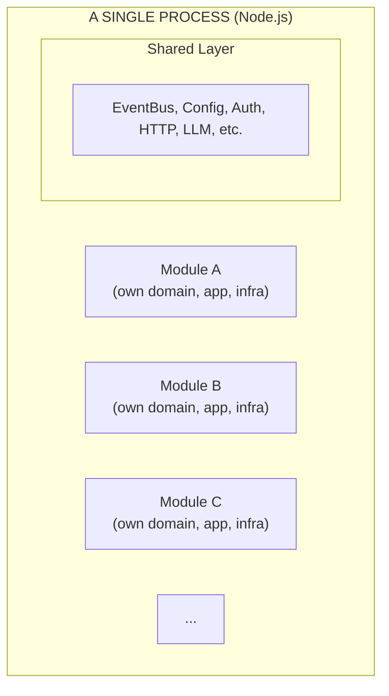
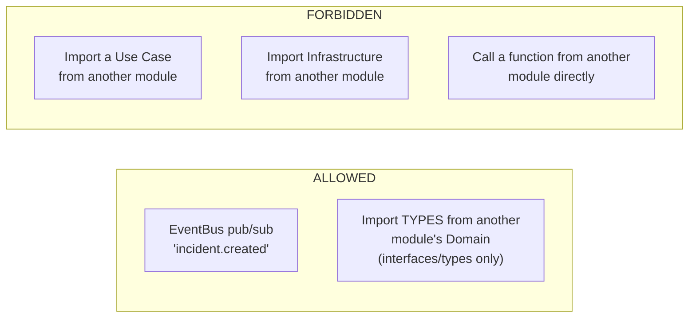
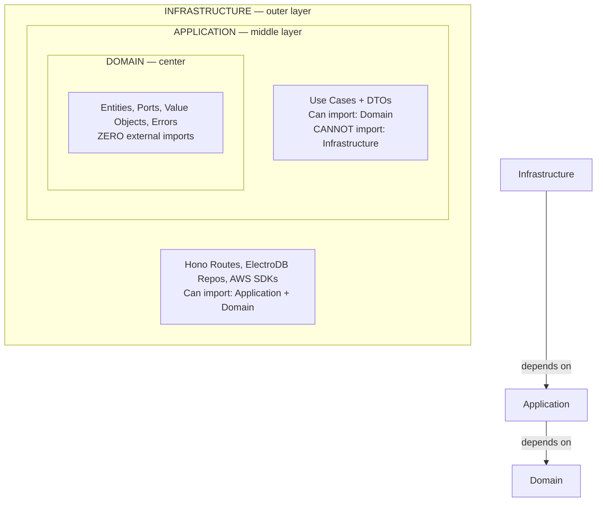
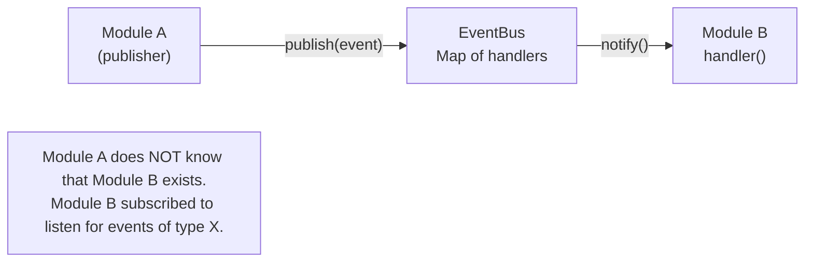
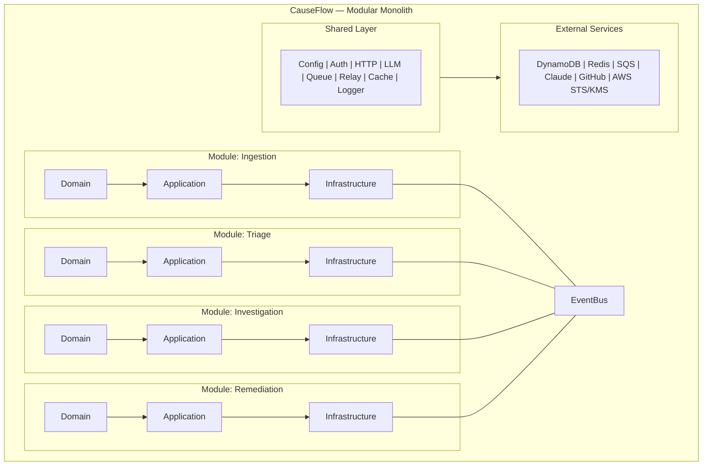

# 02 — CauseFlow Architecture

[< Back to index](./00-index.md) | [Previous: Overview](./01-overview.md) | [Next: Modules >](./03-modules.md)

---

> **Runtime note:** Examples may show DynamoDB/ElectroDB adapters because those
> remain valid AWS-backed adapters. The OSS Docker runtime uses Postgres
> repository adapters and BullMQ/Redis queue adapters behind the same ports.

## Two Fundamental Decisions

CauseFlow uses two architectural decisions that define how all code is organized:

1. **Modular Monolith (Modlito)** — how business modules are organized
2. **Clean Architecture** — how code WITHIN each module is organized

Let's understand each one.

---

## 1. Modular Monolith (Modlito)

### What is it?

A **modular monolith** is a single application (one process, one deploy) that is internally
divided into well-defined modules with clear boundaries.



### Why NOT microservices?

| Aspect | Microservices | Modular Monolith |
|--------|--------------|------------------|
| Deploy | N separate deploys | 1 deploy |
| Latency between modules | Network (ms) | In-process (us) |
| Operational complexity | High (service mesh, distributed tracing) | Low |
| Data consistency | Sagas, compensations | Local transactions |
| Team required | Large | Small (1-2 devs) |

**Golden rule:** start with a modular monolith, migrate to microservices when (if) needed.
CauseFlow is at that stage — modular monolith is sufficient for the current size.

### Inter-Module Communication Rules



**Concrete example:**
- The `ingestion` module publishes the `incident.created` event
- The `audit` module listens to that event and creates an audit entry
- The `audit` module NEVER imports code from the `ingestion` module
- Communication is done 100% through the EventBus

---

## 2. Clean Architecture

### What is it?

Each module is internally organized into 3 concentric layers. The main rule:
**dependencies only point INWARD** (from outside to inside, never the other way around).



### The 3 Layers in Detail

#### Layer 1: Domain (center — the purest)

**What it contains:**
- **Entities** — types that represent business concepts (Incident, Tenant, Pattern)
- **Ports** — interfaces that define WHAT needs to be done (without saying HOW)
- **Value Objects** — types with validation (TenantId, IncidentId, Severity)
- **Domain Errors** — business-specific errors (IncidentNotFoundError)

**Absolute rule:** ZERO imports from external libraries. No imports from AWS SDK,
ElectroDB, Hono, Redis, nothing. Pure TypeScript only.

**Real example** (file `src/modules/ingestion/domain/incident.entity.ts`):
```typescript
// This is an entity — pure type, with no external dependencies
export interface Incident {
  incidentId: IncidentId;
  tenantId: TenantId;
  title: string;
  description: string;
  severity: Severity;            // 'critical' | 'high' | 'medium' | 'low' | 'info'
  status: IncidentStatus;        // 'open' | 'triaging' | 'investigating' | ...
  source: string;                // 'datadog' | 'grafana' | ...
  sourceAlertId: string;
  assignedAgents: AgentRole[];
  createdAt: string;
  updatedAt: string;
}
```

**Port example** (file `src/modules/ingestion/domain/incident.repository.ts`):
```typescript
// This is a PORT — defines WHAT, not HOW
// Does not mention DynamoDB, ElectroDB, SQL — no technology details
export interface IIncidentRepository {
  create(incident: Incident): Promise<Incident>;
  findById(tenantId: TenantId, incidentId: IncidentId): Promise<Incident | null>;
  findBySourceAlertId(tenantId: TenantId, sourceAlertId: string): Promise<Incident | null>;
  updateStatus(tenantId: TenantId, incidentId: IncidentId, status: IncidentStatus): Promise<void>;
}
```

#### Layer 2: Application (middle — orchestration)

**What it contains:**
- **Use Cases** — classes with an `execute()` method that orchestrate a complete operation
- **DTOs** — input/output types for use cases

**Rule:** can import from Domain. NEVER imports from Infrastructure.

**Real example** (`src/modules/ingestion/application/ingest-alert.usecase.ts`):
```typescript
export class IngestAlertUseCase {
  constructor(
    private incidentRepo: IIncidentRepository,  // Port (Domain interface)
    private eventBus: IEventBus,                // Port
    private messageQueue: IMessageQueue,        // Port
  ) {}

  async execute(input: IngestAlertInput): Promise<Incident> {
    // 1. Check deduplication
    const existing = await this.incidentRepo.findBySourceAlertId(input.tenantId, input.sourceAlertId);
    if (existing) throw new DuplicateAlertError(input.sourceAlertId);

    // 2. Create the incident
    const incident = await this.incidentRepo.create({ ...input, status: 'open' });

    // 3. Publish event (other modules react)
    await this.eventBus.publish({ type: 'incident.created', payload: incident });

    // 4. Enqueue for triage (async)
    await this.messageQueue.send(config.queues.alertQueueUrl, incident);

    return incident;
  }
}
```

**Note:** the use case does NOT know:
- That the database is DynamoDB (uses the `IIncidentRepository` interface)
- That the queue is SQS (uses the `IMessageQueue` interface)
- How the event is delivered (uses the `IEventBus` interface)

This is the power of Clean Architecture — you can swap any technology without changing
the business logic.

#### Layer 3: Infrastructure (outer — the "real world")

**What it contains:**
- **Routes** — HTTP endpoints using Hono
- **Repository Implementations** — adapters that implement the Ports using DynamoDB/ElectroDB
- **Consumers** — SQS queue handlers
- **External Service Adapters** — integration with GitHub, AWS, Claude

**Real example** (`src/modules/ingestion/infra/incident.dynamo.repository.ts`):
```typescript
// This is an ADAPTER — implements the Port using DynamoDB/ElectroDB
export class DynamoIncidentRepository implements IIncidentRepository {
  constructor(private entity: typeof IncidentEntity) {}

  async create(incident: Incident): Promise<Incident> {
    const result = await this.entity.create(incident).go();
    return result.data;
  }

  async findById(tenantId: TenantId, incidentId: IncidentId): Promise<Incident | null> {
    const result = await this.entity.get({ tenantId, incidentId }).go();
    return result.data ?? null;
  }
}
```

---

## Directory Structure (Visual)

Each module follows EXACTLY the same structure:

```
src/modules/<module-name>/
├── domain/                    # Domain Layer (center)
│   ├── <entity>.entity.ts     # Pure entity types
│   ├── <entity>.repository.ts # Port (repository interface)
│   └── <entity>.errors.ts     # Domain errors
│
├── application/               # Application Layer (middle)
│   ├── <action>-<entity>.usecase.ts  # Use case
│   └── <entity>.dto.ts        # Input/output DTOs
│
└── infra/                     # Infrastructure Layer (edge)
    ├── <module>.routes.ts     # HTTP routes (Hono)
    ├── <entity>.dynamo.repository.ts  # DynamoDB Adapter
    └── <name>.consumer.ts     # SQS Consumer (if applicable)
```

**Concrete example with the `ingestion` module:**

```
src/modules/ingestion/
├── domain/
│   ├── incident.entity.ts           # Incident interface (pure type)
│   ├── incident.repository.ts       # IIncidentRepository (port)
│   └── incident.errors.ts           # IncidentNotFoundError, DuplicateAlertError
│
├── application/
│   └── ingest-alert.usecase.ts      # IngestAlertUseCase
│
└── infra/
    ├── ingestion.routes.ts          # POST /v1/webhooks/:tenantId/:provider
    ├── incident.dynamo.repository.ts # Implements IIncidentRepository with ElectroDB
    └── parsers/                     # Parsers for each provider
        ├── datadog.parser.ts
        ├── grafana.parser.ts
        ├── cloudwatch.parser.ts
        └── sentry.parser.ts
```

---

## The EventBus — How Modules Communicate

The EventBus is the "mailroom" between modules. It works as an in-process pub/sub:



**Implementation** (`src/shared/domain/events.ts`):

```typescript
class EventBus {
  private handlers: Map<string, Function[]> = new Map();

  subscribe(eventType: string, handler: Function) {
    // Registers a handler for an event type
  }

  async publish(event: { type: string, payload: any }) {
    // Calls ALL registered handlers for that type
    // Uses Promise.allSettled (if one handler fails, the others continue)
  }
}
```

### Important Events

| Event | Published by | Listened by | What Happens |
|-------|-------------|-------------|--------------|
| `incident.created` | Ingestion | Audit | Creates audit entry |
| `triage.completed` | Triage | Investigation (via SQS) | Starts investigation |
| `investigation.completed` | Investigation | Knowledge, Remediation | Extracts pattern, proposes fix |
| `remediation.proposed` | Remediation | Notification | Requests approval |
| `remediation.executed` | Remediation | Audit, Analytics | Records execution |
| `knowledge.pattern_extracted` | Knowledge | (logging) | Pattern learned |
| `tenant.created` / `tenant.updated` | Tenants | Audit, Analytics | Tracks tenant lifecycle |
| `user.created` / `user.updated` / `user.deleted` | Users | Audit | Tracks user lifecycle |
| `trigger.created` / `trigger.deleted` | Automation | Audit | Tracks automation rule changes |

---

## The bootstrap.ts — Where Everything Connects

The `src/bootstrap.ts` file is the **Composition Root** — the place where all dependencies
are "assembled" (connected). It's like putting together a puzzle:

```
bootstrap.ts (simplified):

// 1. Creates the concrete implementations (Adapters)
const dynamoClient = new DynamoDB.DocumentClient();
const incidentRepo = new DynamoIncidentRepository(IncidentEntity);
const eventBus = new EventBus();
const messageQueue = new SQSMessageQueue(sqsClient);

// 2. Creates the Use Cases, injecting the dependencies (Ports)
const ingestAlertUseCase = new IngestAlertUseCase(
  incidentRepo,    // Adapter that implements IIncidentRepository
  eventBus,        // Adapter that implements IEventBus
  messageQueue,    // Adapter that implements IMessageQueue
);

// 3. Creates the routes, injecting the Use Cases
const ingestionRoutes = createIngestionRoutes(ingestAlertUseCase);

// 4. Assembles the Hono app with all routes
const app = createApp(ingestionRoutes, triageRoutes, ...);
```

**Why this matters to you:**
- When you need to understand "where does this dependency come from?", the answer is in `bootstrap.ts`
- When you need to add a new dependency, this is where you register it
- For tests, you can create a bootstrap with mocks instead of the real implementations

---

## Lifecycle & Graceful Shutdown

The `src/lifecycle.ts` file defines `AppLifecycle` — a small orchestrator that registers
shutdown handlers and wires them to `SIGTERM` / `SIGINT`. On signal, components are torn
down **sequentially** (not in parallel) so that downstream consumers never receive work
from a source that is still running. A 30-second overall timeout guards against hangs;
on timeout the process exits with code `1`.

The order is intentional and is assembled in `src/main.ts`:

1. **`scheduler`** — stop cron jobs first so no new scheduled work enters the pipeline
2. **`sqs-consumers`** — stop polling SQS (triage, investigation, remediation consumers)
3. **`sse-manager`** — close live SSE connections to dashboards
4. **`redis`** — close the Redis client used by rate limiter and cache
5. **`relay-registry`** — shut down the WebSocket relay registry (if relay enabled)

Each component implements `ShutdownComponent { name; shutdown(): Promise<void> }`.
Failures in one component are logged but do not abort the sequence — the next component
still gets a chance to clean up.

---

## Visual Summary



[Next: Modules >](./03-modules.md)
