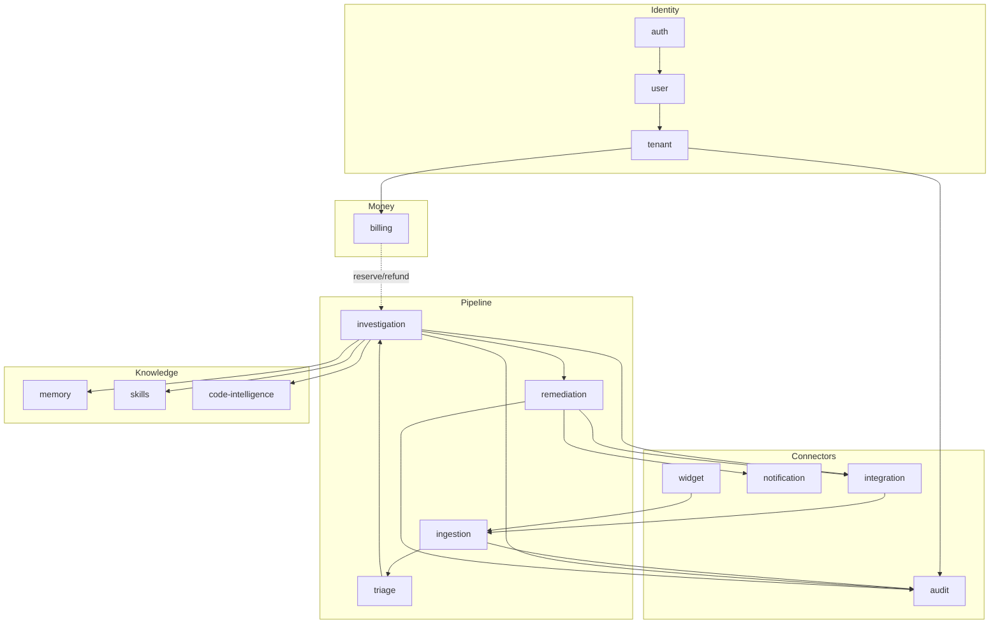

# 03 — The 15 Business Modules

[< Back to index](./00-index.md) | [Previous: Architecture](./02-architecture.md) | [Next: Complete Flow >](./04-complete-flow.md)

---

> **Runtime note:** The OSS Docker runtime uses Postgres repositories and
> BullMQ/Redis queues. AWS-backed deployments may still use DynamoDB,
> ElectroDB, KMS, and SQS adapters where called out below.

## Module Map

CauseFlow is a modular monolith (Modlito) organized as 15 bounded contexts under `src/modules/`. Each module owns its domain, application, and infra layers and communicates with other modules exclusively via the in-process **EventBus** or by importing *types* from another module's `domain/` layer. No module ever reaches into another module's use cases or infra.

The 15 modules fall into five functional groups:

| Group | Modules |
|---|---|
| **Identity & tenancy** | `tenant`, `user`, `auth` |
| **Money & quota** | `billing` |
| **Incident pipeline** | `ingestion`, `triage`, `investigation`, `remediation` |
| **Knowledge & context** | `memory`, `skills`, `code-intelligence` |
| **Connectors & surface** | `integration`, `notification`, `widget`, `audit` |

---

## 1. Tenant — Multi-tenancy and API keys

**Folder:** `src/modules/tenant/`

**Purpose.** Owns the concept of a customer organization on CauseFlow. Each tenant is a hard isolation boundary — data, quotas, plan, integrations, users, and audit trail are all scoped by `tenantId`. This module also issues and revokes API keys used to authenticate inbound webhooks.

**Key entities.**
- `Tenant` — id, name, slug, owner email, plan (`starter` | `pro` | `business` | `enterprise`), status, settings.
- `ApiKey` — prefix + SHA-256 hash (plain key shown once at creation).

**Key use cases.** `CreateTenant`, `GetTenant`, `UpdateTenant`, `ListTenants`, `CreateApiKey`, `ListApiKeys`, `RevokeApiKey`, `CheckBetaAllowlist`.

**External dependencies.** DynamoDB (ElectroDB) for persistence; no third-party services. Plan limits are authoritative for the `billing` module.

**Events.** Publishes `tenant.created`, `tenant.updated`.

**File paths.**
- Domain: `src/modules/tenant/domain/{tenant,api-key}.entity.ts`, `tenant.repository.ts`, `api-key.repository.ts`, `tenant.errors.ts`
- Application: `src/modules/tenant/application/*.usecase.ts`
- Infra: `src/modules/tenant/infra/{tenant,api-key,beta-allowlist}.routes.ts`, `dynamo-*.repository.ts`

---

## 2. User — Team members, invites, settings

**Folder:** `src/modules/user/`

**Purpose.** Represents the humans inside a tenant. Handles invite lifecycle, user CRUD, and per-user settings. Stays in sync with Clerk as the identity provider — Clerk is the source of truth for authentication, `user` is the source of truth for authorization data local to CauseFlow (role, tenant membership, preferences).

**Key entities.** `User`, `Invite`, `UserSettings`.

**Key use cases.** `CreateUser`, `ListUsers`, `UpdateUser`, `DeleteUser`, `GetUserByEmail`, `CreateInvite`, `ListInvites`, `RevokeInvite`, `AcceptInvite`, `GetSettings`, `UpdateSettings`.

**External dependencies.** Clerk (invite emails, identity sync); DynamoDB.

**Events.** Publishes `user.created`, `user.updated`, `user.deleted`. Consumes Clerk webhook translations from the `auth` module.

**File paths.**
- Domain: `src/modules/user/domain/{user,invite,settings}.entity.ts`, repositories
- Application: `src/modules/user/application/*.usecase.ts`
- Infra: `src/modules/user/infra/user.routes.ts`, `dynamo-{user,invite}.repository.ts`

---

## 3. Auth — Clerk webhook translator

**Folder:** `src/modules/auth/`

**Purpose.** The smallest module in the system. It exposes a single public route, `POST /v1/auth/clerk-webhook`, validates the svix signature sent by Clerk, and translates Clerk events (`user.created`, `user.updated`, `user.deleted`, `organization.created`) into calls on the `user` and `tenant` modules. JWT verification for the rest of the API lives in `shared/infra/auth`, not here.

**Key entities.** None (stateless translator).

**Key use cases.** `HandleClerkWebhook`.

**External dependencies.** Clerk (svix-signed webhook payloads).

**Events.** Consumes Clerk webhook events (HTTP, not EventBus). Indirectly triggers `user.*` and `tenant.created` via the modules it calls.

**File paths.**
- Application: `src/modules/auth/application/handle-clerk-webhook.usecase.ts`
- Infra: `src/modules/auth/infra/auth.routes.ts`, `clerk-client.ts`

---

## 4. Billing — Stripe, plans, investigation quota

**Folder:** `src/modules/billing/`

**Purpose.** Everything related to money. Manages the Stripe customer/subscription lifecycle, the plan catalog (Starter $99, Pro $349, Business $899, Enterprise custom), monthly investigation and event quotas, overage packs, the reserve/refund protocol around each investigation, and the Stripe metered billing sync.

The reserve/refund protocol is worth calling out: before the investigation module starts spending on an incident, it calls `ReserveInvestigation` (which holds 1 investigation against the tenant's quota). On success the reservation is committed; on early failure it is refunded via `RefundInvestigation`. Cost per investigation is approximately $0.70.

**Key entities.** `BillingAccount` (per-tenant Stripe linkage, plan, quota counters), `UsageRecord` (per-investigation line item).

**Key use cases.** `Signup`, `CreateCheckout`, `CreateSubscription`, `GetSubscription`, `UpgradeSubscription`, `CancelSubscription`, `ReactivateSubscription`, `CreatePortal`, `HandleWebhook`, `GetCredits`, `GetUsage`, `CheckQuota`, `ReserveInvestigation`, `RefundInvestigation`, `RecordUsage`, `PurchaseQuotaPack`, `LazyRenewal`, `ListPlans`, `ListInvoices`, `UpdateBillingSettings`.

**External dependencies.** Stripe (subscriptions, Customer Portal, metered billing, webhooks), Tenant module (plan limits).

**Events.** Consumes `investigation.completed` (for usage recording), `tenant.created` (bootstraps a `BillingAccount`). Publishes none directly — billing state changes go through Stripe webhooks.

**File paths.**
- Domain: `src/modules/billing/domain/{billing-account,usage-record}.entity.ts`, `plan-catalog.port.ts`, `stripe-customer.port.ts`, `billing.types.ts`
- Application: `src/modules/billing/application/*.usecase.ts`, `ports/`
- Infra: `src/modules/billing/infra/billing.routes.ts`, `stripe-*.ts`, `dynamo-*.repository.ts`

---

## 5. Ingestion — Alert webhooks and incident lifecycle

**Folder:** `src/modules/ingestion/`

**Purpose.** Entry point for every incident, whether automatic (monitoring tool webhook) or manual (operator or support agent in the dashboard). Owns the `Incident` aggregate and its entire lifecycle (open → triaging → investigating → awaiting_approval → remediating → resolved). Provider-specific parsers normalize Datadog, Grafana, CloudWatch, and Sentry payloads into a single `Incident` shape. Deduplicates by `sourceAlertId`.

**Key entities.** `Incident`.

**Key use cases.** `IngestAlert`, `CreateManualIncident`, `GetIncident`, `ListIncidents`, `UpdateIncidentStatus`, `GetIncidentAnalytics`, `CleanupStaleIncidents`.

**External dependencies.** SQS (triage queue), DynamoDB. Parsers in `infra/parsers/`: `datadog.parser.ts`, `grafana.parser.ts`, `cloudwatch.parser.ts`, `sentry.parser.ts`.

**Events.** Publishes `incident.created`, `incident.status_changed`. Consumes `investigation.completed`, `remediation.executed`, `investigation.known_solution_found` to drive status transitions.

**File paths.**
- Domain: `src/modules/ingestion/domain/incident.entity.ts`, `incident.repository.ts`, `incident.errors.ts`
- Application: `src/modules/ingestion/application/*.usecase.ts`
- Infra: `src/modules/ingestion/infra/{incident,webhook,admin,analytics}.routes.ts`, `parsers/`, `dynamo-incident.repository.ts`

---

## 6. Triage — LLM severity classification

**Folder:** `src/modules/triage/`

**Purpose.** Reads newly created incidents from SQS and asks Claude Sonnet to classify them. The LLM returns a structured response (Zod-validated) containing `priority`, `category`, `summary`, `confidence`, and a list of `suggestedAgents`. The suggested agent list is then filtered against the tenant's actually connected integrations — there is no point suggesting `db_analyst` if the tenant has no database integration. If the resulting severity is at or above `minInvestigationSeverity`, the incident is queued for the investigation consumer.

**Key entities.** No persisted aggregate of its own; writes `Evidence` records (owned type, repository imported from the investigation domain surface) and updates the incident via the ingestion module's use case.

**Key use cases.** `TriageIncidentUseCase`.

**External dependencies.** Claude Sonnet (via Claude Agent SDK), SQS, Tenant integrations (for suggested-agent filtering).

**Events.** Consumes `incident.created`. Does not publish events directly — it enqueues the next investigation job and the ingestion status transition produces `incident.status_changed`.

**File paths.**
- Domain: `src/modules/triage/domain/triage.types.ts`, `triage.prompts.ts`, `triage.errors.ts`, `evidence.repository.ts`
- Application: `src/modules/triage/application/triage-incident.usecase.ts`
- Infra: `src/modules/triage/infra/triage-consumer.ts`, `triage.routes.ts`, `dynamo-evidence.repository.ts`

---

## 7. Investigation — Multi-agent root-cause analysis

**Folder:** `src/modules/investigation/`

**Purpose.** The core of the product. Given a triaged incident, runs a multi-agent AI investigation and produces a root cause, a confidence score, and optionally a proposed code fix. Two execution modes coexist:

- **Wave-based mode** — a deterministic pipeline of specialist agents (`scout`, `log_analyst`, `metric_analyst`, `infra_inspector`, `change_detector`, `code_analyzer`, `db_analyst`, `code_fixer`, `verification`) run in parallel waves, with an opus-powered synthesis step at the end.
- **Orchestrator mode** — a single Sonnet agent receives the full tool catalogue and drives its own investigation, used when the problem shape is unknown or skills have been configured.

Both modes write `Evidence` records for every step, support mid-investigation context injection, and honor abort requests. Before spending money, the use case calls `billing.ReserveInvestigation`; on trivial short-circuits (known-solution match) it refunds the reservation.

**Key entities.** `Evidence` (persisted per agent step), plus domain types for investigation state, repo context, and the tool action catalog.

**Key use cases.** `InvestigateIncident`, `GetInvestigation`, `AddInvestigationContext`, `AbortInvestigation`, `RespondKnownSolution`, `RecordInvestigationFeedback`.

**External dependencies.** Claude Agent SDK (Sonnet + Opus), SQS (investigation queue), GitHub (via code tools), AWS API (via relay), Composio (for provider-specific read tools), `memory` module (Hindsight), `skills` module, `code-intelligence` module, `integration` module, `billing` module.

**Events.** Publishes `investigation.progress`, `investigation.completed`, `investigation.known_solution_found`. Consumes triage-emitted SQS jobs (not EventBus).

**File paths.**
- Domain: `src/modules/investigation/domain/{investigation.types,action-catalog,repo-context,investigation.errors}.ts`
- Application: `src/modules/investigation/application/investigate-incident.usecase.ts`, `get-investigation.usecase.ts`, `abort-investigation.usecase.ts`, `add-investigation-context.usecase.ts`, `respond-known-solution.usecase.ts`, `record-investigation-feedback.usecase.ts`, `agent-configs.ts`, `code-analyzer-config.ts`, `code-fixer-config.ts`, `db-analyst-config.ts`, `investigation-registry.ts`, `intelligence/`
- Infra: `src/modules/investigation/infra/investigation-consumer.ts`, `investigation.routes.ts`, `aws-api-tool.ts`, `aws-api-security.ts`, `aws-service-map.ts`, `code-analyzer-tools.ts`, `code-fixer-tools.ts`, `db-tools.ts`, `github-tools.ts`, `investigation-tools.ts`, `memory-tools.ts`

---

## 8. Remediation — Proposed fixes with human approval

**Folder:** `src/modules/remediation/`

**Purpose.** Turns an investigation outcome into a concrete, reviewable action plan and runs it once a human approves. Every remediation goes through propose → approve/reject → execute. Auto-remediation is gated behind an explicit tenant setting. Execution is step-by-step, stops on the first failure, and records structured results for each step. Approvals that sit idle past the timeout are auto-expired.

**Key entities.** `Remediation` (id, incidentId, status, steps, results).

**Key use cases.** `ProposeRemediation`, `ApproveRemediation`, `RejectRemediation`, `ExecuteRemediation`, `GetRemediation`, `RecordRemediationFeedback`, `TimeoutStaleRemediations`.

**External dependencies.** AWS (STS for remediator role assumption, SSM, ECS, Lambda, EC2), GitHub (for `create_fix_pr`), SQS (remediation queue), `notification` module (approval delivery), `audit` module.

**Events.** Publishes `remediation.proposed`, `remediation.approved`, `remediation.rejected`, `remediation.executed`. Consumes `investigation.completed`.

**File paths.**
- Domain: `src/modules/remediation/domain/remediation.entity.ts`, `remediation.repository.ts`, `remediation.errors.ts`
- Application: `src/modules/remediation/application/*.usecase.ts`
- Infra: `src/modules/remediation/infra/remediation-consumer.ts`, `remediation.routes.ts`, `dynamo-remediation.repository.ts`

---

## 9. Memory — Chat history, intent, long-term agent memory

**Folder:** `src/modules/memory/`

**Purpose.** Holds the conversation context that the user and the investigation agents share. Every inbound chat message is classified into one of four intents — `investigation`, `remediation`, `knowledge`, `memory_only` — using Claude Sonnet (no heuristic fallback). Short-term history lives in DynamoDB with Redis-cached summaries; long-term semantic memory is delegated to **Hindsight**, an external HTTP service, so that past investigations remain retrievable across sessions and tenants.

**Key entities.** `ChatMessage` (with a typed `intent` discriminator).

**Key use cases.** `ChatUseCase`.

**External dependencies.** Claude Sonnet (intent classification), Redis (summary cache), Hindsight (long-term memory), DynamoDB.

**Events.** Consumes `investigation.completed` and similar signals to persist investigation summaries into Hindsight. Does not publish EventBus events.

**File paths.**
- Domain: `src/modules/memory/domain/chat-message.entity.ts`
- Application: `src/modules/memory/application/chat.usecase.ts`
- Infra: `src/modules/memory/infra/memory.routes.ts`, `dynamo-chat-history.repository.ts`

---

## 10. Skills — Tenant-defined custom investigation skills

**Folder:** `src/modules/skills/`

**Purpose.** Lets a tenant teach CauseFlow how to investigate their specific systems without a code change. A skill is a named, declarative unit containing a `whenToUse` trigger description, a `systemPrompt`, an `allowedTools` whitelist, a `model` pick, and a `maxTurns` budget. At investigation start, `SelectSkillsUseCase` looks at the incident and picks the skills whose `whenToUse` matches; the orchestrator agent then runs with those skills' prompts and tool restrictions layered in.

**Key entities.** `InvestigationSkill` (name, displayName, whenToUse, systemPrompt, allowedTools, model, maxTurns).

**Key use cases.** `CrudSkillsUseCase`, `SelectSkillsUseCase`.

**External dependencies.** DynamoDB only.

**Events.** None published; consumed by the `investigation` module directly via use-case import of the domain interface.

**File paths.**
- Domain: `src/modules/skills/domain/skill.entity.ts`, `skill.repository.ts`
- Application: `src/modules/skills/application/{crud-skills,select-skills}.usecase.ts`
- Infra: `src/modules/skills/infra/skill.routes.ts`, `dynamo-skill.repository.ts`

---

## 11. Code-intelligence — Repository indexing and code knowledge graph

**Folder:** `src/modules/code-intelligence/`

**Purpose.** Builds a structured representation of a tenant's connected repositories so agents can navigate code without grepping raw files. Each indexed repo becomes a set of `RepoNode`s (directories, packages, entry points), a list of `PackageDependency` edges, and a `RepoServiceMap` that connects source code to runtime services (the "this file powers the `payments-api` ECS service" link). It also runs `SuggestRepoMapping` to propose which repos correspond to which services.

**Key entities.** `RepoNode`, `PackageDependency`, `RepoServiceMap`.

**Key use cases.** `IndexRepository`, `SuggestRepoMapping`.

**External dependencies.** GitHub (cloning and reading repos), DynamoDB.

**Events.** Publishes `knowledge.pattern_extracted`. Consumed by `investigation` via domain-type imports and tool adapters.

**File paths.**
- Domain: `src/modules/code-intelligence/domain/{repo-node,package-dependency,repo-service-map}.entity.ts`, `code-knowledge.repository.ts`
- Application: `src/modules/code-intelligence/application/{index-repository,suggest-repo-mapping}.usecase.ts`
- Infra: `src/modules/code-intelligence/infra/code-knowledge.routes.ts`, `dynamo-code-knowledge.repository.ts`

---

## 12. Integration — Credentials, cloud access, Composio triggers

**Folder:** `src/modules/integration/`

**Purpose.** Everything related to connecting CauseFlow to a tenant's external systems. Stores KMS-encrypted credentials, exposes the relay route used by agent tools to reach tenant cloud APIs, and manages **Composio triggers** — the webhook-based mechanism by which CauseFlow receives events from third-party providers (GitHub, Datadog, Sentry, PagerDuty, etc.). Inbound Composio events are validated, mapped to internal event shapes, and routed into the ingestion pipeline.

**Key entities.** `Integration` (tenant ↔ provider binding with encrypted credentials), `Trigger` (per-provider webhook registration).

**Key use cases.** `ConnectCredential`, `DisconnectIntegration`, `ListAllIntegrations`, `GetCloudIntegration`, `CreateTrigger`, `DeleteTrigger`, `ListTriggers`, `HandleComposioWebhook`.

**External dependencies.** KMS (credential encryption), Composio (trigger management + inbound webhooks), AWS STS (for cloud integrations).

**Events.** Publishes `integration.connected`, `integration.disconnected`, `trigger.created`, `trigger.deleted`, `trigger.event_received`. Consumed by `triage` (for suggested-agent filtering) and `investigation` (tool availability).

**File paths.**
- Domain: `src/modules/integration/domain/trigger.entity.ts`, `trigger.repository.ts`
- Application: `src/modules/integration/application/*.usecase.ts`
- Infra: `src/modules/integration/infra/{integration,trigger,relay}.routes.ts`, `composio-webhook-validator.ts`, `trigger-event-mapper.ts`, `dynamo-trigger.repository.ts`

---

## 13. Notification — In-app SSE, approvals, outbound channels

**Folder:** `src/modules/notification/`

**Purpose.** Owns everything the user sees outside the main request/response cycle. Delivers live incident, investigation, and remediation updates via **Server-Sent Events** to the web portal, and routes outbound messages to Slack, Teams, and Discord through Composio. Also owns the `Approval` object for human-in-the-loop remediation — it's the queue of "please review this action" that a user sees in the portal.

**Key entities.** `Notification`, `Approval`.

**Key use cases.** `ListNotifications`, `MarkNotificationRead`, `ListPendingApprovals`, `RespondApproval`.

**External dependencies.** Composio (Slack/Teams/Discord), Redis pub/sub (SSE fan-out), DynamoDB.

**Events.** Consumes `remediation.proposed`, `remediation.approved`, `investigation.progress`, `investigation.completed`, `investigation.known_solution_found`, and incident lifecycle events. Does not publish to the EventBus — user responses go back through use cases on `remediation`.

**File paths.**
- Domain: `src/modules/notification/domain/{notification,approval}.entity.ts`, repositories
- Application: `src/modules/notification/application/{list-notifications,mark-notification-read,list-pending-approvals,respond-approval}.usecase.ts`
- Infra: `src/modules/notification/infra/notification.routes.ts`, `dynamo-{notification,approval}.repository.ts`

---

## 14. Widget — Embedded customer-facing chat

**Folder:** `src/modules/widget/`

**Purpose.** The customer-facing surface: an embeddable chat widget that a tenant can drop into their own product so their end users can report problems, ask questions, and see investigation status in real time. Each conversation is a `WidgetSession` bound to an API key (for the embedded script) or a custom host (for the branded portal). PII is scrubbed on the way in by the `DataMasker`, follow-up questions are generated automatically, and Web Push is supported for notifications back to the end user.

**Key entities.** `WidgetSession`.

**Key use cases.** `WidgetChatUseCase`, plus the `WidgetEventSubscriber` that fans EventBus updates back to the widget session.

**External dependencies.** Web Push (VAPID), Redis (session state), DynamoDB. Uses the `memory` module for conversation history and the `ingestion` module to open incidents.

**Events.** Consumes `incident.status_changed`, `investigation.progress`, `investigation.completed` to push updates to the widget. Does not publish domain events.

**File paths.**
- Domain: `src/modules/widget/domain/widget-session.entity.ts`, `widget-session.repository.ts`, `data-masking.types.ts`, `push-subscription.types.ts`
- Application: `src/modules/widget/application/widget-chat.usecase.ts`, `widget-event.subscriber.ts`, `data-masker.ts`, `follow-up-generator.ts`, `response-formatter.ts`
- Infra: `src/modules/widget/infra/{widget,portal}.routes.ts`, `portal-shell.html`, `web-push.adapter.ts`, `dynamo-widget-session.repository.ts`

---

## 15. Audit — Hash-chained immutable trail

**Folder:** `src/modules/audit/`

**Purpose.** Records every meaningful action in the system as an append-only, hash-chained entry. Each entry embeds the SHA-256 of the previous entry, so any tampering with a past record breaks the chain from that point forward. Entries can be verified on demand (`VerifyHashChain`) and exported for external auditors (`ExportAudit`). Every other module writes into audit either directly or via EventBus subscribers.

**Key entities.** `AuditEntry` (id, tenantId, action, actor, payload, previousHash, hash, timestamp).

**Key use cases.** `CreateAuditEntry`, `ListAuditEntries`, `VerifyHashChain`, `ExportAudit`.

**External dependencies.** DynamoDB (append-only access pattern).

**Events.** Consumes virtually everything: `tenant.*`, `user.*`, `incident.*`, `investigation.*`, `remediation.*`, `integration.*`, `trigger.*`. Publishes nothing.

**File paths.**
- Domain: `src/modules/audit/domain/audit.entity.ts`, `audit.repository.ts`, `audit.errors.ts`
- Application: `src/modules/audit/application/{create-audit-entry,list-audit-entries,verify-hash-chain,export-audit}.usecase.ts`
- Infra: `src/modules/audit/infra/audit.routes.ts`, `dynamo-audit.repository.ts`

---

## Summary Table

| # | Module | Path | Primary Responsibility |
|---|--------|------|----------------------|
| 1 | Tenant | `src/modules/tenant/` | Multi-tenant orgs, plans, API keys |
| 2 | User | `src/modules/user/` | Team members, invites, settings, Clerk sync |
| 3 | Auth | `src/modules/auth/` | Clerk webhook translator (svix-signed) |
| 4 | Billing | `src/modules/billing/` | Stripe, quota, investigation reserve/refund |
| 5 | Ingestion | `src/modules/ingestion/` | Alert webhooks, parsers, incident lifecycle |
| 6 | Triage | `src/modules/triage/` | LLM severity classification and agent suggestion |
| 7 | Investigation | `src/modules/investigation/` | Multi-agent root-cause analysis (wave + orchestrator) |
| 8 | Remediation | `src/modules/remediation/` | Propose → approve → execute fix workflow |
| 9 | Memory | `src/modules/memory/` | Chat history, intent classification, Hindsight integration |
| 10 | Skills | `src/modules/skills/` | Tenant-defined custom investigation skills |
| 11 | Code-intelligence | `src/modules/code-intelligence/` | Repo indexing, code knowledge graph |
| 12 | Integration | `src/modules/integration/` | KMS-encrypted credentials, Composio triggers, cloud relay |
| 13 | Notification | `src/modules/notification/` | SSE, Slack/Teams/Discord, approval queue |
| 14 | Widget | `src/modules/widget/` | Embeddable chat widget and branded portal |
| 15 | Audit | `src/modules/audit/` | Hash-chained immutable audit trail |

[Next: Complete Flow >](./04-complete-flow.md)
