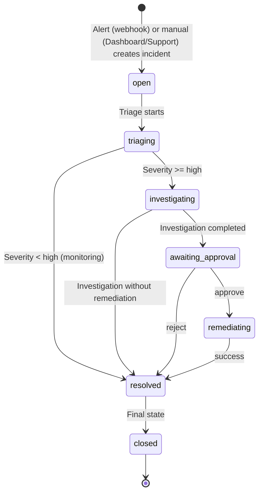

# 04 — Complete Flow: From Tenant Registration to Incident Resolution

[< Back to index](./00-index.md) | [Previous: Modules](./03-modules.md) | [Next: Data Model >](./05-data-model.md)

---

> This is the most important document. It walks step-by-step through EVERYTHING that happens
> in the system, from the first moment a customer signs up to the resolution of a real
> incident. Read slowly and follow what happens in the backend at each step.

> **Runtime note:** Persistence examples in older sections may name DynamoDB.
> In the OSS Docker runtime, the same domain operations are backed by Postgres
> repositories and BullMQ/Redis queues.

---

## Part 1: Tenant Registration and Configuration

### Step 1 — Create the Tenant

There is no public "signup" screen. An admin creates the tenant via API:

```
POST /v1/tenants
Authorization: Bearer <admin-jwt>
Content-Type: application/json

{
  "name": "Acme Corp",
  "slug": "acme-corp",
  "ownerEmail": "ops@acme.com",
  "plan": "enterprise",
  "settings": {
    "awsRoleArn": "arn:aws:iam::123456789:role/CauseFlowAccess",
    "awsExternalId": "causeflow-acme",
    "awsRegion": "us-east-1"
  }
}
```

**What happens in the backend:**

```
1. auth.middleware.ts
   → Validates JWT (signature, expiry, issuer, audience)
   → Extracts claims: { sub: "user_1", tenant_id: "t_admin", roles: ["admin"] }

2. tenant-guard.middleware.ts
   → Verifies the user has the "admin" or "owner" role

3. CreateTenantUseCase.execute()
   → Validates input data (Zod schema)
   → Generates unique tenantId: "t_" + nanoid()
   → Checks if slug already exists (409 Conflict if so)
   → Writes to DynamoDB via ElectroDB:
     PK: $tenant#t_abc123
     SK: $tenant
     Data: { name, slug, ownerEmail, plan, status: "active", settings, createdAt }
   → Publishes event: tenant.created

4. audit.handler.ts (EventBus listener)
   → Creates AuditEntry:
     { action: "tenant.created", actorEmail: "admin@causeflow.com",
       entityType: "tenant", entityId: "t_abc123",
       hash: SHA256(previousHash + data) }

5. HTTP 201 Response:
   {
     "tenantId": "t_abc123",
     "name": "Acme Corp",
     "slug": "acme-corp",
     "status": "active",
     ...
   }
```

### Step 2 — Create an API Key for Webhooks

The tenant needs an API key so that tools like Datadog can send alerts:

```
POST /v1/api-keys
Authorization: Bearer <tenant-jwt>

{ "name": "Datadog Webhook" }
```

**What happens in the backend:**

```
1. Auth middleware validates JWT (claims contain tenant_id: "t_abc123")

2. CreateApiKeyUseCase.execute()
   → Generates random key: "cflo_" + crypto.randomBytes(32).toString('hex')
   → Computes hash: SHA256("cflo_abc123def456...")
   → Writes to DynamoDB:
     PK: $apikey#sha256_hash
     SK: $apikey
     Data: { keyId: "key_xyz", tenantId: "t_abc123", name: "Datadog Webhook",
              prefix: "cflo_abc", keyHash: "sha256_...", status: "active" }

3. HTTP 201 Response:
   {
     "keyId": "key_xyz",
     "name": "Datadog Webhook",
     "plaintextKey": "cflo_abc123def456..."  ← DISPLAYED ONLY ONCE!
   }
```

**WARNING:** The `plaintextKey` is returned ONLY ONCE in this response. After that,
only the hash is stored. If the user loses the key, they must create a new one.

### Step 3 — Configure the Webhook in Datadog

The operator goes to Datadog and configures:
- **URL:** `https://api.causeflow.com/v1/webhooks/t_abc123/datadog`
- **Header:** `X-API-Key: cflo_abc123def456...`
- **Payload:** Standard Datadog format

### Step 4 — (Optional) Connect GitHub

```
1. Tenant accesses: GET /v1/github/callback?installation_id=12345
2. CauseFlow validates the installation with the GitHub API
3. Writes GitHubInstallation to DynamoDB:
   { installationId, tenantId, accountLogin, repositories, permissions }
4. Now code_analyzer and code_fixer can access the tenant's code
```

### Step 5 — (Optional) Configure AWS Cross-Account

The tenant creates an IAM Role in their own AWS account with a trust policy pointing to CauseFlow.
Then updates the tenant settings:

```
PATCH /v1/tenants/t_abc123
{
  "settings": {
    "awsRoleArn": "arn:aws:iam::123456789:role/CauseFlowAccess",
    "awsExternalId": "causeflow-acme",
    "awsRegion": "us-east-1"
  }
}
```

This allows AI agents to securely access the tenant's AWS infrastructure
(CloudWatch Logs, ECS, EC2, etc.) via STS AssumeRole.

---

## Part 2: Incidents — Four Entry Points

CauseFlow supports four ways to create incidents:

1. **Automatic (Webhook)** — monitoring tools (Datadog, Grafana, etc.) send alerts via webhook
2. **Manual (Dashboard/API)** — an operator or support agent describes a customer-reported issue via the Dashboard UI or API
3. **Chat-driven (Memory module)** — user sends a natural-language message to `POST /v1/memory/chat`; an intent classifier decides whether to answer from memory, run a live check, search knowledge, or create a real incident
4. **Composio-integrated third-party triggers** — Composio delivers trigger events (Sentry issues, GitHub pushes, PagerDuty incidents, etc.) to `POST /webhooks/composio`; the system resolves the tenant via `composioTriggerId` and routes the event into the ingestion pipeline

All four paths converge on the same downstream pipeline: triage → investigation → remediation → learning.

Both paths enter the same pipeline and follow the same stages. Each incoming alert
consumes **1 event** from the plan (triage). Each investigation that proceeds past
triage consumes **1 investigation** from the plan.

---

### Part 2a: Manual Incident — Support & Operations (Dashboard / API)

An operator or support agent wants CauseFlow to investigate an issue — either a problem
not caught by monitoring, or a customer-reported issue that needs root cause analysis.
They can use the Dashboard UI or call the API directly:

```
Dashboard or API client → POST /v1/incidents/chat
Authorization: Bearer <jwt>

{
  "title": "Customers cannot export reports",
  "description": "Multiple customers reporting that the export button returns 500 errors since this morning. Ticket SC-4521."
}
```

**What happens in the backend:**

```
1. auth.middleware.ts
   → Validates JWT, extracts tenantId from claims

2. tenant-guard.middleware.ts
   → Verifies the user has admin, owner, or operator role

3. IngestAlertUseCase.execute()
   → Creates Incident:
     {
       incidentId: "inc_manual_001",
       tenantId: "t_abc123",
       title: "Site is down",
       description: "Customers reporting 500 errors...",
       severity: "medium",         ← Default (triage will reclassify)
       status: "open",
       source: "manual",            ← Identifies as created via Dashboard/API
       sourceAlertId: "manual_<nanoid>",
       createdAt: "2026-03-20T14:00:00Z"
     }
   → Publishes event: incident.created
   → Enqueues for triage (SQS)

4. HTTP 201 Response:
   { "incidentId": "inc_manual_001", "status": "open", ... }
```

From here, the incident follows the **exact same pipeline** as an automated alert:
triage → investigation → remediation → learning.

---

### Part 2b: Chat-Driven Entry (Memory Module)

An engineer or support agent talks to CauseFlow in natural language through the dashboard chat
(or a direct API call). The memory module routes the message through an intent classifier
(Claude Sonnet 4.5) that decides what to do — only a subset of messages become real incidents.

```
POST /v1/memory/chat
Authorization: Bearer <jwt>

{ "message": "Cliente não recebeu o pagamento da assinatura" }
```

**What happens in the backend (`ChatUseCase.execute`):**

```
1. Save user message to chat history (DynamoDB)

2. classifyIntent(message)  ← Claude Sonnet 4.5, ROUTER_PROMPT, temperature 0
   → Returns ONE of five intents:
     {
       intent: "memory_only" | "knowledge" | "live_check" | "incident" | "general",
       service?: "payment-service",
       timeWindow?: "last 1h",
       title?: "<short incident title>",
       reasoning: "<why this intent>"
     }

3. Dispatch by intent:

   ┌── "general" ────────────────────────────────────────────────┐
   │ Static greeting / help response — no LLM, no tools.         │
   └─────────────────────────────────────────────────────────────┘

   ┌── "memory_only" ────────────────────────────────────────────┐
   │ User is ASKING about past knowledge (history, architecture, │
   │ prior incidents). Uses agentMemory.reflect() with budget    │
   │ "high" to synthesize an answer from Hindsight memory.       │
   │ Returns synchronously. NO live data, NO new incident.       │
   └─────────────────────────────────────────────────────────────┘

   ┌── "knowledge" ──────────────────────────────────────────────┐
   │ User is TELLING the system facts about their infra          │
   │ ("Nosso core usa ECS e Lambda para webhooks"). Haiku        │
   │ extracts services/categories, then agentMemory.retain()     │
   │ writes the statement into Hindsight for future              │
   │ investigations to use as context.                           │
   └─────────────────────────────────────────────────────────────┘

   ┌── "live_check" ─────────────────────────────────────────────┐
   │ User is asking about what's happening RIGHT NOW. Dispatched │
   │ ASYNC (fire-and-forget), response goes back over SSE.       │
   │ runLiveCheck():                                             │
   │   a. Recalls historical context (agentMemory.recall)        │
   │   b. Vends STS credentials for log_analyst role             │
   │   c. Runs an agent with LOG_TOOLS + METRIC_TOOLS +          │
   │      MEMORY_TOOLS, max 5 turns                              │
   │   d. Agent hits real CloudWatch via aws_api_call            │
   │   e. Saves assistant response, broadcasts via SSE           │
   │   f. retains the Q&A back into Hindsight                    │
   │ No incident is created.                                     │
   └─────────────────────────────────────────────────────────────┘

   ┌── "incident" ───────────────────────────────────────────────┐
   │ Something is BROKEN and needs a formal investigation.       │
   │ handleIncident():                                           │
   │   a. ReserveInvestigationUseCase.execute(tenantId)          │
   │      ↳ Atomically reserves 1 investigation slot from        │
   │        BillingAccount. If quota exhausted → return          │
   │        "Investigation limit reached. Please upgrade…".      │
   │        NO incident created.                                 │
   │   b. Creates Incident via incidentRepo.create({             │
   │        sourceProvider: "chat", sourceAlertId: chatId,       │
   │        severity: "medium", status: "open"                   │
   │      })                                                     │
   │   c. Publishes incident.created event                       │
   │   d. Enqueues on SQS investigation queue                    │
   │   e. Returns immediately with status: "processing" and      │
   │      incidentUrl for the dashboard                          │
   │ From here the normal triage → investigation pipeline runs.  │
   └─────────────────────────────────────────────────────────────┘
```

Key properties:
- Only `incident` consumes a BillingAccount investigation slot. `memory_only`, `knowledge`, `live_check`, `general` do not.
- `live_check` lets an engineer query real infrastructure without creating an Incident — it's a read-only diagnostic channel.
- `knowledge` is how the user progressively teaches CauseFlow about their stack. Future investigations automatically pick up this context through `agentMemory.recall()`.
- There is no heuristic fallback: if Sonnet classification fails, the default is `memory_only` (safe, read-only).

---

### Part 2c: Composio-Integrated Third-Party Triggers

Composio is a universal integration layer (Sentry, PagerDuty, GitHub, Linear, Shortcut, etc.).
Instead of building dozens of bespoke webhook parsers, CauseFlow registers Composio triggers
per-tenant and receives a single unified webhook stream:

```
Composio sends:
POST /webhooks/composio
X-Composio-Signature: <hmac>

{
  "id": "evt_abc",
  "type": "composio.trigger.message",
  "metadata": {
    "trigger_slug": "SENTRY_ISSUE_CREATED",
    "trigger_id": "trg_xxx",            ← the composioTriggerId we stored
    "connected_account_id": "ca_yyy"
  },
  "data": { ...provider-specific payload... }
}
```

**What happens in the backend (`HandleComposioWebhookUseCase.execute`):**

```
1. composio-webhook-validator
   → HMAC-SHA256 validation against Composio webhook secret
   → If mismatch → 401 invalid_signature

2. Filter by type
   → Only "composio.trigger.message" is processed; other event
     types (connection.status, auth, etc.) are ignored

3. Tenant resolution
   → triggerRepo.findByComposioTriggerId(trigger_id)
   → If not found → 404 trigger_not_found, stop
   → If found → trigger.tenantId is the owning tenant

4. TriggerEventMapper.map(trigger_slug, data, tenantId)
   → Maps provider-specific payloads to ONE of:
     - { type: "alert", source, payload }      ← most triggers
     - { type: "change_event", data }          ← deploys, commits, merges
     - { type: "ignored" }                     ← noise / acks

5. Dispatch:
   - "alert" → IngestAlertUseCase.execute(tenantId, rawAlert)
     → Same path as Part 2d (webhook alert) from step 6 onwards:
       dedupe → create Incident (source: mapped provider) →
       publish incident.created → enqueue triage
   - "change_event" → publish graph.change_added event
     → Graph module correlates with services + future investigations
   - "ignored" → log + skip

6. HTTP 200 { processed: true, action: "incident_created" | ... }
```

The key invariant: Composio triggers are routed by `composioTriggerId`, not by tenant slug in
the URL. This lets Composio use a single webhook URL for all tenants while keeping multi-tenant
isolation — the tenant is derived from the trigger registration, not from the request.

---

### Part 2d: Automatic Incident via Webhook

Now let's simulate a real scenario. The payment-service of Acme Corp tenant is
timing out. Datadog detects it and sends an alert.

---

### STAGE 1: Alert Arrives (Ingestion)

```
Datadog sends:
POST /v1/webhooks/t_abc123/datadog
X-Webhook-Signature: sha256=abc123...
X-API-Key: cflo_abc123def456...

{
  "alert_id": "dd-12345",
  "title": "High Error Rate on payment-service",
  "text": "Error rate exceeded 50% threshold for payment-service in us-east-1",
  "alert_type": "error",
  "priority": "critical",
  "tags": ["service:payment-service", "env:production"]
}
```

**What happens in the backend, line by line:**

```
ingestion.routes.ts
│
├─ 1. Extracts :tenantId and :provider from URL
│     tenantId = "t_abc123", provider = "datadog"
│
├─ 2. Validates API Key
│     Header X-API-Key → SHA256 → looks up DynamoDB by hash
│     If not found → 401 Unauthorized
│     If found and revoked → 401 Unauthorized
│     If key's tenantId != URL's tenantId → 403 Forbidden
│
├─ 3. Validates HMAC-SHA256
│     Computes: HMAC-SHA256(body, webhookSecret)
│     Compares with X-Webhook-Signature header
│     If mismatch → 401 Invalid Signature
│
├─ 4. Provider Registry: selects parser
│     provider = "datadog" → DatadogParser
│
├─ 5. DatadogParser.parse(body)
│     Normalizes to internal format:
│     {
│       title: "High Error Rate on payment-service",
│       description: "Error rate exceeded 50%...",
│       source: "datadog",
│       sourceAlertId: "dd-12345",
│       severity: "high",            // mapped from Datadog's "critical"
│       metadata: { tags: [...], ... }
│     }
│
├─ 6. IngestAlertUseCase.execute()
│     │
│     ├─ 6a. Deduplication
│     │       Query: incidentRepo.findBySourceAlertId("t_abc123", "dd-12345")
│     │       If already exists → 409 Conflict (no duplicate created)
│     │       If not exists → continues
│     │
│     ├─ 6b. Creates Incident in DynamoDB
│     │       incidentId: "inc_" + nanoid()
│     │       {
│     │         incidentId: "inc_xyz789",
│     │         tenantId: "t_abc123",
│     │         title: "High Error Rate on payment-service",
│     │         severity: "high",
│     │         status: "open",         ← Initial state
│     │         source: "datadog",
│     │         sourceAlertId: "dd-12345",
│     │         assignedAgents: [],     ← No agents yet
│     │         createdAt: "2026-03-20T14:30:00Z"
│     │       }
│     │       DynamoDB: PK=$tenant#t_abc123, SK=$incident#inc_xyz789
│     │
│     ├─ 6c. Publishes event to EventBus
│     │       eventBus.publish({
│     │         type: "incident.created",
│     │         payload: { incidentId, tenantId, title, severity }
│     │       })
│     │       → Audit module listens → creates AuditEntry
│     │
│     └─ 6d. Enqueues for triage
│             messageQueue.send(SQS_ALERT_QUEUE_URL, {
│               incidentId: "inc_xyz789",
│               tenantId: "t_abc123"
│             })
│
└─ 7. HTTP 201 Response
       { "incidentId": "inc_xyz789", "status": "open", ... }
```

**Total time: ~200ms** (fast because triage is handled async in the queue)

---

### STAGE 2: AI Triage

The SQS consumer picks up the message from the queue (continuous polling):

```
triage.consumer.ts
│
└─ TriageIncidentUseCase.execute({ incidentId: "inc_xyz789", tenantId: "t_abc123" })
   │
   ├─ 1. Fetches incident from DynamoDB
   │     incidentRepo.findById("t_abc123", "inc_xyz789")
   │
   ├─ 2. Updates status: "open" → "triaging"
   │     incidentRepo.updateStatus("t_abc123", "inc_xyz789", "triaging")
   │
   ├─ 3. Looks up similar historical patterns
   │     knowledgePort.findSimilar({ title, description })
   │     → Returns: [{ patternId: "pat_001", match: 0.87, rootCause: "Memory leak" }]
   │
   ├─ 4. Calls Claude Sonnet 4.5
   │     │
   │     │  System Prompt:
   │     │  "You are an SRE incident classifier. Analyze the incident
   │     │   and return: priority, summary, confidence, suggestedAgents."
   │     │
   │     │  User Prompt:
   │     │  "Title: High Error Rate on payment-service
   │     │   Description: Error rate exceeded 50% threshold...
   │     │   Source: datadog
   │     │   Similar historical patterns: [Memory leak (87% match)]"
   │     │
   │     │  Zod schema (structured output):
   │     │  z.object({
   │     │    priority: z.enum(["critical","high","medium","low","info"]),
   │     │    summary: z.string(),
   │     │    confidence: z.number().min(0).max(1),
   │     │    suggestedAgents: z.array(z.enum([...]))
   │     │  })
   │     │
   │     └─ AI Response:
   │        {
   │          priority: "critical",        // Reclassified from high → critical!
   │          summary: "Pattern consistent with memory leak. 50% error rate
   │                    indicates severe degradation. Similar history found.",
   │          confidence: 0.88,
   │          suggestedAgents: ["log_analyst", "metric_analyst",
   │                           "infra_inspector", "change_detector"]
   │        }
   │
   ├─ 5. Langfuse: records the entire LLM call
   │     (prompt, response, tokens, cost, latency)
   │
   ├─ 6. Updates Incident in DynamoDB
   │     severity: "high" → "critical"
   │     assignedAgents: ["log_analyst", "metric_analyst", ...]
   │
   ├─ 7. Creates Evidence (type: triage)
   │     {
   │       evidenceId: "evd_001",
   │       incidentId: "inc_xyz789",
   │       agentRole: "triage",
   │       content: { priority: "critical", summary: "...", ... }
   │     }
   │
   ├─ 8. Publishes event: triage.completed
   │
   └─ 9. Enqueues for investigation (because severity = "critical" >= "high")
         │  ⚡ BILLING QUOTA GATE — ReserveInvestigationUseCase.execute(tenantId)
         │     Atomically reserves 1 investigation slot from the tenant's
         │     BillingAccount (DynamoDB conditional update, single round-trip).
         │     - On success: slot is reserved, Stripe Meter receives a
         │       `causeflow_investigation` usage event (fire-and-forget).
         │     - On failure (quota exhausted): investigation is NOT enqueued;
         │       incident is marked with reason "quota_exceeded" and the
         │       tenant is notified to upgrade. NO agents are spawned.
         │     The slot is refunded if the investigation ultimately fails
         │     before producing any evidence (protects the tenant from
         │     being billed for crashes on our side).
         │     Implementation: src/modules/billing/application/reserve-investigation.usecase.ts
         │
         messageQueue.send(SQS_INVESTIGATION_QUEUE_URL, {
           incidentId: "inc_xyz789",
           tenantId: "t_abc123",
           assignedAgents: ["log_analyst", "metric_analyst", ...]
         })
```

**Total time: ~5-30 seconds** (depends on Claude latency)

---

### STAGE 3: Multi-Agent Investigation

This is the most complex step. The SQS consumer picks up the message:

```
investigation.consumer.ts
│
└─ InvestigateIncidentUseCase.execute(...)
   │
   ├─ 1. Validates incident exists and is in "triaging" status
   │
   ├─ 1b. ⚡ KNOWLEDGE-DRIVEN PRE-CHECK (IMPLEMENTED)
   │     Before spawning any agents, calls:
   │       agentMemory.reflect(tenantId,
   │         "Is this a known incident with a proven resolution? ...",
   │         { budget: "mid", tags: ["investigation","remediation"] })
   │     If Hindsight returns { known: true, rootCause, fix, confidence }
   │     with confidence >= 0.85:
   │       → Short-circuits the entire investigation
   │       → Sets incident.knownSolutionStatus = "pending"
   │       → Writes rootCause + recommendedActions from the known fix
   │       → Transitions incident to "awaiting_approval" (or "resolved"
   │         if there are no actions to approve)
   │       → Publishes investigation.known_solution_found event
   │       → Returns without dispatching agents (massive cost savings)
   │     Only when no high-confidence match is found does the investigation
   │     proceed to enrichment + agent dispatch below.
   │
   ├─ 2. Updates status: "triaging" → "investigating"
   │
   ├─ 2a. ⚡ EXECUTION MODE SELECTION
   │     Two alternative execution topologies (controlled by
   │     config.enhancedRunner.orchestratorMode):
   │
   │     (A) ORCHESTRATOR MODE — single Sonnet agent, all tools
   │         One `orchestrator` agent runs with the union of LOG_TOOLS,
   │         METRIC_TOOLS, INFRA_TOOLS, CHANGE_DETECTION_TOOLS,
   │         MEMORY_TOOLS, GITHUB_TOOLS, DB_TOOLS and any Composio
   │         integration tools. It decides dynamically which tools to
   │         call and in what order. More flexible for complex, novel
   │         incidents where the fixed wave decomposition is suboptimal.
   │         Defined in src/modules/investigation/application/agent-configs.ts
   │         as ORCHESTRATOR_CONFIG. Synthesis still runs afterwards.
   │
   │     (B) WAVE MODE — fixed parallel specialist agents (default,
   │         documented in steps 3-4 below). Scout (wave 0) → foundational
   │         agents (wave 1) → specialists (wave 2) → synthesis.
   │
   │     Both modes produce the same SubAgentResult shape, so downstream
   │     stages (synthesis, code_fixer, remediation) are identical.
   │
   ├─ 2b. ENRICHMENT (additional context)
   │     │
   │     ├─ Fetches historical patterns: knowledgePort.findSimilar(...)
   │     │   → "Pattern pat_001 (Memory leak) has 87% similarity"
   │     │
   │     ├─ Fetches blast radius: graphPort.getBlastRadius("payment-service")
   │     │   → "payment-service affects: api-gateway, order-service"
   │     │
   │     ├─ Fetches recent changes: graphPort.getRecentChanges(...)
   │     │   → "Deploy v2.1.0 2h ago, config change 1h ago"
   │     │
   │     └─ Fetches code context (if GitHub connected):
   │         → "Last commit: 'fix: connection pool size' by dev@acme.com"
   │
   ├─ 3. CREDENTIAL VENDING (STS)
   │     For each agent that needs access to the tenant's AWS:
   │     credentialVendor.vend({
   │       tenantId: "t_abc123",
   │       incidentId: "inc_xyz789",
   │       agentRole: "log_analyst",
   │       actions: ["logs:GetQueryResults", "logs:StartQuery"],
   │       resources: ["arn:aws:logs:us-east-1:123456789:*"]
   │     })
   │     → Returns temporary credentials (15min) with MINIMUM permissions
   │
   ├─ 4. DISPATCHES AGENTS IN PARALLEL
   │
   │     Promise.allSettled([
   │       runAgent("log_analyst", {
   │         model: "claude-haiku-4-5-20251001",
   │         tools: [query_logs, get_incident_details],
   │         credentials: stsCredsLogAnalyst,
   │         context: enrichedContext
   │       }),
   │       runAgent("metric_analyst", {
   │         model: "claude-haiku-4-5-20251001",
   │         tools: [query_metrics, describe_service],
   │         credentials: stsCredsMetricAnalyst
   │       }),
   │       runAgent("infra_inspector", {
   │         model: "claude-sonnet-4-5-20250929",
   │         tools: [describe_service, get_resources, list_events],
   │         credentials: stsCredsInfraInspector
   │       }),
   │       runAgent("change_detector", {
   │         model: "claude-haiku-4-5-20251001",
   │         tools: [get_recent_changes, get_deployment_history],
   │         credentials: stsCredsChangeDetector
   │       }),
   │     ])
   │
   │     Each agent:
   │       a. Receives a specialized system prompt
   │       b. Has access to specific tools (functions it can call)
   │       c. Uses STS credentials with minimum permissions
   │       d. Runs in parallel with the others
   │       e. Returns findings (list of discoveries)
   │       f. Findings are saved as Evidence in DynamoDB
   │
   │     Example — what log_analyst does:
   │       Tool call: query_logs({
   │         logGroup: "/ecs/payment-service",
   │         query: "fields @message | filter @message like /error|exception|timeout/"
   │       })
   │       → CloudWatch returns: "10,000 errors in 30min, repeated OutOfMemoryError"
   │       → Agent analyzes and returns:
   │         "Payment-service is generating OutOfMemoryError every 2 seconds.
   │          Heap is at 95%. Probable memory leak since deploy v2.1.0."
   │
   │     NOTE: Hypotheses refined implicitly in the tool use loop
   │     (5-20 iterations). Cross-validation between agents at Synthesis.
   │
   ├─ 5. SYNTHESIS (Claude Opus 4.6)
   │     Collects findings from ALL agents and synthesizes:
   │
   │     System: "You are an SRE investigation synthesizer. Consolidate the
   │              findings from multiple agents into a coherent analysis."
   │
   │     User: "Agent findings:
   │            log_analyst: repeated OutOfMemoryError, heap 95%
   │            metric_analyst: CPU 92%, memory 95%, p99 latency 8s
   │            infra_inspector: ECS task restarted 5x in 1h (OOM Kill)
   │            change_detector: Deploy v2.1.0 2h ago, changed connection pool"
   │
   │     Structured response:
   │     {
   │       rootCause: "Memory leak introduced in deploy v2.1.0.
   │                   Connection pool change does not close connections properly.",
   │       confidence: 0.92,
   │       findings: [...],
   │       recommendedActions: [
   │         { type: "restart_service", params: { service: "payment-service" } },
   │         { type: "rollback_service", params: { service: "payment-service", version: "v2.0.9" } },
   │         { type: "create_fix_pr", params: { description: "Fix connection pool leak" } }
   │       ]
   │     }
   │
   ├─ 6. (If code issue) CODE FIXER
   │     If code_analyzer found the bug in code AND GitHub is connected:
   │     → code_fixer agent (Claude Sonnet) generates a patch
   │     → Creates a draft PR on GitHub with the fix
   │
   ├─ 7. Saves final result
   │     Incident.rootCause = "Memory leak in connection pool v2.1.0"
   │     Incident.recommendedActions = [...]
   │
   ├─ 8. Publishes event: investigation.completed
   │     → Knowledge module listens → ExtractPatternUseCase (learns pattern)
   │     → Remediation module listens → ProposeRemediationUseCase
   │
   └─ 9. Revokes STS credentials for all agents
         credentialVendor.revokeAll(incidentId)
```

**Total time: 1-5 minutes** (agents run in parallel, the slowest defines the time)

#### Graceful Degradation

Agents are added dynamically based on connected integrations:

```
Agent             Requires            Automatic activation
──────────────────────────────────────────────────────────
log_analyst       AWS (CloudWatch)    If AWS configured
metric_analyst    AWS (CloudWatch)    If AWS configured
infra_inspector   AWS (ECS/EC2)       If AWS configured
change_detector   AWS (CloudTrail)    If AWS configured
code_analyzer     GitHub App          If GitHub installed
db_analyst        Relay               If Relay connected
code_fixer        GitHub App          If code_analyzer found bug
```

Without any integration: Triage works (analyzes text, no tools),
investigation runs without agents, synthesis uses only alert text +
historical patterns, remediation only suggests actions (no infra access).

---

### STAGE 4: Remediation Proposal

```
ProposeRemediationUseCase.execute(...)
│
├─ 1. Creates Remediation in DynamoDB
│     {
│       remediationId: "rem_001",
│       incidentId: "inc_xyz789",
│       tenantId: "t_abc123",
│       status: "proposed",
│       description: "Restart payment-service + rollback to v2.0.9",
│       steps: [
│         { type: "restart_service", params: { service: "payment-service" },
│           status: "pending" },
│         { type: "rollback_service", params: { service: "payment-service",
│           version: "v2.0.9" }, status: "pending" },
│         { type: "create_fix_pr", params: { ... }, status: "pending" }
│       ]
│     }
│
├─ 2. Updates Incident: status "investigating" → "awaiting_approval"
│
├─ 3. Creates PendingApproval
│     {
│       approvalId: "appr_001",
│       remediationId: "rem_001",
│       status: "pending",
│       timeout: 1800000  // 30 minutes
│     }
│
├─ 4. Sends SSE notification
│     chatPlatform.requestApproval({
│       channel: "t_abc123",
│       message: "Remediation proposed for inc_xyz789:
│                 1. Restart payment-service
│                 2. Rollback to v2.0.9
│                 3. Create PR with connection pool fix
│                 Approve?"
│     })
│     → Operator's browser receives via SSE
│
└─ 5. Publishes event: remediation.proposed
      → Audit module records
```

---

### STAGE 5: Human Approval

The operator sees the notification on the dashboard and approves:

```
POST /v1/notifications/approvals/appr_001
Authorization: Bearer <jwt>

{ "action": "approve" }
```

**What happens:**

```
ApproveRemediationUseCase.execute(...)
│
├─ 1. Verifies approval exists and is "pending"
├─ 2. Verifies it has not expired (30min timeout)
├─ 3. Updates approval: "pending" → "approved"
├─ 4. Updates remediation: "proposed" → "approved"
├─ 5. Updates incident: "awaiting_approval" → "remediating"
├─ 6. Publishes event: remediation.approved
└─ 7. Enqueues for execution: SQS Remediation Queue
```

---

### STAGE 6: Remediation Execution

```
remediation.consumer.ts
│
└─ ExecuteRemediationUseCase.execute(...)
   │
   ├─ 1. Vends STS credentials (role: remediator)
   │     Permissions: ecs:UpdateService, ecs:RegisterTaskDefinition, etc.
   │
   ├─ 2. Executes Step 1: restart_service
   │     cloudProvider.restartService("payment-service")
   │     → Calls ECS: RegisterTaskDefinition + UpdateService (force deploy)
   │     → Marks step as "completed"
   │     → AuditEntry: "remediation.step_executed"
   │
   ├─ 3. Executes Step 2: rollback_service
   │     cloudProvider.rollbackService("payment-service", "v2.0.9")
   │     → Fetches previous task definition → UpdateService
   │     → Marks step as "completed"
   │
   ├─ 4. Executes Step 3: create_fix_pr
   │     githubAdapter.createPullRequest({
   │       repo: "acme/payment-service",
   │       branch: "fix/connection-pool-leak",
   │       title: "fix: close connections properly in pool",
   │       body: "...",
   │       patch: "..."
   │     })
   │     → Marks step as "completed"
   │
   ├─ 5. All steps completed!
   │     Remediation status: "approved" → "completed"
   │     Incident status: "remediating" → "resolved"
   │
   ├─ 6. Publishes event: remediation.executed
   │     → Audit module records
   │     → Analytics module updates MTTR
   │
   └─ 7. Revokes STS credentials for the remediator
```

---

### STAGE 7: Learning (Knowledge)

After resolution, the system learns:

```
ExtractPatternUseCase (triggered by investigation.completed)
│
├─ 1. Claude extracts structured pattern:
│     {
│       symptoms: [
│         { signal: "error_rate_spike", service: "payment-service", threshold: "50%" },
│         { signal: "memory_saturation", service: "payment-service", threshold: "95%" },
│         { signal: "oom_kills", service: "payment-service" }
│       ],
│       rootCause: {
│         category: "code_defect",
│         description: "Memory leak in connection pool management"
│       },
│       fix: {
│         action: "restart_service + rollback + fix PR",
│         automated: true
│       }
│     }
│
├─ 2. Checks for duplicates (similarity >= 85%)
│     If similar pattern found → increments occurrences + updates confidence
│     If not found → creates new Pattern (confidence: 0.50, status: learning)
│
├─ 3. Publishes: knowledge.pattern_extracted
│
└─ 4. Next similar incident will be investigated FASTER
      (agents already start with memory leak hypothesis)
```

---

### Customer Support Workflow

For customer support teams, the same pipeline applies with these differences:

| Aspect | SRE Workflow | Support Workflow |
|--------|-------------|-----------------|
| **Entry point** | Webhook from monitoring tool | `POST /v1/incidents/chat` from Dashboard |
| **Who creates** | Automatic (Datadog, Grafana, etc.) | L2/L3 support agent |
| **Pre-investigation** | Knowledge-driven pre-check (IMPLEMENTED) via `agentMemory.reflect()` — short-circuits to known solution when confidence ≥ 85% | Same pre-check path; if no known solution → doc_enricher + specialists |
| **Investigation enrichment** | Infrastructure-focused (logs, metrics, infra) | Same + documentation search via Notion/Shortcut (planned: doc_enricher agent) |
| **Output** | Technical root cause + remediation | Technical root cause + customer-facing explanation (planned) |
| **Knowledge Base value** | Faster future investigations; known incidents short-circuit entirely (no agents spawned) | Known issues resolved instantly via KB pre-check; L1 can also search KB directly (planned: `/v1/knowledge/search` API) |

> Features marked as "planned" are in the [Implementation Backlog](../../implementation_backlog.md).

---

## Incident State Machine (Complete)



---

## Complete Timeline (Typical Times)

```
t=0s       Alert arrives (POST webhook)           → ~200ms
t=0.2s     Incident created, enqueued             → SQS
t=1s       Triage starts                          → ~5-30s
t=30s      Triage complete, enqueued              → SQS
t=35s      Investigation starts                   → ~1-5min
t=35s      AI agents dispatched in parallel
t=2min     All agents completed
t=2.5min   Opus synthesis completed
t=3min     Remediation proposed, awaiting approval
t=3-33min  HUMAN APPROVES (or 30min timeout)
t=33min    Remediation execution                  → ~1-10min
t=35min    Incident resolved!
t=36min    Pattern extracted (learning)

MTTR (Mean Time To Resolve): ~35 minutes
(vs. ~2-4 hours with a human SRE alone)
```

[Next: Data Model >](./05-data-model.md)
