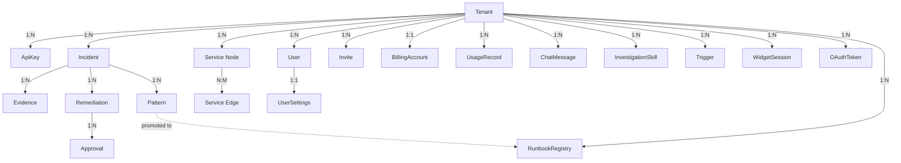

# 05 — Data Model

[< Back to index](./00-index.md) | [Previous: Complete Flow](./04-complete-flow.md) | [Next: API Endpoints >](./06-api-endpoints.md)

---

## Runtime Persistence

The OSS Docker runtime uses Postgres. The authoritative local schema is
`core/infra/postgres/migrations/001_create_causeflow_schema.sql`, and the
runtime repositories live under `core/src/modules/**/infra/pg-*.repository.ts`
plus shared helpers in `core/src/shared/infra/db/pg-client.ts`.

AWS-backed deployments may still use the DynamoDB single-table model described
below.

## DynamoDB Single Table Design

CauseFlow uses **a single DynamoDB table** for ALL data. This may seem strange if you come
from relational databases (PostgreSQL, MySQL), but it is the recommended pattern by AWS for
DynamoDB.

### Why a single table?

| Aspect | Multiple Tables | Single Table |
|--------|-----------------|--------------|
| Queries | Must join data from several tables | Everything together, one query returns it all |
| Performance | Multiple round-trips to the database | One round-trip |
| Cost | Pay per table | Pay per use (cheaper) |
| Complexity | SQL with JOINs | PK/SK keys + indexes (GSIs) |

### How It Works (PK/SK Keys)

Each item in DynamoDB has:
- **PK (Partition Key)** — identifies the "group" the data belongs to
- **SK (Sort Key)** — identifies the specific item within the group

```
Table: causeflow (SINGLE table for EVERYTHING)
──────────────────────────────────────────────────────────────

PK (Partition Key)           │ SK (Sort Key)              │ Type
─────────────────────────────┼────────────────────────────┼──────────
$tenant#t_abc123             │ $tenant                    │ Tenant
$tenant#t_abc123             │ $incident#inc_001          │ Incident
$tenant#t_abc123             │ $incident#inc_002          │ Incident
$tenant#t_abc123             │ $evidence#inc_001#evd_001  │ Evidence
$tenant#t_abc123             │ $evidence#inc_001#evd_002  │ Evidence
$tenant#t_abc123             │ $remediation#rem_001       │ Remediation
$tenant#t_abc123             │ $pattern#pat_001           │ Pattern
$tenant#t_abc123             │ $audit#aud_001             │ AuditEntry
$tenant#t_abc123             │ $notification#noti_001     │ Notification
$tenant#t_abc123             │ $approval#appr_001         │ Approval
$apikey#sha256_hash          │ $apikey                    │ ApiKey
$tenant#t_abc123             │ $oauth#notion#tok_001      │ OAuthToken
$tenant#t_abc123             │ $github#inst_001           │ GitHubInstallation
$tenant#t_abc123             │ $service#svc_001           │ ServiceNode
$tenant#t_abc123             │ $edge#edge_001             │ ServiceEdge
$tenant#t_abc123             │ $change#chg_001            │ ChangeEvent
$tenant#t_abc123             │ $codeknowledge#ck_001      │ CodeKnowledge
$tenant#t_abc123             │ $feedback#fb_001           │ Feedback
$tenant#t_abc123             │ $chatMessage#chat_01#msg_1 │ ChatMessage
$tenant#t_abc123             │ $skill#skl_001             │ InvestigationSkill
$tenant#t_abc123             │ $billingAccount            │ BillingAccount (singleton)
$tenant#t_abc123             │ $usageRecord#usg_001       │ UsageRecord
$tenant#t_abc123             │ $user#usr_001              │ User
$tenant#t_abc123             │ $invite#user@acme.com      │ Invite
$tenant#t_abc123             │ settings#usr_001           │ UserSettings
$tenant#t_abc123             │ $trigger#trg_001           │ Trigger
$tenant#t_abc123             │ $widgetSession#sess_001    │ WidgetSession
$tenant#t_abc123             │ $oauthToken#notion         │ OAuthToken
$tenant#t_abc123             │ $runbookRegistry#hash      │ RunbookRegistry
```

> CauseFlow currently has **~29 entities** persisted in this single table. Each section
> below documents the most important ones; less central entities (PackageDependency,
> RepoNode, RepoServiceMap, ChangeEvent, Integration, Feedback) follow the same pattern
> and live in `src/shared/infra/db/entities/`.

### Global Secondary Indexes (GSIs)

GSIs are "extra indexes" that allow querying by other fields:

```
GSI1 (Usage examples):
gsi1pk                          │ gsi1sk                    │ Use
────────────────────────────────┼───────────────────────────┼──────────
$tenant#slug#acme-corp          │ $tenant                   │ Look up tenant by slug
$inc#t_abc123#critical          │ $inc#open                 │ Look up incidents by severity+status
$evd#t_abc123#inc_001           │ $evd#log_analyst          │ Look up evidence by agent
$pat#t_abc123#stable            │ $pat#0.85                 │ Look up patterns by status+confidence
$noti#t_abc123#unread           │ $noti#2026-03-20          │ Look up unread notifications
```

### ElectroDB — The ORM That Abstracts All of This

You do NOT need to build PK/SK keys manually. ElectroDB handles that:

```typescript
// Entity definition (src/shared/infra/db/entities/IncidentEntity.ts)
const IncidentEntity = new Entity({
  model: { entity: "incident", version: "1", service: "causeflow" },
  attributes: {
    tenantId: { type: "string", required: true },
    incidentId: { type: "string", required: true },
    title: { type: "string" },
    severity: { type: ["critical", "high", "medium", "low", "info"] },
    status: { type: ["open", "triaging", "investigating", ...] },
    // ... other fields
  },
  indexes: {
    primary: {
      pk: { field: "pk", composite: ["tenantId"] },
      sk: { field: "sk", composite: ["incidentId"] }
    },
    bySeverityStatus: {
      index: "gsi1",
      pk: { field: "gsi1pk", composite: ["tenantId", "severity"] },
      sk: { field: "gsi1sk", composite: ["status"] }
    }
  }
});

// USAGE — you don't think about PK/SK, just the fields
await IncidentEntity.create({
  tenantId: "t_abc123",
  incidentId: "inc_xyz",
  title: "High Error Rate",
  severity: "critical",
  status: "open"
}).go();

// Query — ElectroDB builds the DynamoDB query automatically
const incidents = await IncidentEntity.query
  .bySeverityStatus({ tenantId: "t_abc123", severity: "critical" })
  .where(({ status }, { eq }) => eq(status, "open"))
  .go();
```

---

## All Entities (Detailed)

### 1. Tenant

```
Tenant {
  tenantId: TenantId           // "t_abc123" (branded type)
  name: string                 // "Acme Corp"
  slug: string                 // "acme-corp" (unique)
  ownerEmail: string           // "ops@acme.com"
  plan: Plan                   // "starter" | "pro" | "business" | "enterprise"
  status: TenantStatus         // "active" | "suspended" | "trial" | "cancelled"
  settings: {
    maxIncidents: number       // Active incident limit
    investigationsPerMonth: number // Monthly investigations (per plan) — code field: investigationCredits (to be renamed)
    investigationsUsed: number     // Investigations consumed this cycle — code field: creditsUsed (to be renamed)
    eventsPerMonth: number         // Monthly events/triage (per plan) — code field: alertCap (to be renamed)
    eventsUsed: number             // Events consumed this cycle — code field: alertsReceived (to be renamed)
    billingCycleStart: string      // Start of current billing cycle (ISO 8601)
    overagePolicy: string          // "auto_charge" | "manual"
    autoRemediation: boolean       // Remediate automatically without approval?
    awsRoleArn?: string        // IAM Role ARN for cross-account
    awsExternalId?: string     // External ID (STS security)
    awsRegion?: string         // Tenant's AWS region
  }
  createdAt: string            // ISO 8601
  updatedAt: string
}
```

**Quota per plan:**

| Plan | Investigations/mo | Events/mo | Monthly Price |
|------|-------------------|-----------|---------------|
| Starter | 15 | 500 | $99 |
| Pro | 60 | 3,000 | $349 |
| Business | 200 | 10,000 | $899 |
| Enterprise | Custom | Custom | Custom (min $2,000) |

> Field names in the code (`investigationCredits`, `creditsUsed`, `alertCap`) will be
> renamed to match the new terminology when the billing system is implemented.

### 2. Incident

```
Incident {
  incidentId: IncidentId       // "inc_xyz789"
  tenantId: TenantId           // "t_abc123"
  title: string                // "High Error Rate on payment-service"
  description: string          // Detailed description
  severity: Severity           // "critical" | "high" | "medium" | "low" | "info"
  status: IncidentStatus       // "open" | "triaging" | "investigating" |
                               // "awaiting_approval" | "remediating" |
                               // "resolved" | "closed"
  source: string               // "datadog" | "grafana" | "cloudwatch" | "sentry" | "manual"
  sourceAlertId: string        // Original alert ID (for deduplication)
  assignedAgents: AgentRole[]  // ["log_analyst", "metric_analyst", ...]
  rootCause?: string           // Populated after investigation
  recommendedActions?: Action[]// Actions recommended by the AI
  totalCostUsd?: number        // Total investigation cost in USD
  costBreakdown?: {            // Cost breakdown
    subAgents: number          //   Sub-agent cost
    synthesis: number          //   Synthesis cost (Opus)
    codeFixer: number          //   Code fixer cost
  }
  investigationDurationMs?: number // Total investigation duration in ms
  metadata?: object            // Extra data from provider
  resolvedAt?: string          // When it was resolved
  createdAt: string
  updatedAt: string
}
```

### 3. Evidence

```
Evidence {
  evidenceId: string           // "evd_001"
  incidentId: IncidentId       // "inc_xyz789"
  tenantId: TenantId           // "t_abc123"
  agentRole: AgentRole         // "coordinator" | "orchestrator" | "log_analyst" |
                               // "metric_analyst" | "infra_inspector" | "change_detector" |
                               // "code_analyzer" | "code_fixer" | "remediator" |
                               // "db_analyst" | "operator" | "issue_correlator" |
                               // "apm_analyst" | "notification_sender" | "falsifier" |
                               // "scout" | "diagnosis_verifier"
  type: string                 // "triage" | "investigation" | "synthesis"
  content: object              // Agent findings (free format)
  model: string                // "claude-haiku-4-5-20251001"
  tokensUsed: number           // Tokens consumed
  costUsd: number              // Cost in USD
  durationMs: number           // Execution time
  createdAt: string
}
```

### 4. Remediation

```
Remediation {
  remediationId: string        // "rem_001"
  incidentId: IncidentId       // "inc_xyz789"
  tenantId: TenantId           // "t_abc123"
  status: RemediationStatus    // "proposed" | "approved" | "rejected" |
                               // "executing" | "completed" | "failed"
  description: string          // Remediation description
  steps: RemediationStep[]     // List of actions to execute
  approvedBy?: string          // Email of who approved
  approvedAt?: string
  completedAt?: string
  createdAt: string
}

RemediationStep {
  type: ActionType             // "restart_service" | "scale_service" | ...
  params: object               // Action parameters
  status: StepStatus           // "pending" | "executing" | "completed" | "failed"
  output?: string              // Execution result
  startedAt?: string
  completedAt?: string
}
```

### 5. Pattern

```
Pattern {
  patternId: string            // "pat_001"
  tenantId: TenantId
  title: string                // "Memory leak in Java services"
  symptoms: Symptom[]          // List of indicative signals
  rootCause: {
    category: string           // "capacity" | "code_defect" | "config" | "network"
    description: string
    evidence: string[]
  }
  fix: {
    action: string
    description: string
    automated: boolean         // Whether it can be automated
  }
  confidence: number           // 0.0 to 1.0 (Bayesian updated)
  occurrences: number          // How many times seen
  status: PatternStatus        // "learning" | "stable" | "runbook_candidate" | "archived"
  lastSeenAt: string
  createdAt: string
}
```

### 6. AuditEntry

```
AuditEntry {
  entryId: string              // "aud_001"
  tenantId: TenantId
  action: AuditAction          // "tenant.created" | "incident.created" | ... (67 types)
  actorEmail: string           // Who performed the action
  actorType: string            // "user" | "system" | "agent"
  entityType: string           // "tenant" | "incident" | "remediation" | ...
  entityId: string             // ID of the affected entity
  details?: object             // Extra details
  previousHash: string         // Hash of the previous entry (hash chain)
  hash: string                 // SHA256(previousHash + data)
  createdAt: string
}
```

### 7. ServiceNode & ServiceEdge (Graph)

```
ServiceNode {
  serviceId: string            // "svc_001"
  tenantId: TenantId
  name: string                 // "payment-service"
  type: ServiceType            // "api" | "database" | "cache" | "queue" | "cdn" | "gateway"
  team?: string                // "payments-team"
  criticality: number          // 1-10 (for blast radius)
  metadata?: object
}

ServiceEdge {
  edgeId: string               // "edge_001"
  tenantId: TenantId
  sourceServiceId: string      // Where the dependency originates
  targetServiceId: string      // Where it points to
  type: EdgeType               // "http" | "database" | "cache" | "event" | "grpc"
  metadata?: object
}
```

### 8. Notification & Approval

```
Notification {
  notificationId: string
  tenantId: TenantId
  type: string                 // "investigation.progress" | "remediation.proposed" | ...
  title: string
  message: string
  status: string               // "unread" | "read"
  metadata?: object
  createdAt: string
}

Approval {
  approvalId: string           // "appr_001"
  tenantId: TenantId
  remediationId: string
  status: ApprovalStatus       // "pending" | "approved" | "rejected" | "expired"
  requestedBy: string          // System or user that requested
  respondedBy?: string         // Who approved/rejected
  reason?: string              // Reason for rejection
  timeout: number              // ms (default 1800000 = 30min)
  requestedAt: string
  respondedAt?: string
}
```

### 9. ApiKey

```
ApiKey {
  keyId: string                // "key_xyz"
  tenantId: TenantId
  name: string                 // "Webhook Datadog"
  prefix: string               // "cflo_abc" (first chars for identification)
  keyHash: string              // SHA256 of the full key (NEVER plain text)
  status: string               // "active" | "revoked"
  createdAt: string
  lastUsedAt?: string
}
```

### 10. OAuthToken & GitHubInstallation

```
OAuthToken {
  tokenId: string
  tenantId: TenantId
  provider: string             // "notion" | "shortcut" | "trello"
  encryptedToken: string       // Encrypted with KMS (AES-256-GCM)
  encryptedDataKey: string     // DEK encrypted with CMK
  iv: string                   // Initialization Vector
  expiresAt?: string
  createdAt: string
}

GitHubInstallation {
  installationId: string       // GitHub App installation ID
  tenantId: TenantId
  accountLogin: string         // "acme" (GitHub org or user)
  repositories: string[]       // ["payment-service", "order-service"]
  permissions: object          // { contents: "read", pull_requests: "write", ... }
  createdAt: string
}
```

### 11. ChatMessage

Conversational chat history (Operator chat, agent dialogue with end users).

```
ChatMessage {
  tenantId: TenantId           // PK component
  chatId: string               // SK component (groups messages by conversation)
  messageId: string            // SK component (orders messages within chat)
  role: "user" | "assistant"
  content: string              // Message text (markdown allowed)
  intent: "memory_only" | "live_check" | "incident" | "general" | "knowledge"
  status: "completed" | "processing" | "error"
  costUsd?: number             // Cost of generating this assistant message
  liveDataChecked?: boolean    // True if assistant queried fresh data
  toolCallsCount?: number      // Number of tool invocations
  createdAt: string
}
```

- **PK:** `tenantId`
- **SK:** `chatId#messageId`
- **GSI1 (`byChatCreated`):** pk=`tenantId`, sk=`createdAt` — chronological scan across all chats

### 12. InvestigationSkill

Custom tenant-defined investigation playbooks (sub-agents the orchestrator can dispatch).

```
InvestigationSkill {
  id: SkillId                  // "skl_xyz"
  tenantId: TenantId
  name: string                 // Unique within tenant: "kubernetes-pod-crashloop"
  displayName: string          // Human-readable: "Kubernetes Pod CrashLoopBackOff"
  description: string          // What this skill investigates
  whenToUse: string            // Triage condition: "When incident involves OOMKilled..."
  systemPrompt: string         // Static prompt cached via prompt caching
  allowedTools: string[]       // Subset of investigation tools this skill may call
  model?: string               // Optional model override (e.g. "claude-sonnet-4-5")
  maxTurns?: number            // Default: 5
  minToolCalls?: number        // Default: 2 — forces evidence gathering
  isEnabled: boolean
  createdAt: string
  updatedAt: string
}
```

- **PK:** `tenantId`, **SK:** `id`
- **GSI1 (`byName`):** pk=`tenantId`, sk=`name` — lookup by unique skill name

### 13. BillingAccount

Per-tenant usage counters and Stripe linkage. **Singleton per tenant** (one item, no SK component).

```
BillingAccount {
  tenantId: TenantId           // PK (sole key — singleton)
  investigationsLimit: number  // Monthly cap (default 15 — Starter)
  investigationsUsed: number   // Consumed this billing cycle
  eventsLimit: number          // Monthly cap (default 500)
  eventsUsed: number           // Consumed this billing cycle
  plan?: Plan                  // "starter" | "pro" | "business" | "enterprise"
  stripeCustomerId?: string    // Stripe customer reference
  stripeSubscriptionId?: string// Active subscription
  createdAt: string
  updatedAt: string
}
```

- **PK:** `tenantId`, **SK:** *(empty composite — singleton)*

### 14. UsageRecord

Historical usage snapshots — append-only record per investigation/event for auditability and per-period reporting.

```
UsageRecord {
  tenantId: TenantId
  recordId: string             // "usg_001" (typically `${period}#${ulid}`)
  type: "investigation" | "event"
  incidentId?: string          // Linked incident, if applicable
  costUsd?: number             // Cost of this consumption unit
  createdAt: string
}
```

- **PK:** `tenantId`, **SK:** `recordId`
- **GSI1 (`byType`):** pk=`tenantId#type`, sk=`createdAt` — period rollups by type

### 15. User, Invite & UserSettings

Users belong to tenants. Invites are pending memberships.

```
User {
  tenantId: TenantId
  userId: string               // "usr_001"
  email: string
  name: string
  role: "admin" | "member"
  profileComplete: boolean
  termsAcceptedAt?: string
  createdAt: string
  updatedAt: string
}
```

- **PK:** `tenantId`, **SK:** `userId`
- **GSI1 (`byUserId`):** pk=`userId`, sk=`tenantId` — user across tenants
- **GSI2 (`byEmail`):** pk=`email`, sk=`tenantId` — login lookup

```
Invite {
  tenantId: TenantId
  email: string                // SK — pending invitee
  invitedBy: string            // userId of inviter
  role: "admin" | "member"
  status: "pending" | "accepted" | "expired" | "revoked"
  expiresAt: string
  createdAt: string
  updatedAt: string
}
```

- **PK:** `tenantId`, **SK:** `email`

```
UserSettings {
  tenantId: TenantId
  userId: string               // SK template: "settings#${userId}"
  theme: "light" | "dark" | "system"
  locale: "en" | "pt-br"
  notifications: {
    emailOnComplete: boolean
    emailOnError: boolean
    slackOnComplete: boolean
    slackOnError: boolean
  }
  createdAt: string
  updatedAt: string
}
```

- **PK:** `tenantId`, **SK:** `settings#${userId}`

### 16. Trigger

Composio-managed triggers (webhooks/event listeners that fire incidents).

```
Trigger {
  tenantId: TenantId
  triggerId: string            // Internal id
  triggerSlug: string          // Composio slug, e.g. "DATADOG_ALERT"
  provider: string             // "datadog" | "github" | "slack" | ...
  composioTriggerId: string    // Composio's external id
  connectedAccountId: string   // Composio connected account
  config: object               // Trigger-specific config
  status: "active" | "paused" | "error"
  lastEventAt?: string
  eventCount: number
  createdAt: string
  updatedAt: string
}
```

- **PK:** `tenantId`, **SK:** `triggerId`
- **GSI1 (`byComposioTrigger`):** pk=`composioTriggerId`, sk=`tenantId` — webhook dispatch lookup

### 17. WidgetSession

Embeddable customer chat widget session (a public-facing visitor talks to a CauseFlow agent).

```
WidgetSession {
  tenantId: TenantId
  sessionId: string            // SK
  agentId?: string             // Skill/agent assigned to this session
  agentName?: string
  messages: Message[]          // Inline transcript (denormalized for read latency)
  status: "active" | "closed"
  pushSubscription?: object    // Web Push subscription (browser notifications)
  expiresAt: number            // TTL — DynamoDB auto-deletes expired sessions
  createdAt: string
  updatedAt: string
}
```

- **PK:** `tenantId`, **SK:** `sessionId`
- TTL field: `expiresAt` (epoch seconds)

### 18. OAuthToken (full schema)

Encrypted-at-rest envelope for third-party OAuth tokens. Stored once per tenant per provider.

```
OAuthToken {
  tenantId: TenantId
  provider: "trello" | "notion" | "shortcut" | "jira" | "linear" | "hubspot" | "confluence"
  // Encrypted access token (envelope encryption)
  encryptedToken: string
  encryptedDek: string         // DEK encrypted under KMS CMK
  tokenIv: string
  tokenTag: string             // GCM auth tag
  // Encrypted refresh token (same envelope shape)
  encryptedRefreshToken?: string
  refreshDek?: string
  refreshIv?: string
  refreshTag?: string
  expiresAt?: string
  scopes?: string[]
  metadata?: { workspaceId?: string; workspaceName?: string; userId?: string }
  createdAt: string
  updatedAt: string
}
```

- **PK:** `tenantId`, **SK:** `provider`
- **GSI1 (`byProvider`):** pk=`provider`, sk=`tenantId` — cross-tenant audit by provider
- **Invariant:** Plaintext tokens are NEVER stored. All envelope fields are required for the access token.

### 19. RunbookRegistry

Promoted patterns — recurring root causes that have crystallized into runbook candidates.

```
RunbookRegistry {
  tenantId: TenantId
  rootCauseHash: string        // SK — stable hash of root cause signature
  rootCauseSummary: string     // Human-readable summary
  occurrences: number          // How many times this root cause has been observed
  confirmations: number        // How many times user confirmed correctness
  lastSeen: string
  fixAction: string            // Action label (e.g. "restart_service")
  fixDescription: string
  automated: boolean           // Whether the fix can be auto-applied
  createdAt: string
  updatedAt: string
}
```

- **PK:** `tenantId`, **SK:** `rootCauseHash`
- **GSI1 (`byTenant`):** pk=`tenantId`, sk=`occurrences` — most-frequent root causes first

---

## Branded Types — Type Safety

CauseFlow uses "branded types" so TypeScript prevents you from mixing up IDs:

```typescript
// Definition (src/shared/domain/value-objects.ts)
type TenantId = string & { readonly __brand: 'TenantId' };
type IncidentId = string & { readonly __brand: 'IncidentId' };

// Creation
const tid = "t_abc123" as TenantId;
const iid = "inc_xyz" as IncidentId;

// COMPILE-TIME ERROR!
// findIncidentById(iid, tid)  ← TypeScript complains: expected TenantId, received IncidentId
// findIncidentById(tid, iid)  ← OK!
```

This prevents subtle bugs like passing an incidentId where a tenantId is expected.

---

## Relationship Diagram



[Next: API Endpoints >](./06-api-endpoints.md)
