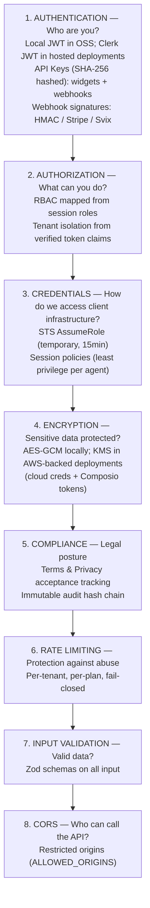
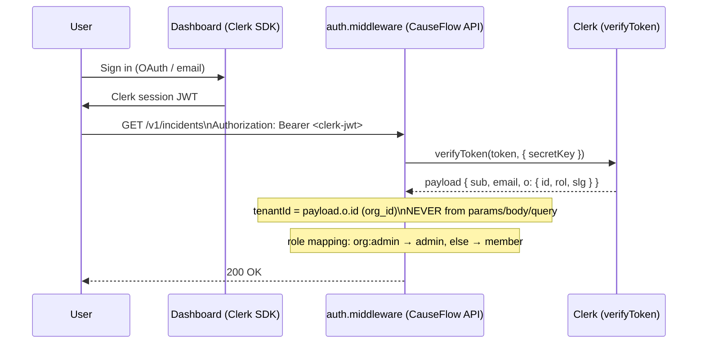
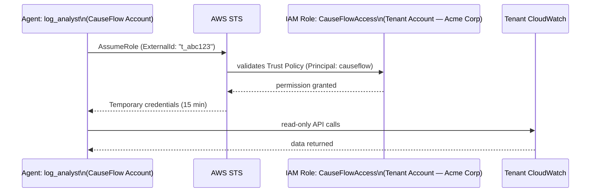

# 08 — Security

[< Back to index](./00-index.md) | [Previous: AI System](./07-ai-system.md) | [Next: AWS Infrastructure >](./09-aws-infrastructure.md)

---

## Security Overview

CauseFlow handles access to clients' production infrastructure. Security is not optional — it is the system's #1 priority.



---

## 1. Authentication

CauseFlow exposes distinct security schemes, each matched to the threat model of
its surface. The route files are the source of truth for which scheme a route
accepts.

| Scheme               | Header                  | Used by                                       | Verification                          |
| -------------------- | ----------------------- | --------------------------------------------- | ------------------------------------- |
| `bearerAuth`         | `Authorization: Bearer` | Dashboard / API clients (local JWT in OSS, Clerk JWT in hosted deployments) | JWT verification          |
| `apiKeyAuth`         | `X-API-Key`             | Widget + webhook ingest                       | SHA-256 hash lookup       |
| `webhookSecret`      | `X-Webhook-Signature`   | Generic webhook ingest (HMAC)                 | HMAC-SHA256(body, secret) + timingSafeEqual |
| `webhookSignature`   | `X-Composio-Signature`  | Composio integration callbacks                | HMAC-SHA256(body, composioSecret)     |
| `stripeSignature`    | `stripe-signature`      | Stripe billing webhooks                       | `stripe.webhooks.constructEvent`      |
| `svixSignature`      | `svix-id`, `svix-timestamp`, `svix-signature` | Clerk user/org webhooks | `svix` `Webhook.verify`               |

---

### 1.1 Clerk OAuth (Primary Dashboard Auth)

**Clerk is the primary authentication mechanism for CauseFlow.** All dashboard and API endpoints verify a Clerk-issued JWT. There is no bespoke JWT issuance — CauseFlow does not mint its own tokens.



**Implementation** — `src/shared/infra/http/middleware/auth.middleware.ts`:

```typescript
const payload = await verifyToken(token, {
  secretKey: config.clerk.secretKey,
});

// Clerk JWT v2 compact org claim: o = { id, rol, slg }
const oPayload = payload.o as { id?: string; rol?: string; slg?: string };
const orgId = oPayload?.id ?? payload.org_id;

// IDOR PROTECTION: tenantId comes ONLY from the verified JWT org claim.
// NEVER from params, body, or query string.
c.set('tenantId', tenantId(orgId));
c.set('userId', payload.sub);
c.set('userEmail', payload.email);
c.set('userRoles', roles); // mapped from org:admin / org:member
```

**Public paths** (no Clerk JWT required):

```typescript
const PUBLIC_PATHS = [
  '/health', '/health/detailed',
  '/v1/webhooks/',          // apiKeyAuth + webhookSecret
  '/webhooks/',              // provider-specific signatures
  '/v1/auth/clerk-webhook',  // svixSignature
  '/v1/billing/webhook',     // stripeSignature
  '/v1/widget/',             // apiKeyAuth (X-API-Key)
  '/v1/signup',              // self-serve provisioning
  '/portal',                 // customer portal
  '/dashboard',              // static frontend
];
```

**Provisioning exception:** `POST /v1/tenants` requires a valid Clerk JWT but permits a missing `org_id` claim (used during initial onboarding before the Clerk org exists).

---

### 1.2 Widget API Key Auth

Public-facing widget endpoints (`/v1/widget/*`) are called from browsers that do not have a Clerk session. These routes use `X-API-Key` via `widget-auth.middleware.ts`:

```
POST /v1/widget/events
X-API-Key: cflo_pub_abc123...

1. Hash the key:   keyHash = SHA-256(headerValue)
2. Look up in DynamoDB (api-key.repository) by hash
3. Confirm key.status === 'active'
4. Inject key.tenantId into the Hono context
```

The plaintext key is **never stored** — only the SHA-256 hash is persisted. Revoked keys are hard-deleted, not soft-flagged.

---

### 1.3 Webhook Auth Middleware (`/v1/webhooks/:tenantId/:provider`)

Generic observability webhook ingest accepts a **shared webhook secret OR API key** (per-key webhook secret takes precedence):

```
POST /v1/webhooks/t_abc123/datadog
X-Webhook-Signature: sha256=<hmac>
X-API-Key: cflo_...            (optional — enables per-key secret)
Body: { ... }

Flow (webhook-auth.middleware.ts):

1. If X-API-Key present AND apiKeyRepo provided:
     a. keyHash = SHA-256(apiKey)
     b. Look up active key; read key.webhookSecretHash
     c. expected = HMAC-SHA256(body, key.webhookSecretHash)
     d. timingSafeEqual(sig, expected) → pass / fail closed
2. Else fallback to global WEBHOOK_SECRET:
     expected = HMAC-SHA256(body, globalSecret)
     timingSafeEqual(sig, expected)
```

Both branches use `timingSafeEqual` against buffers of equal length to prevent timing attacks. Per-key failures do NOT fall through to the global secret — an explicit per-key attempt must succeed on its own.

---

### 1.4 Stripe Webhook Signature (`stripeSignature`)

`POST /v1/billing/webhook` is verified via the `stripe-signature` header:

```typescript
const event = stripe.webhooks.constructEvent(
  rawBody,
  request.headers['stripe-signature'],
  config.stripe.webhookSecret,
);
```

Stripe's library enforces signature validity and a ±5 minute timestamp tolerance to defeat replay attacks. The raw body (not parsed JSON) is required — if the body is JSON-parsed before verification, the signature will not match.

---

### 1.5 Clerk Webhook Signature (`svixSignature`)

`POST /v1/auth/clerk-webhook` receives user/org lifecycle events. Clerk signs webhooks using **Svix**, which sends three headers:

```
svix-id:        msg_abc123
svix-timestamp: 1742486460
svix-signature: v1,<base64-hmac> v1,<base64-hmac>
```

Verification:

```typescript
import { Webhook } from 'svix';
const wh = new Webhook(config.clerk.webhookSigningSecret);
const evt = wh.verify(rawBody, {
  'svix-id': headers['svix-id'],
  'svix-timestamp': headers['svix-timestamp'],
  'svix-signature': headers['svix-signature'],
});
```

Svix rejects messages older than 5 minutes (replay protection) and returns a typed event for `user.created`, `organization.created`, `organizationMembership.*`, etc.

---

### 1.6 Composio Webhook Signature (`webhookSignature`)

Composio integration callbacks (tool execution results, OAuth completion) arrive at provider-specific webhook paths and carry an `X-Composio-Signature` header. Verification is HMAC-SHA256 over the raw body using the per-tenant `composioWebhookSecret`, validated with `timingSafeEqual`.

---

## 2. RBAC (Role-Based Access Control)

### Roles

Roles derive from Clerk organization roles (`payload.o.rol`), mapped at the middleware boundary:

```
Clerk role    →  CauseFlow role
──────────────────────────────
org:admin     →  admin    (full tenant control)
org:member    →  member   (operate incidents, view reports)
(no org role) →  <blocked — except provisioning path>
```

The legacy `owner / operator / viewer` split has been collapsed into `admin / member`. Fine-grained permissions (e.g. approving remediations) are gated per-route via `requireRole('admin')`.

### Tenant Isolation (IDOR Protection)

**`tenantId` is NEVER read from request params, body, or query string.** It is sourced exclusively from the verified Clerk JWT `o.id` (org_id) claim. Every repository query is keyed on `tenantId`:

```typescript
// DynamoDB single-table: PK = $tenant#tenantId, SK = $incident#incidentId
// Physically impossible to access another tenant's data
async findById(tenantId: TenantId, incidentId: IncidentId) { ... }
```

---

## 3. STS Credentials (Cross-Account AWS Access)

### The Problem

AI agents need access to the CLIENT's AWS infrastructure (CloudWatch, ECS, etc.). Permanent credentials would be a huge security risk.

### The Solution: STS AssumeRole with ExternalId



### Session Policies (Least Privilege per Agent)

```
log_analyst       → logs:GetQueryResults, logs:StartQuery, logs:GetLogEvents
metric_analyst    → cloudwatch:GetMetricData, cloudwatch:GetMetricStatistics
infra_inspector   → ecs:DescribeServices, ecs:DescribeTasks, ec2:DescribeInstances  (read-only)
remediator        → ecs:UpdateService, ecs:RegisterTaskDefinition  (ONLY after human approval)
```

Read-only agents receive IAM policies that literally omit mutating verbs — not even "allow but audit." The role cannot `UpdateService` even if an agent is jailbroken.

### Credential Lifecycle

```
1. Investigation begins → credentialVendor.vend({ agentRole, incidentId })
2. STS AssumeRole with restrictive session policy (15-min TTL)
3. Agent uses temporary creds
4. Investigation ends → credentialVendor.revokeAll(incidentId) → audit event
```

---

## 4. Token Encryption

Used for **all sensitive secrets at rest**:
- Cloud provider credentials (AWS/GCP/Azure secret keys where not STS)
- **Composio integration tokens** (GitHub, Notion, Linear, Shortcut, etc.) — same envelope mechanism
- OAuth refresh tokens

### How It Works

Implementation: OSS local runtime uses
`src/shared/infra/credentials/aes-gcm-token-encryption.ts`; AWS-backed
deployments can use KMS envelope encryption.

```
encrypt(plaintext):
  1. KMS.GenerateDataKey({ KeyId: alias/causeflow-token-encryption, KeySpec: AES_256 })
     → returns { Plaintext DEK, Encrypted DEK }
  2. iv = randomBytes(12)
  3. cipher = AES-256-GCM(plaintextDEK, iv, authTagLength: 16)
  4. ciphertext = cipher.update(plaintext) + cipher.final()
  5. tag = cipher.getAuthTag()
  6. dekPlaintext.fill(0)   // zero out plaintext DEK from memory
  7. return { ciphertext, encryptedDek, iv, tag } (all base64)

decrypt(payload):
  1. KMS.Decrypt(encryptedDek) → plaintext DEK
  2. decipher = AES-256-GCM(plaintextDEK, iv, authTagLength: 16)
  3. decipher.setAuthTag(tag)
  4. plaintext = decipher.update(ciphertext) + decipher.final()
  5. dekPlaintext.fill(0)
  6. return plaintext
```

### Security Guarantees

- Token is **never** stored in plaintext — persistence only holds ciphertext
- DEK is **never** persisted in plaintext — only the KMS-encrypted version is stored
- Plaintext DEK exists in process memory ONLY during encrypt/decrypt, then is zeroed
- AES-256-GCM provides **authenticated encryption** — any tampering with the ciphertext fails the auth tag check at decrypt time
- Even with full DynamoDB access, tokens are unreadable without KMS `Decrypt` permission on the CMK
- Composio tokens reuse the exact same pipeline — there is no separate, weaker path for integration secrets

In OSS mode, the `TOKEN_ENCRYPTION_KEY` env var supplies the AES-256-GCM key and
Postgres stores only ciphertext.

---

## 5. Legal Acceptance Tracking

To satisfy privacy and terms-of-service compliance, every `User` entity records acceptance timestamps:

```typescript
interface User {
  id: UserId;
  email: string;
  // ...
  termsAcceptedAt?: ISODateString;   // Terms of Service acceptance
  legalAcceptedAt?: ISODateString;   // Privacy Policy / DPA acceptance
}
```

**Rules:**
- Both timestamps are set during signup (or on re-acceptance after a ToS version bump)
- A user with missing `termsAcceptedAt` or `legalAcceptedAt` is redirected to a consent screen before being allowed to use the dashboard
- Timestamps are immutable once written for a given ToS version — a ToS revision creates a new acceptance row, preserving the prior consent audit trail
- Acceptance events flow through the audit hash chain (`auth.terms_accepted`, `auth.privacy_accepted`)

---

## 6. Audit Trail (Hash Chain)

Each action generates an audit entry chained by SHA-256:

```
Entry N:
  action: "incident.created"
  data:   { incidentId, tenantId, ... }
  previousHash: <hash of Entry N-1>
  hash:         SHA-256(previousHash + JSON(data))

Integrity verification:
  For each entry (except genesis):
    recomputed = SHA-256(entry[N-1].hash + JSON(entry[N-1].data))
    if recomputed != entry[N].previousHash → TAMPERING DETECTED
```

Categories: `tenant.*`, `incident.*`, `investigation.*`, `remediation.*`, `credential.*`, `auth.*` (including `auth.terms_accepted`), `github.*`, `notification.*`, `billing.*`.

---

## 7. Rate Limiting (Fail-Closed)

Per-tenant, per-plan limits enforced via Redis `INCR` with an in-memory fallback:

```
Plan         | Limit         | Window
-------------|---------------|--------
starter      | 100 req/min   | 60s
pro          | 500 req/min   | 60s
business     | 2000 req/min  | 60s
enterprise   | 2000 req/min  | 60s
```

If Redis is down, counters fall back to an in-process `Map` — **fail-closed**. Better to deny some legitimate requests than allow DDoS.

Response headers: `X-RateLimit-Limit`, `X-RateLimit-Remaining`, `X-RateLimit-Reset`.

---

## 8. CORS

```typescript
app.use(cors({
  origin: config.cors.allowedOrigins,  // explicit list, NEVER "*"
  allowMethods: ['GET', 'POST', 'PUT', 'PATCH', 'DELETE'],
  allowHeaders: ['Content-Type', 'Authorization', 'X-API-Key'],
  credentials: true,
}));
```

---

## 9. Input Validation (Zod)

All HTTP, SQS, and LLM tool-call input is validated with Zod before reaching a use case. Invalid data returns `400` and never enters application logic.

---

## 10. Data Masking in Logs

Structured logging (pino) applies a redaction allow-list: Authorization headers, API keys, Clerk JWTs, OAuth tokens, Composio secrets, Stripe keys, and `encryptedDek`/`ciphertext` fields are replaced with `[REDACTED]`. Log shipping pipelines drop any record flagged with `sensitive: true`.

---

## Security Checklist (for maintenance)

- [ ] Hosted auth secrets set and rotated; OSS `JWT_SECRET` is not the default
- [ ] Clerk webhook signing secret set when Clerk webhooks are enabled
- [ ] `STRIPE_WEBHOOK_SECRET` set (Stripe signature verification)
- [ ] `WEBHOOK_SECRET` is strong (>32 random chars)
- [ ] `TOKEN_ENCRYPTION_KEY` is strong in OSS; KMS CMK/IAM are configured in AWS-backed deployments
- [ ] CORS `ALLOWED_ORIGINS` has no wildcard
- [ ] Rate limiting active (Redis UP or fallback working)
- [ ] STS session TTL ≤ 15 min; read-only roles cannot mutate
- [ ] No Clerk JWTs, API keys, or Composio tokens appear in logs
- [ ] Audit hash chain verified periodically
- [ ] Revoked API keys are hard-deleted, not soft-flagged
- [ ] All users have `termsAcceptedAt` and `legalAcceptedAt` set
- [ ] OpenAPI security schemes (`bearerAuth`, `apiKeyAuth`, `webhookSecret`, `webhookSignature`, `stripeSignature`, `svixSignature`) match middleware wiring

[Next: AWS Infrastructure >](./09-aws-infrastructure.md)
