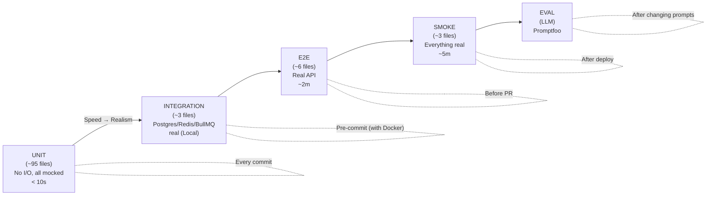

# 11 — Testing System

[< Back to index](./00-index.md) | [Previous: Local Environment](./10-local-environment.md) | [Next: Maintenance >](./12-production-maintenance.md)

---

## 5 Testing Levels

CauseFlow has 5 testing levels, from fastest to most comprehensive:



---

## 1. Unit Tests

**What they test:** Pure logic, no I/O (no database, no network, no queue).
**Framework:** Vitest
**Location:** `tests/unit/modules/`
**Count:** ~95 files
**Time:** < 10 seconds

### How to Run

```bash
pnpm test:run
```

### What Is Tested

Each module has unit tests for:
- **Use Cases** — business logic
- **Parsers** — alert normalization
- **Domain Services** — pure calculations (Bayesian update, hash chain)
- **Value Objects** — type validation

### Example

```typescript
// tests/unit/modules/ingestion/ingest-alert.usecase.test.ts

describe('IngestAlertUseCase', () => {
  it('should create incident from valid alert', async () => {
    // Arrange
    const mockRepo = { create: vi.fn(), findBySourceAlertId: vi.fn(() => null) };
    const mockEventBus = { publish: vi.fn() };
    const mockQueue = { send: vi.fn() };
    const useCase = new IngestAlertUseCase(mockRepo, mockEventBus, mockQueue);

    // Act
    await useCase.execute({
      tenantId: 't_test' as TenantId,
      title: 'High Error Rate',
      source: 'datadog',
      sourceAlertId: 'dd-123',
    });

    // Assert
    expect(mockRepo.create).toHaveBeenCalledOnce();
    expect(mockEventBus.publish).toHaveBeenCalledWith(
      expect.objectContaining({ type: 'incident.created' })
    );
    expect(mockQueue.send).toHaveBeenCalledOnce();
  });

  it('should reject duplicate alerts', async () => {
    const mockRepo = {
      findBySourceAlertId: vi.fn(() => ({ incidentId: 'existing' })),
    };
    const useCase = new IngestAlertUseCase(mockRepo, ...);

    await expect(useCase.execute({ sourceAlertId: 'dd-123', ... }))
      .rejects.toThrow(DuplicateAlertError);
  });
});
```

### Important Rule: Mocks in Unit Tests

In unit tests, EVERYTHING that involves I/O is mocked:
- Repositories → `vi.fn()`
- EventBus → `vi.fn()`
- MessageQueue → `vi.fn()`
- Claude API → `vi.fn()`

This ensures that tests are fast and do not depend on infrastructure.

### Module Coverage Snapshot

The table below reflects current unit-test coverage by module. Modules without
dedicated unit suites are covered indirectly via E2E/integration tests and LLM
evals; filling those gaps is tracked as ongoing work.

| Module          | Unit tests                                | Notes                                                     |
| --------------- | ----------------------------------------- | --------------------------------------------------------- |
| `ingestion`     | Yes (`tests/unit/modules/ingestion/`)     | Parsers, dedup, manual incident, webhook routes           |
| `triage`        | Yes (`tests/unit/modules/triage/`)        | Evidence repository, domain services                     |
| `investigation` | Yes (`tests/unit/modules/investigation/`) | Agent tools, GitHub tools, change detector, routes       |
| `remediation`   | Yes (`tests/unit/modules/remediation/`)   | Propose/approve/reject/execute, PR flow, timeout         |
| `notification`  | Yes (`tests/unit/modules/notification/`)  |                                                           |
| `tenant`        | Yes (`tests/unit/modules/tenant/`)        |                                                           |
| `audit`         | Yes (`tests/unit/modules/audit/`)         | Hash chain integrity                                      |
| `skills`        | Yes (`tests/unit/modules/skills/`)        | Dynamic skill selection                                   |
| `widget`        | Yes (`tests/unit/modules/widget/`)        | Chat use case, data masking, response formatter          |
| `memory`        | Gap — covered by E2E/evals                | Chat history + intent classification; unit suite pending |
| `billing`       | Gap — covered by E2E                      | Quota reserve/refund, Stripe webhook; unit suite pending |
| `integration`   | Gap — covered by E2E                      | Composio triggers; unit suite pending                    |
| `auth`          | Middleware only (`tests/unit/shared/`)    | Clerk webhook covered by E2E; unit suite pending         |

---

## 2. Integration Tests

**What they test:** Real interaction with Postgres, Redis, and BullMQ in the OSS runtime.
**Framework:** Vitest
**Location:** `tests/integration/`
**Count:** ~3 files
**Time:** ~30 seconds
**Requires:** Docker

### How to Run

```bash
# First, bring up the local infrastructure:
docker-compose up -d

# Then run the tests:
pnpm test:integration
```

### What Is Tested

- **Postgres:** Real CRUD of entities (create, query, update, delete)
- **Redis:** Real rate limiting (set, incr, expire)
- **BullMQ:** Real job enqueue/dequeue paths

### Example

```typescript
// tests/integration/postgres.test.ts

describe('Postgres Integration', () => {
  it('should create and retrieve an incident', async () => {
    // Uses local Postgres from docker-compose.yml
    await incidentRepository.save({
      tenantId: 't_test',
      incidentId: 'inc_test',
      title: 'Test Incident',
      severity: 'high',
      status: 'open',
    });

    const result = await incidentRepository.findById('t_test', 'inc_test');

    expect(result?.title).toBe('Test Incident');
  });
});
```

---

## 3. E2E Tests (End-to-End)

**What they test:** The complete pipeline, from webhook to resolution.
**Framework:** Vitest
**Location:** `tests/e2e/scenarios/`
**Count:** ~6 scenarios
**Time:** ~2 minutes
**Requires:** Docker + running server

### How to Run

```bash
docker-compose up -d
pnpm dev &          # Start the server in background
pnpm test:e2e
```

### Tested Scenarios

1. **Datadog alert ingestion** → verifies incident creation
2. **Complete pipeline** → alert → triage → investigation → remediation
3. **Deduplication** → same alert does not create a duplicate incident
4. **Rate limiting** → exceeding the limit returns 429
5. **Invalid HMAC** → webhook with wrong signature returns 401
6. **Approval flow** → proposal → approval → execution

**Note:** E2E tests use **stubs for Claude** (they do not call the real API).
This avoids costs and makes tests deterministic.

---

## 4. Smoke Tests

**What they test:** Basic verification that the deployed system is working.
**Framework:** Vitest
**Location:** `tests/smoke/scenarios/`
**Count:** ~3 scenarios
**Time:** ~5 minutes
**Requires:** Deployed system (staging or production)

### How to Run

```bash
SMOKE_BASE_URL=https://staging.causeflow.com pnpm test:smoke
```

### Scenarios

1. **Health check** → `/health/detailed` returns healthy
2. **Auth flow** → valid JWT accesses endpoints, invalid returns 401
3. **Basic webhook** → alert arrives and creates an incident

**When to run:** After each deploy to staging, before promoting to production.

---

## 5. LLM Quality Tests (Promptfoo)

**What they test:** Whether the AI prompts are generating responses of acceptable quality.
**Framework:** Promptfoo, wrapped in a Vitest bridge (`vitest.eval.config.ts`)
**Location:** `tests/eval/` — eval framework + scenarios + `promptfoo/` suite
**Current suites:** `promptfoo/triage.yaml` (triage prompt) and `promptfoo/pipeline.yaml` (full investigation pipeline). The Vitest bridge (`tests/eval/promptfoo-bridge.test.ts`, `tests/eval/run-eval.test.ts`) lets evals run as part of the normal test runner.

### How to Run

```bash
pnpm eval:triage          # Evaluates triage
pnpm eval:pipeline        # Evaluates complete pipeline
```

### What Is Tested

```yaml
# Simplified example of triage eval

tests:
  - description: "OOM should be classified as critical"
    vars:
      title: "OutOfMemoryError on payment-service"
      description: "Java heap space exhausted, service restarting"
    assert:
      - type: equals
        value: "critical"
        path: "priority"
      - type: contains
        value: "memory"
        path: "summary"

  - description: "Generic warning should NOT be critical"
    vars:
      title: "Disk usage warning at 70%"
    assert:
      - type: not-equals
        value: "critical"
        path: "priority"
```

### When to Run

- After any change to agent system prompts
- After updating models (e.g., Haiku 4.5 → new version)
- Periodically (weekly) to detect regressions

---

## Test Structure

```
tests/
├── unit/                          # Fast, no I/O
│   └── modules/
│       ├── ingestion/
│       ├── triage/
│       ├── investigation/
│       ├── remediation/
│       ├── knowledge/
│       ├── graph/
│       ├── notification/
│       ├── tenant/
│       ├── audit/
│       ├── skills/              # dynamic skill selection
│       └── widget/
│
├── integration/                   # Real Postgres/Redis/BullMQ
│   ├── postgres.test.ts
│   ├── redis.test.ts
│   └── queue.test.ts
│
├── e2e/                          # Complete pipeline
│   └── scenarios/
│       ├── ingestion.e2e.test.ts
│       ├── pipeline.e2e.test.ts
│       └── ...
│
├── smoke/                        # Post-deploy
│   └── scenarios/
│       ├── health.smoke.test.ts
│       └── ...
│
├── eval/                         # LLM quality
│   └── promptfoo/
│
├── fixtures/                     # Reusable test data
│   ├── datadog-alert.json
│   ├── grafana-alert.json
│   └── ...
│
└── helpers/                      # Test utilities
    ├── test-bootstrap.ts         # Bootstrap with mocks
    └── test-factories.ts         # Factories for creating entities
```

---

## TDD in CauseFlow

The project follows TDD (Test-Driven Development):

### For New Features:
```
1. Write the test FIRST (it will fail — "Red")
2. Implement the MINIMUM code to pass ("Green")
3. Refactor while keeping tests passing ("Refactor")
4. Add integration tests
5. Add E2E tests
```

### For Bug Fixes:
```
1. Write a test that REPRODUCES the bug (it will fail)
2. Fix the bug
3. Verify that the test now passes
4. Add regression test if necessary
```

[Next: Maintenance >](./12-production-maintenance.md)
