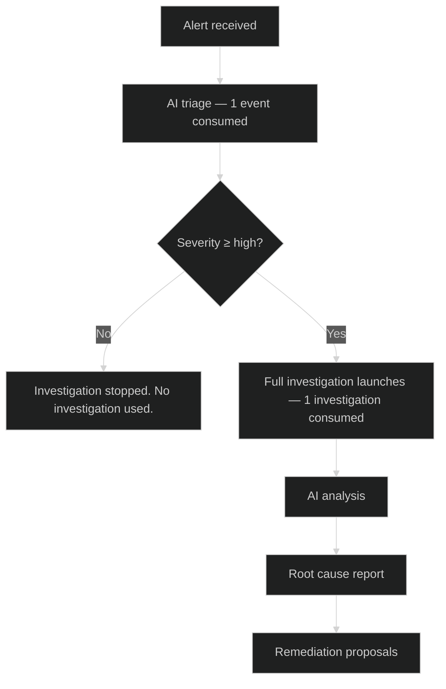

Every CauseFlow plan includes a monthly allowance of **investigations** and **events**. This page explains how each is consumed, how to monitor your usage, and what happens when you reach your limit.

## Events vs investigations

<CardGroup cols={2}>
  <Card title="Events" icon="bell">
    Every incoming alert consumes **1 event**. An event covers AI triage — severity classification and initial evidence gathering.
  </Card>
  <Card title="Investigations" icon="magnifying-glass">
    If an alert's severity meets your threshold (default: **high** or above), CauseFlow automatically launches a full investigation. This consumes **1 investigation** from your monthly allowance.
  </Card>
</CardGroup>

### How consumption works

<Tip>
  You can adjust the severity threshold that triggers a full investigation in **Dashboard > Settings > Investigation Policy**. Raising the threshold to `critical` reduces investigation usage on lower-priority alerts.
</Tip>

## Monthly allowances by plan

| Plan | Investigations / mo | Events / mo |
|------|---------------------|-------------|
| Starter | 15 | 500 |
| Pro | 60 | 3,000 |
| Business | 200 | 10,000 |
| Enterprise | Custom | Custom |

## Viewing your usage

Your current usage is always visible in the dashboard.

**Dashboard > Billing** shows:

- Investigations used this billing cycle
- Events used this billing cycle
- Remaining allowance for each
- Next reset date
- Overage charges accrued (if any)

You will also see a usage bar on the main dashboard header when you are within 20% of your limit.

## Monthly reset

Investigations and events reset at the start of each billing cycle. Unused allowance does not roll over to the next month.

Your billing cycle start date is shown in **Dashboard > Billing**.

## When you reach your limit

You have two options to continue using CauseFlow beyond your monthly allowance:

- **Overage (auto-charge)** — Additional usage is billed automatically at the end of the billing cycle via your Stripe payment method on file. You can review accrued overage at any time in **Dashboard > Billing**.
- **Quota packs (manual purchase)** — Buy additional investigations or events upfront at a reduced per-unit rate from **Dashboard > Billing > Buy Quota**. Quota packs are consumed before overage charges apply.

For pricing details, visit [causeflow.ai/pricing](https://causeflow.ai/pricing).

## Avoiding unexpected charges

<Tip>
  Monitor your usage in **Dashboard > Billing** regularly. You can set up email notifications when you reach 80% of your monthly limit — go to **Dashboard > Settings > Notifications**.
</Tip>

If you consistently hit your limit, consider upgrading your plan. The per-investigation cost is lower on higher plans than the overage rate.

Upgrading mid-cycle takes effect immediately. You are charged a prorated amount for the remainder of the billing period. See [Manage subscription](/billing/manage-subscription) for details.
