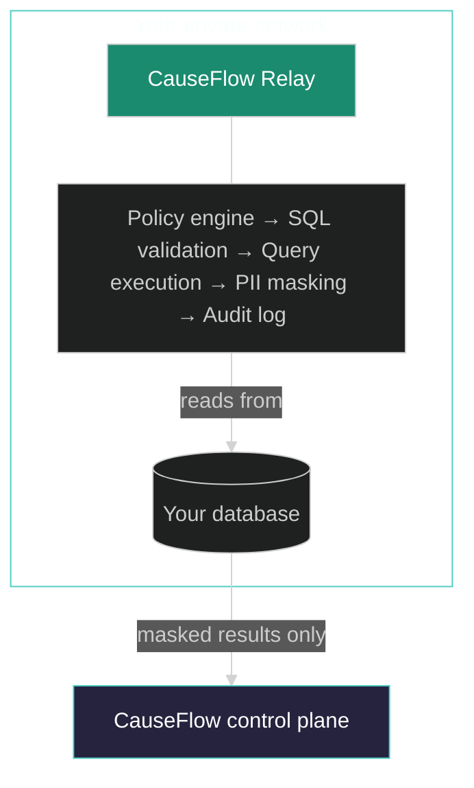

<Info>
  The Relay container image is in early access. Contact [support@causeflow.ai](mailto:support@causeflow.ai) to request access.
</Info>

CauseFlow Relay is a lightweight Docker agent you deploy inside your own private network. It gives CauseFlow's AI agents read-only access to your databases — without exposing them to the public internet and without any raw PII ever leaving your infrastructure.

The Relay establishes a single outbound WebSocket connection to the CauseFlow control plane. Your firewall never needs an inbound rule. The Relay receives queries, runs them locally against your databases, masks any PII in the results, and returns only the sanitized data.

## Key properties

| Property | Details |
|---|---|
| **Zero inbound traffic** | Outbound WSS/443 only. No inbound ports. No firewall rule changes. |
| **Read-only access** | Only `SELECT` queries for PostgreSQL. Only `find` operations for MongoDB. All write operations are blocked at the policy layer. |
| **PII masking** | CPF, email, credit card numbers, phone numbers, and bearer tokens are masked inside the Relay before results leave your network. Custom patterns supported. |
| **Policy engine** | Per-resource allowlist, per-operation allowlist, configurable row limits, and SQL injection protection. |
| **Audit trail** | Every query request, result, and masking event is logged as structured JSON. |
| **Container security** | Runs as non-root (UID 10001), read-only filesystem, all Linux capabilities dropped, no-new-privileges flag set. |

## How it works

The Relay connects outbound to `wss://api.causeflow.ai`. From that point forward:

1. The control plane sends query requests to the Relay via JSON-RPC 2.0 over the WebSocket.
2. The Relay validates each request against your policy configuration.
3. Safe queries are executed locally against your database.
4. Results are scanned for PII patterns and masked before being returned.
5. A structured audit log entry is written for every request.

Your raw database credentials and PII never leave your network.

## What the Relay is not

- **Not a proxy.** The Relay is not a SQL proxy or connection forwarder. It executes queries locally and returns only masked results.
- **Not a tunnel.** There is no inbound tunnel into your network. The Relay holds the outbound connection — the control plane cannot initiate connections to your infrastructure.
- **Not a replication agent.** The Relay does not sync or copy your data. It responds to individual queries on demand.

## Next steps

<CardGroup cols={2}>
  <Card title="Quickstart" icon="rocket" href="/relay/quickstart">
    Deploy the Relay in your private network in under 10 minutes.
  </Card>
  <Card title="Architecture" icon="diagram-project" href="/relay/architecture">
    Understand the communication protocol and request lifecycle.
  </Card>
  <Card title="Configuration" icon="sliders" href="/relay/configuration">
    Full reference for relay-config.yaml.
  </Card>
  <Card title="Deployment" icon="server" href="/relay/deployment">
    Docker, Kubernetes, ECS Fargate, and more.
  </Card>
</CardGroup>
