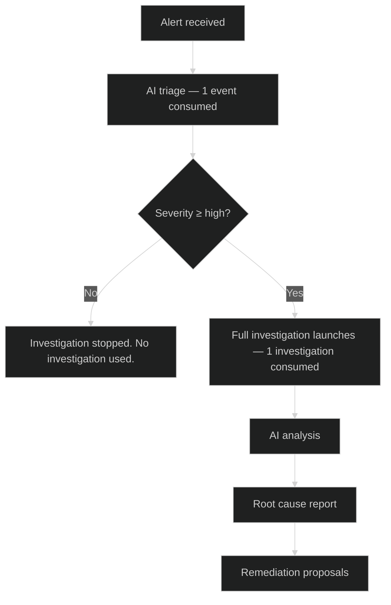

In the open-source distribution, CauseFlow does not meter usage against commercial plan quotas or bill for overages.
This page explains how **investigations** and **events** are counted so you can monitor load on your own infrastructure.

## Events vs investigations

<CardGroup cols={2}>
  <Card title="Events" icon="bell">
    Every incoming alert consumes **1 event**. An event covers AI triage — severity classification and initial evidence gathering.
  </Card>
  <Card title="Investigations" icon="magnifying-glass">
    If an alert's severity meets your threshold (default: **high** or above), CauseFlow automatically launches a full investigation. This consumes **1 investigation**.
  </Card>
</CardGroup>

### How consumption works

<Tip>
  You can adjust the severity threshold that triggers a full investigation in **Dashboard > Settings > Investigation Policy**. Raising the threshold to `critical` reduces investigation volume on lower-priority alerts.
</Tip>

## Open-source limits

Self-hosted CauseFlow does **not** enforce monthly commercial allowances or overage billing.
Your practical limits come from:

- CPU, memory, and storage on the machines running Core, the worker, and the dashboard
- LLM provider rate limits and API keys you configure
- Database and Redis capacity in your Docker Compose stack

Tune these in your deployment instead of purchasing hosted quota packs.

## Deploying CauseFlow

To run CauseFlow locally or on your own servers, clone the [CauseFlow monorepo](https://github.com/vinicius91carvalho/causeflow-ai) and follow the root **Quickstart** (`./init.sh`).
Full setup instructions live in the [published docs](https://vinicius91carvalho.github.io/causeflow-ai/docs/) and the repository README.

For deployment architecture and environment variables, see [Open-source usage](/billing/plans).
