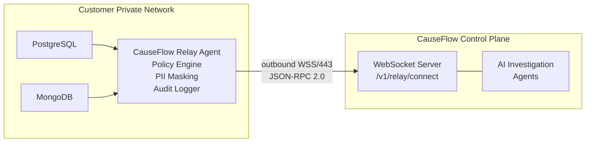

# CauseFlow Relay

**Secure, read-only database relay for accessing customer databases in private networks.** CauseFlow Relay is a lightweight agent deployed inside the customer's network (VPC, on-prem, or any private environment) that establishes an outbound-only WebSocket connection to the CauseFlow control plane — no inbound ports, no firewall rules needed.

## How It Works



The relay receives database query requests from CauseFlow's AI investigation agents via JSON-RPC 2.0 over WebSocket. Every request passes through a local policy engine, SQL validation, and PII masking before results leave the customer's network.

## Key Properties

| Property | Details |
|----------|---------|
| **Zero Inbound** | All connections are outbound to port 443. No firewall rules needed |
| **Read-Only** | Only SELECT queries (Postgres) and find operations (MongoDB). Enforced at SQL parser level and with READ ONLY transactions |
| **PII Masking** | CPF, email, credit card, phone, and bearer tokens masked before data leaves the network. Custom patterns supported |
| **Policy Engine** | Per-resource allowlist: which databases, which operations, max rows per query |
| **Audit Trail** | Every request logged with structured JSON — resource, operation, result, timing, masking stats |
| **Non-root** | Runs as UID 10001, read-only filesystem, all Linux capabilities dropped |

## Quick Start

### Prerequisites

| Tool | Version |
|------|---------|
| Docker | >= 20 |
| A CauseFlow tenant with relay enabled | - |
| Network access to your databases | - |

### 1. Configure

```bash
cp relay-config.example.yaml relay-config.yaml
```

Edit `relay-config.yaml`:

```yaml
controlPlane:
  url: wss://your-causeflow-instance/v1/relay/connect
  token: ${RELAY_TOKEN}      # From CauseFlow dashboard
  tenantId: ${TENANT_ID}     # Your tenant ID

resources:
  - id: main-pg
    type: postgres
    name: Main PostgreSQL
    connection:
      host: ${PG_HOST}
      port: 5432
      database: ${PG_DATABASE}
      user: ${PG_USER}
      password: ${PG_PASSWORD}
    allowedOperations: [query, describe_table, list_tables, explain]
    maxRowsPerQuery: 1000

  - id: main-mongo
    type: mongodb
    name: Main MongoDB
    connection:
      uri: ${MONGO_URI}
      database: ${MONGO_DATABASE}
    allowedOperations: [query, describe_table, list_tables, explain]
    maxRowsPerQuery: 1000

masking:
  enabled: true
  patterns:
    - name: cpf
      regex: '\d{3}\.\d{3}\.\d{3}-\d{2}'
      replacement: '***.***.***-**'
    - name: email
      regex: '[a-zA-Z0-9._%+-]+@[a-zA-Z0-9.-]+\.[a-zA-Z]{2,}'
      replacement: '***@***.***'
    - name: credit_card
      regex: '\d{4}[\s-]?\d{4}[\s-]?\d{4}[\s-]?\d{4}'
      replacement: '****-****-****-****'

audit:
  enabled: true
  level: info
```

### 2. Run with Docker

```bash
docker run -d \
  --name causeflow-relay \
  --restart unless-stopped \
  -v $(pwd)/relay-config.yaml:/app/relay-config.yaml:ro \
  -e RELAY_TOKEN=<token-from-dashboard> \
  -e TENANT_ID=<your-tenant-id> \
  -e PG_HOST=your-db-host \
  -e PG_DATABASE=yourdb \
  -e PG_USER=readonly_user \
  -e PG_PASSWORD=secret \
  --memory=512m \
  --cpus=0.5 \
  --read-only \
  --tmpfs /tmp:size=64m \
  --security-opt no-new-privileges \
  --cap-drop ALL \
  causeflow-relay:latest
```

### 3. Verify

Once connected, the relay appears in the CauseFlow dashboard under your tenant's connections. You can also check via API:

```bash
curl http://your-causeflow-instance/v1/relay/status \
  -H "Authorization: Bearer <jwt>"
# { "connected": true, "resources": [...] }
```

### Local Development

```bash
# Install dependencies
npm install

# Start with hot reload (connect to local CauseFlow dev server)
npm run dev

# Build
npm run build

# Start production build
npm start
```

## Architecture

```
relay/
├── src/
│   ├── index.ts                    # Entry point, main loop, graceful shutdown
│   ├── transport/
│   │   ├── protocol.ts             # JSON-RPC 2.0 types and helpers
│   │   └── ws-client.ts            # WebSocket client with auto-reconnect
│   ├── drivers/
│   │   ├── driver.port.ts          # IReadOnlyDriver interface
│   │   ├── postgres/
│   │   │   ├── pg-driver.ts        # PostgreSQL driver (connection pool, READ ONLY)
│   │   │   └── pg-query-parser.ts  # SQL validation (block DDL/DML, dangerous functions)
│   │   └── mongodb/
│   │       └── mongo-driver.ts     # MongoDB driver (block $out/$merge)
│   ├── config/
│   │   ├── schema.ts               # Zod configuration schemas
│   │   └── loader.ts               # Config loading (YAML + env var fallback)
│   ├── policy/
│   │   └── policy-engine.ts        # Resource allowlist, operation validation, row limits
│   ├── masking/
│   │   └── masking-engine.ts       # Regex-based PII masking on query results
│   ├── audit/
│   │   └── audit-logger.ts         # Structured JSON audit trail
│   └── health/
│       └── health-reporter.ts      # Per-resource health checks with latency
├── package.json
├── tsconfig.json
├── Dockerfile
└── relay-config.example.yaml
```

## Communication Protocol

The relay and control plane communicate via **JSON-RPC 2.0 over WebSocket**.

### Request (Control Plane -> Relay)

```json
{
  "jsonrpc": "2.0",
  "id": "req-uuid",
  "method": "execute",
  "params": {
    "resourceId": "main-pg",
    "operation": "query",
    "params": { "sql": "SELECT id, status FROM orders WHERE created_at > now() - interval '1h'", "limit": 100 }
  }
}
```

### Response (Relay -> Control Plane)

```json
{
  "jsonrpc": "2.0",
  "id": "req-uuid",
  "result": {
    "rows": [{ "id": "ord-001", "status": "failed" }],
    "rowCount": 1,
    "fields": [{ "name": "id", "type": "varchar" }, { "name": "status", "type": "varchar" }],
    "executionTimeMs": 12,
    "masked": false,
    "maskedFieldCount": 0
  }
}
```

### RPC Methods

| Method | Description |
|--------|-------------|
| `execute` | Run a database operation (query, describe_table, list_tables, explain) |
| `list_resources` | List all configured database resources |
| `describe_resource` | Get tables/collections for a resource |
| `health_check` | Run health checks on all configured databases |

### Relay-Initiated Messages

| Type | Interval | Description |
|------|----------|-------------|
| `heartbeat` | Every 30s | Keeps connection alive, signals health to control plane |
| `resource_update` | On connect + on change | Reports available databases and their types |

## Security

### SQL Validation (PostgreSQL)

The SQL parser (powered by `node-sql-parser`) blocks:

- **DDL/DML statements**: INSERT, UPDATE, DELETE, DROP, ALTER, CREATE, TRUNCATE
- **Dangerous functions**: `pg_sleep`, `pg_read_file`, `pg_write_file`, `pg_ls_dir`, `pg_stat_file`, `pg_terminate_backend`, `pg_cancel_backend`, `pg_reload_conf`, `dblink`, `dblink_exec`
- **Multi-statement injection**: Semicolons separating multiple statements
- All queries run inside a `READ ONLY` transaction with a 30-second statement timeout

### MongoDB Validation

- Blocks `$out` and `$merge` aggregation stages (these write to collections)
- Only read operations: find, aggregate (read-only), count

### Policy Engine Flow

```
Request received
    │
    ├── Resource in config?     ── NO ──> REJECT
    ├── Operation in allowlist? ── NO ──> REJECT
    ├── Row limit within max?   ── NO ──> CLAMP to max
    ├── SQL/query safe?         ── NO ──> REJECT
    │
    ▼
  EXECUTE
    │
    ├── Mask PII in results
    ├── Log to audit trail
    │
    ▼
  RETURN masked results
```

### Container Security

The Docker image enforces minimal privileges:

```
- User: relay (UID 10001), non-root
- Filesystem: read-only (--read-only)
- Privileges: no new privileges (--security-opt no-new-privileges)
- Capabilities: all dropped (--cap-drop ALL)
- Memory: 512MB limit
- CPU: 0.5 cores limit
- Writable: only /tmp (tmpfs, 64MB, in-memory)
- Network: outbound only (port 443 to control plane)
```

## Database Drivers

### PostgreSQL (`PgDriver`)

| Operation | Description |
|-----------|-------------|
| `query` | Execute SELECT with row limit. READ ONLY transaction, 30s timeout |
| `describe_table` | Columns, types, nullability, constraints |
| `list_tables` | All tables in public schema |
| `explain` | EXPLAIN ANALYZE for query performance |

Connection pool: max 5 connections, 30s idle timeout, 10s connection timeout.

### MongoDB (`MongoDriver`)

| Operation | Description |
|-----------|-------------|
| `query` | Find with filter + limit. Blocks $out/$merge |
| `describe_table` | Schema inferred from 10 sample documents + index listing |
| `list_tables` | All collections in the database |
| `explain` | Execution statistics for a filter |

Connection pool: max 5 connections, 10s server selection timeout.

## PII Masking

Masking is applied **inside the relay, before data leaves the customer's network**. The control plane and AI agents never see raw PII.

| Pattern | Example Input | Masked Output |
|---------|---------------|---------------|
| CPF (Brazilian) | `123.456.789-00` | `***.***.***-**` |
| Email | `user@example.com` | `***@***.***` |
| Credit card | `1234-5678-9012-3456` | `****-****-****-****` |
| Bearer token | `Bearer abc123xyz` | `Bearer ***` |
| Phone (BR) | `(11) 98765-4321` | `(**) *****-****` |

Custom patterns can be added in `relay-config.yaml` under `masking.patterns`.

## Tech Stack

| Component | Technology |
|-----------|-----------|
| Runtime | Node.js 22, TypeScript |
| WebSocket | ws |
| PostgreSQL | pg (connection pool) |
| MongoDB | mongodb (native driver) |
| SQL Parsing | node-sql-parser |
| Validation | Zod |
| Logging | Pino (structured JSON) |
| Config | YAML (yaml) + env var fallback |

## Deployment Options

| Platform | Method |
|----------|--------|
| **Docker** | `docker run` with config volume mount |
| **Docker Compose** | Service alongside your databases |
| **Kubernetes** | Pod/Deployment in the same VPC |
| **ECS Fargate** | Task in private subnets |
| **VM / Bare metal** | `node dist/index.js` with config file |

**Resource requirements**: ~128m CPU idle, <500m under load. 100-200MB memory. 50MB disk (image).

## Integration with CauseFlow

This relay is used by the CauseFlow control plane as a git submodule. The control plane side implements:

- **WebSocket server** at `/v1/relay/connect` that accepts relay connections
- **RelayRegistry** that tracks per-tenant relay connections and health
- **WssRelayGateway** that sends JSON-RPC requests and correlates responses
- **DB Analyst agent** that uses the relay to investigate data-layer incidents

For full integration details, see [13 — Relay Integration](../docs/product/13-relay-integration.md) in the CauseFlow product docs.

## License

Proprietary. All rights reserved.
